{width="4.163888888888889in"
height="1.2534722222222223in"}

毕业设计（论文）

课题名称 [基于三维重建的立木树高]{.underline}

[测量方法的研究与实现]{.underline}

学 院

专 业

二○二三 年 五 月 二十五 日

# 摘 要

我国林木资源种类丰富、数量庞大，是世界上重要的林业大国。广西是中国的林业大省，统计数据显示，截至2022年底，广西市县平均森林覆盖率达63%。因此，林业资源信息的准确性与时效性对林业资源的保护与发展有着至关重要的作用。针对目前立木因子测量技术中存在着测量周期长、测量误差大、仪器成本高、自动化程度低等的问题，本文结合了深度估计、图像分割和三维重建等新技术，通过智能手机APP实现了对林木树高的自动化测量。本文的主要研究工作如下：

（1）结合Depth from
Motion算法和MidasNet模型的深度图生成方法。通过特征点空间位置信息的变化估计每个像素的深度，获取粗糙的立木绝对深度图，选取多种数据集训练MidasNet模型，使用模型预测精细的相对深度，最后使用绝对深度校准相对深度，得到精细的绝对深度图。

（2）改进Attention
U-Net的立木图像分割模型。增加深度图作为网络输入，在解码阶段进行多模态特征融合，提供更丰富的空间信息，进而提高模型的分割精度和鲁棒性。采集不同环境下，不同树木的图像，并运用图像增强技术制作立木数据集，训练改进的Attention
U-Net模型，从而在图像中自动分割出树木。

（3）基于拟合树冠曲线的树木最高点估计方法。根据树木轮廓检测最高点是否被遮挡，并通过拟合树冠曲线估计最高点，补全树木轮廓用于从融合彩色图和深度图得到的三维点云中提取立木点云。

（4）基于以上深度估计、图像分割和三维重建技术，采用Android开发，结合Flask、PyTorch框架，设计与实现了立木树高测量系统。

实验证明，本方案测量树高的最大相对误差为4.87%，最小相对误差为1.92%，平均相对误差为3.20%，满足国家森林资源连续清查的精度要求。

关键词：树高测量 深度估计 图像分割 特征融合 智能手机

**\**

**Research and Implementation of Tree Height Measurement Method Based on
Three-dimensional Reconstruction**

# **ABSTRACT**

China has abundant forest resources, making it an important forestry
country in the world. Guangxi, as a major forestry province in China,
had an average forest coverage rate of 63% at the end of 2022.
Therefore, the accuracy and timeliness of forestry resource information
play a crucial role in the protection and development of forest
resources. In view of the problems such as long measurement cycles,
large measurement errors, high instrument costs, and low automation
level in current standing tree factor measurement technologies, this
paper combines new technologies such as depth estimation, image
segmentation, and 3D reconstruction to achieve automated measurement of
tree height through a smartphone app. The main implementation
technologies of this solution are as follows:

\(1\) An algorithm combining the Depth from Motion algorithm and the
MidasNet is used to generate the depth map. By estimating the depth of
each pixel based on the change in the spatial position of feature
points, a rough absolute depth map of the standing tree is obtained.
Multiple datasets are used to train the MidasNet, which predicts fine
relative depth. Finally, the relative depth is calibrated using the
rough depth to obtain a fine absolute depth map.

\(2\) An improved Attention U-Net model for standing tree image
segmentation. The depth map is added as an input to the network, and
multimodal feature fusion is performed during the decoding phase to
provide richer spatial information, improving the segmentation accuracy
and robustness. Images of different trees in different environments are
collected and enhanced to create a standing tree dataset used to train
the improved Attention U-Net model to automatically segment trees in
images.

\(3\) A method for estimating the highest point of trees based on
fitting the tree crown curve. Detect whether the highest point is
blocked according to the tree contour, and estimate the highest point to
complete the tree contour by fitting the tree crown curve, which is used
to extract the standing tree point cloud from the 3D point cloud
obtained by fusing color map and depth map.

\(4\) Based on the above depth estimation, image segmentation and
three-dimensional reconstruction technology, using Android development,
combined with Flask and PyTorch, a tree height measurement system is
designed and implemented.

Experimental results show that the maximum relative error in measuring
tree height using this approach is 4.87%, the minimum is 1.92%, and the
average is 3.20%, which meets the accuracy requirements of national
forest resources continuous inventory.

**Keywords:** Tree height measurement; Depth estimation; Image
segmentation; Feature fusion; Smart phone

目录

[摘 要 [I](#摘-要)](#摘-要)

[**ABSTRACT** [II](#abstract)](#abstract)

[第一章 绪论 [1](#绪论)](#绪论)

[1.1课题研究背景及意义 [1](#课题研究背景及意义)](#课题研究背景及意义)

[1.2国内外研究现状 [2](#国内外研究现状)](#国内外研究现状)

[1.3课题研究目标 [8](#课题研究目标)](#课题研究目标)

[1.4研究方法 [9](#研究方法)](#研究方法)

[1.5论文组织结构 [10](#论文组织结构)](#论文组织结构)

[第二章 相关技术及开发环境介绍
[12](#相关技术及开发环境介绍)](#相关技术及开发环境介绍)

[2.1单目深度估计理论基础
[12](#单目深度估计理论基础)](#单目深度估计理论基础)

[2.2 Attention-UNet图像分割模型
[15](#attention-unet图像分割模型)](#attention-unet图像分割模型)

[2.3开发环境及工具介绍 [16](#开发环境及工具介绍)](#开发环境及工具介绍)

[2.4 Android开发 [16](#android开发)](#android开发)

[2.5 Flask框架 [17](#flask框架)](#flask框架)

[2.5本章小结 [17](#本章小结)](#本章小结)

[第三章 基于三维重建的立木树高测量方法
[18](#基于三维重建的立木树高测量方法)](#基于三维重建的立木树高测量方法)

[3.1结合DfM和MidasNet的绝对深度估计方法
[18](#结合dfm和midasnet的绝对深度估计方法)](#结合dfm和midasnet的绝对深度估计方法)

[3.2改进Attention-UNet的树木图像分割模型
[31](#改进attention-unet的树木图像分割模型)](#改进attention-unet的树木图像分割模型)

[3.3立木三维点云的生成 [41](#立木三维点云的生成)](#立木三维点云的生成)

[3.4树高计算 [46](#树高计算)](#树高计算)

[3.5树高测量结果验证与分析
[47](#树高测量结果验证与分析)](#树高测量结果验证与分析)

[3.6本章小结 [48](#_Toc135490587)](#_Toc135490587)

[第四章 立木树高测量APP设计与实现
[50](#立木树高测量app设计与实现)](#立木树高测量app设计与实现)

[4.1需求分析 [50](#需求分析)](#需求分析)

[4.2系统概要设计 [51](#系统概要设计)](#系统概要设计)

[4.3系统详细设计 [52](#系统详细设计)](#系统详细设计)

[4.4系统展示 [60](#系统展示)](#系统展示)

[4.5本章小结 [65](#本章小结-2)](#本章小结-2)

[第五章 总结与展望 [66](#总结与展望)](#总结与展望)

[5.1论文工作总结 [66](#论文工作总结)](#论文工作总结)

[5.2展望 [66](#展望)](#展望)

[参考文献 [68](#参考文献)](#参考文献)

[附录 [75](#附录)](#附录)

[致谢 [85](#致谢)](#致谢)

# 绪论

## 1.1课题研究背景及意义 {#课题研究背景及意义 .Title}

近年来，我国积极践行"绿水青山就是金山银山"
的发展理念，实施了退牧还草、防沙治沙和退耕还林等多个生态修复工程，森林覆盖率逐年上升，截至2023年4月，全国森林覆盖率达到了24.02%。要建立高效的智能林业测量系统，促进智慧林业的快速发展和林业资源整合，必须及时获取各种可靠的林木资源数据，这对现有的林木资源调查提出了更高的要求
^\[1,2\]^。树高测量是森林调查作业中不可缺少的环节^\[3\]^，树高是指树根与树上最高分枝尖端之间的垂直距离^\[4\]^，常用于估计森林生长、年龄、材积、生物量和碳储量等^\[5\]^。可持续森林管理需要大量的树木高度数据支持^\[6\]^。通过对树高数据的分析处理，监测和评估森林的健康程度，为森林的可持续发展制定计划提供依据^\[7\]^。树高测量结果准确与否，关系着下一步继续分析研究的合理性
^\[8\]^。由此可见，树高测量是森林资源清查中重要的一环，其准确性至关重要。

目前，传统的森林资源调查技术主要分为人工测量和机器辅助测量。其中，传统人工测量即采用人工读取和手工记录数据的方法，测量效率相对较低，测量精度容易受人为操作和环境因素的影响，如图1-1(a)所示。相比之下，机器辅助式测量主要使用电子全站仪、经纬仪、测树枪等精密仪器，使得林业资源调查工作得到了较大的改善^\[9,10\]^，但精密仪器购置成本高，部分仪器还需要专业的操作技术，自动化程度较低，而且不便携带，容易受到使用环境的限制，如图1-1(b)所示。

  -------------------------------------------------------------- -------------------------------------------------------------
   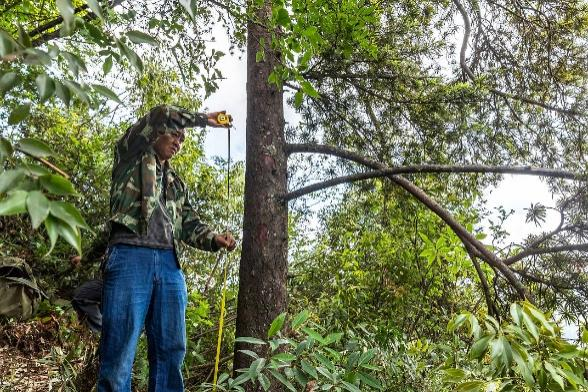{width="2.4715277777777778in"   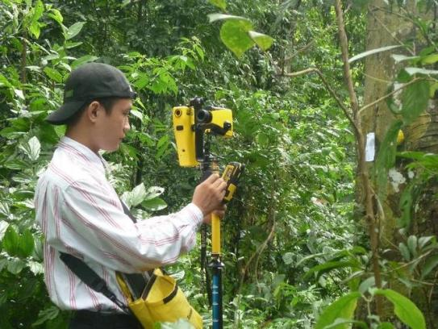{width="2.470138888888889in"
                  height="1.742361111111111in"}                                 height="1.7513888888888889in"}

                           (a)人工测量                                                  (b)机器辅助测量
  -------------------------------------------------------------- -------------------------------------------------------------

图1-1 测量设备

近年来，随着人工智能和计算机技术的发展，图像处理和计算机视觉等技术逐渐被广泛应用于林业测量领域，通过便携设备采集林木数据并自动分析得到立木因子数据的方法成为研究热点。

因此，本文以智能手机为采集设备，结合图像分割和三维重建技术，实现了一种高精度、自动化、低成本的树高测量方案。使用本方案进行树高测量，能快速、非接触地获得立木树高的测量数据，推动智慧林业的发展。

## 1.2国内外研究现状 {#国内外研究现状 .Title}

### 1.2.1立木因子测量研究现状 {#立木因子测量研究现状 .三级标题}

早期，在立木因子测量工作中普遍采用皮尺等耗费人力和时间的测量方法，测量精确性和稳定性相对较低，而且这种接触式测量会对树木造成一定程度的破坏。随着林业信息化的发展，经纬仪、全站仪和测树枪等高精度测量仪器不断涌现，但这些设备昂贵，携带不便，且操作步骤复杂，不利于在森林资源调查中普及。

近年来随着计算机视觉和无人机技术的进步，出现一些基于LiDAR、遥感影像的立木因子测量方法，使用小型无人机拍摄多光谱图像，并结合地理信息分析图像以求取立木因子。杨坤等人^\[11\]^采用无人机获取立木影像，在三维点云中利用最大类间方差分割出树木点云和树下点云，提取立木高度。该方法测量精度较高，绝对误差小于80cm，但需要人工筛选数据，自动化程度不高，同时无人机飞行高度和树冠形状会对测量结果产生较大影响。Panagiotidis等^\[12\]^通过构建冠层高度模型，在无人机高分辨率图像上提取立木高度，并估计冠幅。该方法有较高精度，但容易受天气和人为误操作影响，且需要昂贵的高精度摄像头。Yin等人^\[13\]^使用无人机采集的光探测和测距数据探测和划分个体树木，实现了树高和冠幅的检测和测量。测量孤立单株树木时精度较好，但在多株树木密集分布时，个体数目的划分误差较大。

随着三维重建技术的发展，该技术逐渐被应用于林业测量中，通常使用三维传感器获取数据，如激光扫描传感器。Mayamanikandan
T.等人^\[14\]^从三维地面激光雷达数据中提取树木体积，平均相对误差为5.31%。Tian等^\[15\]^对地面激光扫描仪和无人机影像点云进行配准，结合冠层高度模型对高郁闭度人工针叶林的树高进行提取，均方根误差为6cm。杨全月^\[16\]^利用三维激光扫描仪获取的立木三维点云数据，基于寻找凸包算法实现树冠的表面积、投影面积以及体积等林木参数的自动解算，但激光扫描传感器获取的立木点云数据量庞大，后期处理复杂且计算时间长。

随着计算机视觉的发展，一些学者将基于图像的三维重建方法应用于摄影测量中。Collazos
D
T等^\[17\]^使用单目相机从多个角度拍摄照片，使用SfM算法建立一棵树的三维模型，分析得到的测树因子误差约为2cm，但是该方法需要拍摄20张以上重叠度高的图像，平均三维重建时间为50分钟。练一宁^\[18\]^对林分样地内部进行了视频拍摄，再对视频进行抽帧获取一定量重叠的像片，获取像片的位姿，从而建立林分样地的三维点云模型，以提取样地中树木信息，该方法的相对误差为3.14%～8.61%，但需要标定物，视频拍摄要求高且后续处理复杂。孙英伟^\[19\]^
基于空间前方交会算法采集待测树木不同角度的图像，利用SfM算法将单木照片变成点云数据，并对点云数据进行单木结构参数提取，测量精度较高，但图像采集操作复杂，且图像处理周期长。

近年来，关于机器视觉的研究不断涌现。机器视觉主要分为双目视觉和单目视觉。刘金成^\[20\]^研发了一种实时动态双目立体摄影测树仪，融合三角函数原理、SfM算法和双目摄影测量算法原理计算立木高度。张真维等^\[21\]^提出了一种使用双目摄像机测量树高的方法，该方法操作相对简单，误差不高于3.93%。尹萍等^\[22\]^使用消费级USB双目相机采集立木图像，生成视差图，再转化为深度图，进而获取立木三维点云，最后利用最值遍历法实现树木参数的测量，误差较小。然而，双目视觉系统需要解决两个摄像头之间的最优距离和特征点匹配问题，这对精度要求较高且较难实现。

相较于双目视觉，单目视觉摄影测量方法在图像采集阶段使用单个相机，更便于携带和数据处理。高莉平和徐爱俊^\[23\]^将显著性分析和Canny算子应用于树高测量，一定程度上提高了测量鲁棒性，但在实际应用中，由于林木环境复杂，该方法测量误差较大。武新梅^\[24\]^将图像处理与单目视觉相结合，提出了一种基于智能手机的单目视觉方法，采用多维特征自适应Mean
Shift算法对树木图像进行分割，具有较强的鲁棒性，但其计算速度相对较慢。Coelho等^\[25\]^使用单目相机为每棵待测树木拍摄2张照片，基于几何关系解算树高，平均相对误差为10.9%，但需要在树木附近放置一个特别设计的标定物用于图像处理和相机校准。

随着人工智能的发展，一些学者将深度学习应用于林业图像处理。Juyal
P和Sharma S ^\[26\]^提出了一种利用Mask
R-CNN快速计算树顶体积的方法，提高了计算树木生物量的效率，但是在拍摄树木时，需要一个白色的矩形板作为参照物。Itakura
K和Hosoi
F^\[27\]^提出了一种结合立体相机和YOLOv2来估计树干直径和树种的方法，该方法的均方根误差约为3.14cm，但当树干直径大于80cm时测量结果不稳定。张真维^\[28\]^融合双目视觉算法和YOLOv4目标检测算法，实现了树木数量统计和树木高度测量，但仅在树木背景简单的情况下取得较高精度，且每次只能对单株树木进行测量。总体而言，结合深度学习的林业测量方法仍有很大的研究空间，相关数据集较为稀缺。

综上所述，国内外关于立木树高测量的研究经历了从传统的人工测量方法到基于全站仪、经纬仪等高精度测量仪器的测量方法的发展过程。随着计算机视觉和无人机技术的进步，出现了一些基于雷达、遥感影像以及三维重建技术的立木因子测量方法。然而，这些方法仍存在一些局限性，比如需要筛选单株样本、后期处理复杂且计算时间长等问题。近年来，国内外的研究者开始探索结合消费级便携式设备和人工智能的立木树高测量方法。相对于人工测量方法和机器辅助测量方法，消费级便携式设备具有价格低廉、便携灵活的优势，有望成为立木树高测量的重要手段，然而目前此类技术仍需要克服自动化程度不高、数据处理时间长、易受外界环境影响等问题。

### 1.2.2三维重建研究现状 {#三维重建研究现状 .三级标题}

三维重建是指对三维物体建立适合计算机表示和处理的数学模型的方法^\[29\]^。目前，三维重建技术主要分为三种：使用激光雷达仪的三维重建技术、基于多视图的三维重建技术和基于图像纹理的三维重建技术。

使用激光雷达仪的三维重建技术。张晨博^\[30\]^提出了综合双目立体视觉系统和手持式激光三维扫描技术，利用极线约束重建平行多线激光、RANSAC算法匹配特征点和基于欧氏距离特征的三维拼接方法，用于提高激光三维扫描技术的精度，但需对目标物体贴人工标记点，且对表面纹理复杂的物体需要重复扫描，可能会产生累积误差。Ni等人^\[31\]^提出了一种基于激光雷达和双目立体视觉系统的三维重建方法，有效增加了最大拍摄距离，但需要从不同角度和距离采集目标图像，且对拍摄角度要求高，准确率受人为操作影响。

基于多视图的三维重建技术。Li等人^\[32\]^建立了一种双目立体视觉平台，结合AD-Census和自适应支持权重(ASW）算法进行图像匹配，对室内、田野和温室中的植物进行三维重建，验证了方法的鲁棒性，但是需要通过笔记本电脑进行控制。韩婧^\[33\]^提出了一种基于深度学习的多视图三维重建方法，利用估算相机内外参数和神经网络进行立体匹配，预测深度图并融合构建三维点云，提高了重建结果的完整度和精度，但使用三维卷积神经网络，对硬件内存和计算资源需求大。周三章^\[34\]^用深度相机从四个不同角度采集点云数据，利用标定球进行点云配准，恢复树干、树枝和盆栽三类物体的三维结构，有效提高了大角度点云配准的准确度，但需要人为放置标定球，配准过程自动化程度低。

基于图像纹理的三维重建技术。Holzmann等人^\[35\]^在三维重建过程中引入语义信息和平面先验信息，生成城市三维重建模型，但该算法运行时间较长。Pontes^\[36\]^使用卷积自编码器提取单个图像的潜在空间，使用多标签分类器分类为索引，用前馈网络转化为形状参数推断3D网格模型，能恢复物体几何形状，但无法还原真实尺寸。Zhu等人^\[37\]^利用智能手机采集林场样地序列图像，综合MSR图像增强、Harris角点检测和SURF特征检测，快速重构三维森林模型，提取单株树木胸径，平均精度达92％，但光照和地形影响图像质量，导致重叠率不稳定，定位不准确。

总而观之，激光雷达可以通过发射激光直接获取场景的三维信息，测量准确且不易受外界环境变化干扰，但存在扫描频率低、点云数据稀疏、设备成本高的问题。多视图系统可以使用相对便宜的设备采集数据，但需要对大量图像进行特征点匹配，时间和计算资源成本较高。基于图像纹理的三维重建技术只需要一台摄像机即可进行三维重建，通常可以利用
CPU
进行计算，无需使用昂贵的计算硬件，实现大型场景的实时三维重建，但是所重建的三维模型只能恢复物体的几何形状而不能恢复真实尺寸，且对光照条件要求较高，在弱光、过曝等场景下，会出现色差、点云噪声等问题。

### 1.2.3深度估计研究现状 {#深度估计研究现状 .三级标题}

深度图是一种图像，其中每个像素的灰度值表示该像素在场景中与相机的距离，距离越远则深度值越大^\[38\]^。深度图描述了场景中物体的空间关系，因此被广泛应用于三维重建、立体匹配、姿态估计等计算机视觉任务中。深度分为相对深度和绝对深度。相对深度图中，像素点的像素值不具有实际意义，只能通过比较像素值之间的大小关系来判断相对位置，而绝对深度图中，每个像素点的值即为其与相机之间的真实距离，如图1-2所示，其中A是真实物体表面上的一点，通过光路投射到深度图上，所对应的点为a，a点的像素值等于OA
投影到Z轴的长度，即点A在Z轴的坐标值。

图1-2 光路图

深度图的获取方式可分为主动测量和被动测量。主动测量方式即使用能够主动发射激光、红外线等的设备获取深度图，包括结构光深度相机^\[39\]^、TOF相机^\[40\]^、激光雷达^\[41\]^等，此类设备价格高昂，不利于推广使用。被动测量方式主要包括基于深度线索的深度估计法、基于传统机器学习的深度估计法和基于深度学习的深度估计法。

基于深度线索的深度估计法分为基于单目视觉的深度信息构建方法和基于多目视觉的深度信息构建方法。其中，基于单目视觉的深度估计主要根据角点、边缘、纹理等图像特征和匹配算法估计场景深度。刘杰平等^\[42\]^通过深度视觉词典进行多尺度检测，匹配深度信息获取深度图，简化了特征提取，但对于弱纹理物体如树干地面等无法准确深度估计，适用性有限。王琦等人^\[43\]^采用最佳熵阈值图像分割法进行图像分割，进行立体匹配得到视差图，根据视差与深度的关系计算得到深度。Valentin等人^\[44\]^提出Depth
from
Motion算法，结合手机相机和惯性测量单元的数据，通过关键帧选取、立体校正、立体匹配估计深度信息，不需要额外硬件支持，可以应用于绝大多数智能手机，但是预测精度易受位姿误差、运动模糊以及弱纹理的影响。

基于多目视觉的深度图获取方法通过分析不同视角中深度线索的变化来预测深度。Ha等^\[45\]^对一段小视角变化视频进行密集立体匹配生成高质量的深度图，引入自标定光束调整取代传统相机标定，但处理一段时长为1秒的视频需要10分钟，时间成本较高。Gordon等人^\[46\]^
提出跟踪相邻视频帧之间的变化约束生成深度图的方法，可以对未标定相机拍摄的视频图像进行深度估计，但林木图像背景复杂，特征点多，特征提取和匹配周期长，难以达到实时性能。Godard^\[47\]^提出结合双目立体相机和光流法进行深度估计的方法，利用左右图像间的光流信息约束求解深度值，可以实现实时深度获取，但光照变化、遮挡和纹理不连续等因素会影响其精度。

基于传统机器学习技术的深度信息构建方法分为有参数的学习方法和无参数的学习方法。有参数的学习方法是指能量函数中含有未知参数的方法，训练的过程是求解这些参数。Saxena等^\[48\]^以超像素为单元，利用MRF框架拟合特征与深度关系，只需少量输入图像就能估计深度，但实时性差，对图像的角度和视角要求高。Liu等人^\[49\]^以像素和亚像素为结点构建MRF模型，利用语义分割结果引导像素深度估计，提高鲁棒性，但该方法不适用于复杂场景，因为语义分割无法处理所有物体。Wang等^\[50\]^提出了一种描述单色图像和深度图线性关系的参数模型，可以从给定单色图像预测深度图，可以自适应地处理颜色失真和光照变化，但在复杂场景中非线性变化可能导致深度估计不精确。

无参数的学习方法则是在已有数据集中检索相似图像以推测深度，不需要通过学习获得参数。莫一鸣^\[51\]^通过融合前景和背景的深度线索来估计单目视频深度图，利用相邻帧的信息来约束深度图的平滑性，不需要复杂的参数调优，但对输入图像的质量和噪声等因素较为敏感。Liu等人^\[52\]^以超像素为节点构建CRF模型，预测超像素深度值，通过深度融合提高深度精度和稳定性，但需要大量计算资源和时间。

基于深度学习的深度估计方法分为基于监督学习、无监督和半监督学习的方法三种^\[53\]^。Ranftl等^\[54\]^提出MidasNet模型，使用多个数据集进行监督学习，使模型在没有见过的数据集上有更好的泛化能力，但只能估计相对深度。张雪霏^\[55\]^提出了一种基于语义分割的无监督深度估计模型，使用预先训练的语义分割模型提供先验信息，缓解了语义失真和边界不清问题，但依赖于预训练模型，对新场景泛化能力低。Kuznietsov等人^\[56\]^通过半监督学习方法融合带标签和不带标签数据预测深度，利用未标记数据提高模型泛化性能，但在需要精度高的深度预测时可能不如传统的有监督学习方法。

概而论之，多目视觉可以利用多个视角的信息来计算不同图像之间的匹配关系，从而更准确地确定深度信息，然而，与单目视觉相比，多目视觉需要更多的硬件成本和计算资源。单目视觉可以有效避免双目视觉系统中立体图像对的测量覆盖范围小，受环境光照影响图像对的纹理等特征性影响立体匹配等问题，但是往往需要借助于其他的信息来增强深度估计的准确性，例如运动估计、形状先验等。有参数的机器学习方法需要手动选择图像特征来建立模型，特征的质量直接影响深度估计的精度。无参数的机器学习方法则不需要人为设定模型参数，但是这种方法需要使用大量数据集来检索相似的图像，因此检索耗时长，无法应用于立木等复杂场景。基于深度学习的深度图获取方法精度较高，能够应用于多种应用场景，但是缺乏准确的先验信息，只能估计相对深度。

### 1.2.4图像分割研究现状 {#图像分割研究现状 .三级标题}

图像分割是一个广泛的研究课题，国内外学者已经在此领域进行了大量研究。图像分割是大多数目标检测、图像识别、特征提取和分类任务的关键步骤^\[57\]^。在本文研究的立木树高测量方法中，通过图像分割获取立木轮廓是求取立木树高的前提。图像分割方法主要分为传统图像分割方法和基于深度学习的语义分割方法。

传统图像分割方法运用阈值、区域、图论等理论与边缘检测等技术分割立木图像。葛玉峰等^\[58\]^基于绿色植物反射绿光多的特征,
利用RGB图像各通道之间的差值进行分割，简单易操作，但没有考虑实际复杂情况，无法准确分割。赵茂程等人^\[59\]^利用分形维数和颜色进行树木图像分割，比基于颜色的方法精度更高，但对于植物过多或重叠的情况分割困难。Jiang等人^\[60\]^结合Canny算子和PCNN模型进行图像分割，先进行边缘检测，再使用PCNN模型划分目标和背景，能同时识别多个目标，但对低对比度或同质性高的区域表现不如传统图像分割方法。郭晶晶等^\[61\]^利用颜色通道计算色差值并结合高斯混合模型实现树木分割，能够检测出单株立木的轮廓且适应阴影和光照不均情况，但是处理枝叶稀疏的树木有信息丢失问题。

随着深度学习技术在机器视觉领域的不断深入应用，使用神经网络分割林木图像已成为一种趋势。基于深度学习的语义分割方法包括基于
Fully Convolutional Networks（FCN）结构、基于 Deep Lab 结构、基于
Pyramid Scene Parsing Network 结构、基于 Mask R-CNN结构和基于 U-Net
结构等。

Long等人^\[62\]^提出使用FCN进行语义分割，去掉全连接层，仅使用卷积层进行完全卷积，使网络能接受任意大小输入并输出相应分割结果，可直接对图像像素分类，但上采样过程可能丢失细节信息导致边缘模糊或分割区域断裂。Yang等^\[63\]^提出M-FCN，引入MMF对彩色图像和彩色红外图像进行融合，提高了适应复杂场景的能力，但多源信息融合可能导致对比度不一致等问题影响分割效果。He等人^\[64\]^在FCN中引入不同深度的卷积层作为特征提取器和多个任务的结构，同时完成特征提取和分割，处理效率高，但需要大量参数调整，对标注数据质量有一定要求。

DeepLab是一种基于深度卷积神经网络的图像分割网络，由Chen等^\[65\]^提出，引入深度卷积扩大感受野，采用完全连接的条件随机场增强分割结果的平滑性和连通性，在准确性和效率方面相比基于FCN的模型有所提升，但是当目标大面积重叠时分割精度不够理想。Chen等人^\[66\]^优化DeepLab，提出DeepLabv3+，采用编码-解码架构、深度可分离卷积和深监督等技术，增强网络中间层信息传递与反向传播，提高模型精确度且加快收敛速度，但深度可分离卷积可能导致信息损失，在处理不规则目标时精度稍低。

Zhao等^\[67\]^提出PSPNet解决FCN只利用局部场景类别信息的问题，使用金字塔池化模块提取不同区域特征并融合不同尺度和层次的特征，充分利用全局上下文信息提高分割精度和泛化性能，但计算复杂度较高，需要大量计算资源。张达等^\[68\]^使用轻量化网络MobileNet替代PSPNet的ResNet，使用深度可分离卷积减少参数量和计算量，提高分割速度，但精度相对低，处理模糊或遮挡图像时可能丢失细节信息。

He等^\[69\]^提出了Mask
R-CNN，使物体轮廓预测分支与边界框识别分支并行，可以同时预测物体的位置和形状，但是计算速度相对较慢，不适合实时应用。Yu等人^\[70\]^改进Mask
R-CNN算法，引入VTrans
E模块整合全局语义信息，准确地分割和定位人体与环境的视觉关系，但增加了计算量。

为解决下采样引起的分辨率损失影响分割精度的问题，Ronneberger等^\[71\]^提出了U-Net，由编码器和解码器对称构成，用LSTM机制记忆之前信息提高分割精度，已广泛应用于生物医学影像分割，但层数深容易过拟合。Zhou等^\[72\]^在U-Net的编码器和解码器加入额外的子U-Net网络模块和跳跃连接，使特征提取和重建更加精细，但增加了网络结构复杂度和训练部署成本。Alom等^\[73\]^提出的R^2^U-Net在U-Net的编码器和解码器中加入循环残差连接，提高分割准确性，但仅适用于医学图像分割，其他数据集上的效果尚待提高。Oktay等^\[74\]^将注意力机制引入U-Net，构建了Attention
U-Net，可以自适应地调整特征图通道的权重以更好聚焦于目标结构，在小型数据集上具有显著的预测性能提升。

综上所述，在复杂背景下拍摄的林木图片存在较多噪声，通常会导致传统的图像分割模型分割效果不理想。深度学习的语义分割已经被广泛应用于各行各业，并且在实际使用中取得了非常好的效果。本文在之前相关研究的基础上改进了Attention
U-Net模型，并使用自己构建的树木图像数据集进行训练，实验结果证明该分割模型在树木图像分割方面具有良好的效果。

## 1.3课题研究目标 {#课题研究目标 .Title}

本文旨在设计并实现一个易于操作、成本低、精度高的立木树高测量APP，解决当前林业测量精度低、成本高、操作复杂、不易携带等问题。本文将智能手机运用到林业测量，结合深度估计、改进的Attention
U-Net图像分割、三维点云生成与处理等技术，实现了一个精度高、智能化的实时立木树高测量系统。本文的研究内容包括以下几个部分：

（1）结合DfM
算法和MidasNet模型的立木深度图生成方法。立木在自然环境中的生长条件十分复杂，基于大量图像的立体匹配算法要求拍摄的图像角度和距离必须满足一定条件，不适用于获取立木场景的深度信息。本研究运用DfM算法，从手机运动过程中获取的少量不同视角的立木图像入手，研究特征点空间位置信息的变化，从而估计每个像素的深度，获得粗绝对深度信息，再使用MidasNet模型预测得到精相对深度信息，将粗绝对深度和精相对深度信息相结合，从而获取精细的立木绝对深度图。

（2）基于深度学习的立木图像分割方法。在传统的图像分割方法中，需要根据每张立木图像的色彩、纹理等因素调整分割处理时的参数，普适性不高。本研究对Attention
U-Net进行改进，增加深度图作为网络的输入，提供更丰富的空间信息，进而提高图像分割的精确性和鲁棒性。采集不同环境下，不同树木的图像，制作立木数据集，训练改进的Attention
U-Net模型，从而在图像中自动分割出待测立木。

（3）基于深度图的立木三维重建方法。传统的三维重建方法需要通过激光、雷达等直接测量技术或基于大量图像的立体匹配技术恢复物体的三维坐标，设备成本昂贵，时间和计算资源成本较高。本研究融合深度图与彩色图，实现场景三维点云的快速生成。提取立木三维点云时，本文首先使用图像分割结果检测树木最高点的遮挡情况，通过拟合树冠曲线估计最高点，补全树木轮廓。接着使用轮廓排除点云中的非树区域，再进行半径滤波处理以去除噪声，获得立木三维点云。

（4）基于三维点云的立木高度测量方法。传统的基于图像的立木三维测量方法通常基于相机成像原理，在测算树高时需要进行相机标定、放置标定物、测量设备与树木的水平距离等复杂的前期工作。本文基于三维重建，对上述研究工作得到的立木三维点云提取轴对齐包围盒，从而实现方便快捷的立木高度测量。

## 1.4研究方法 {#研究方法 .Title}

本文方法主要包括树木图像采集、深度估计、树木图像分割、立木三维重建和树高测量五个部分，整体流程如图1-3所示。

图1-3树高测量流程图

首先使用手机拍摄立木的彩色图像，同时通过DfM算法获取绝对深度图。然后使用MidasNet模型对彩色图预测相对深度图，再使用绝对深度校准相对深度，得到最终的精细绝对深度图。接着使用改进的Attention-UNet进行树木图像分割。然后通过融合彩色图和深度图生成场景三维点云。根据图像分割结果判断树木最高点是否被遮挡，若是，则通过拟合树冠曲线估计最高点，补全树木轮廓，分割出立木点云并使用半径滤波去除噪声点，从而提取立木点云的高度，实现立木树高的测量。总体技术路线如图1-4所示。

图1-4总体技术路线

## 1.5论文组织结构 {#论文组织结构 .Title}

本文共五章，章节安排如下：

第一章 绪论

本章首先阐述了本课题的研究背景与研究意义，并分别对立木因子测量、三维重建、深度估计和图像分割的国内外研究现状进行综述，接着基于现有研究确定了本课题的研究目标，最后介绍了本文的组织结构。

第二章 相关技术及开发环境介绍

本章介绍了单目深度估计和图像分割的相关理论，以及系统所使用的开发环境和库。

第三章 基于三维重建的立木树高测量方法

本章首先介绍了DfM算法和MidasNet模型的实现流程，以及如何将它们应用到立木树高测量系统中，从而实现快速准确的深度估计和树木图像分割。其次介绍了对Attention-UNet模型的改进、树木数据集的制作、训练和测试过程，以及特征融合对模型性能的影响。最后介绍了三维点云的生成、分割和去噪过程，以及如何使用轴对齐包围盒提取树木的高度信息，并对本文提出的树高测量方法进行了实验验证和误差分析。

第四章 立木树高测量APP设计与实现

本章主要介绍了基于智能手机安卓APP的立木树高测量系统的需求分析、概要设计和详细设计，并对系统功能和操作流程进行了展示。

第五章 总结与展望

本章对整体的研究结果做出总结，并提出了研究过程中还有待改进的内容。

# 相关技术及开发环境介绍

## 2.1单目深度估计理论基础 {#单目深度估计理论基础 .Title}

单目深度估计是为了获取三维场景中物体表面与相机成像平面之间的垂直距离，该技术是三维重建、场景感知、增强现实的基础。在本文所研究的测量方法中，深度估计的结果至关重要，因为它直接影响三维重建和树高计算的精度。

### 2.1.1 DfM绝对深度估计算法 {#dfm绝对深度估计算法 .三级标题}

本文使用DfM（Depth from
Motion）算法在智能手机的单个CPU上预测低延迟、边缘对齐的密集深度图。处理流程如图2-1所示。DfM算法首先使用已有的VIO平台跟踪6DoF（六自由度）姿态，并通过手机相机获取灰度图像序列，6DoF姿态是指物体在三维空间中的位置和方向的全部自由度，即沿x、y、z三个直角坐标轴方向的移动自由度和绕这三个坐标轴的转动自由度；接着从图像序列中选取适合立体匹配的关键帧，然后使用关键帧和当前帧之间的相对6DoF姿态执行极线校正，再使用成对条件随机场估计视差，并使用遮挡惩罚损失技术排除错误的估计，接着通过线性转换从视差图中估计出稀疏深度图，然后对稀疏深度图进行平面双边滤波，对像素周围的局部区域进行加权平均，生成平滑的密集深度图，权重取决于像素之间的空间距离和灰度值的相似性。实验证明，该算法可以估算0\~65米范围内的深度值，在0.5\~20米内平均相对误差低于5%，随着与摄影机距离的增加，误差呈二次方增加。处理速度可达到30\~120帧/秒，实际处理速度与智能手机硬件有关。

图2-1 DfM算法流程

### 2.1.2 MidasNet相对深度估计模型 {#midasnet相对深度估计模型 .三级标题}

虽然DfM算法可以获得绝对深度，但是由于该算法输出的深度图边缘较模糊，不利于重建三维模型，因此本文使用MidasNet估计得到边缘更清晰的相对深度图，用于与DfM算法生成的绝对深度图融合，最终得到边缘明确的绝对深度图。MidasNet包含编码器和解码器两个部分，其中编码器提取图像特征，解码器通过反卷积操作和特征融合将特征图映射到度图。结构如图2-2所示。

图2-2 MidasNet模型结构

图2-2中，输入是维度为(N×3×H×W)的RGB图像，其中N是batch
size；Conv表示卷积操作；ConvBnAct表示卷积、批归一化和激活操作；Upsample表示上采样操作，Concat表示拼接操作。编码器和解码器的输出进行跨层连接（Skip
Connection），维持低维特征以提高模型稳定性。

编码器部分引入ResNet101^\[75\]^中的残差块来解决深度[神经网络](https://so.csdn.net/so/search?q=%E7%A5%9E%E7%BB%8F%E7%BD%91%E7%BB%9C&spm=1001.2101.3001.7020)的退化(degradation)问题，退化问题是使用浅层直接堆叠成深层网络，不仅难以利用深层网络强大的特征提取能力，而且准确率会下降，这个退化不是由于过拟合引起的。

残差块用堆叠的层拟合一个残差映射（residual
mapping）。假如已经有一个模型学得了x，而原来新加入的层要学习的是H(x)，现在换成学习H(x)-x，也就是新加入的层学习的是真实值与之前学得的值的残差F(x):=H(x)−x，因此原来的映射H(x)转化为F(x)+x。在极端情况下，如果恒等映射是最优的，则将残差F(x)置为零，比用一堆非线性层拟合恒等映射更容易。

F(x)+x
可以通过前馈神经网络的快捷连接来实现，如图2-3所示。快捷连接只执行恒等映射，它们的输出被添加到叠加层的输出中，不增加额外参数和计算复杂性。

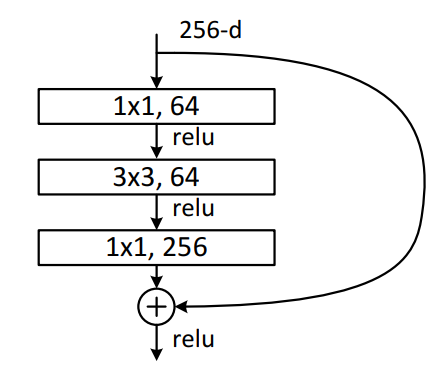{width="2.4825503062117233in"
height="2.071569335083115in"}

图2-3 残差块

残差块的定义如公式(2-1)所示：

  ------------------------------------------------------------- ---------
      $$y = F\left( x,\left\{ W_{i} \right\} \right) + x$$          (2-1)

  ------------------------------------------------------------- ---------

其中x和y是一层的输入和输出向量。函数F(x, {W~i~})表示要学习的残差映射。
图2-3中的例子包含三层，其中F =
W~3~σ(W~2~σ(W~1~x))，σ代表ReLU，F+x操作由一个快捷连接和元素级加法组成。在加法之后再执行一次激活。x和F的维数必须相等，否则要通过快捷连接执行线性投影W~s~
，以匹配维度，如公式(2-2)所示：

  ------------------------------------------------------------- ---------
    $$y = F\left( x,\left\{ W_{i} \right\} \right) + W_{s}x$$       (2-2)

  ------------------------------------------------------------- ---------

多个残差块的堆叠可以使网络更加深层，从而可以学习到更加抽象和丰富的特征表示，提高网络对于输入图像的理解能力，进而提高网络的性能和鲁棒性。

解码器部分由反卷积操作组成，将从编码器中得到的特征图映射回深度图。在解码器的每个反卷积操作之后，会进行一次特征融合，以帮助恢复丢失的高频信息。此外，还会使用一些后处理技术，如Sigmoid激活函数、双线性插值等，帮助减小噪声并提高模型精度。

## 2.2 Attention-UNet图像分割模型 {#attention-unet图像分割模型 .Title}

立木图像分割是立木树高测量系统中最重要的模块之一。本文改进Attention-UNet模型进行语义分割。语义分割是一种典型的计算机视觉问题，其涉及将一些原始数据（例如，平面图像）作为输入并将它们转换为具有突出显示的感兴趣区域的掩模。

Attention-UNet将注意力门集成到U-Net模型中，使网络可以学习注意力权重，并且不需要额外的标签，只增加少量的计算量。Attention-UNet模型的整体框架如图2-4所示，其核心是U-Net的结构，在跨层连接中增加了一个注意力门，经过这个门后再进行特征图拼接操作。编码器中的细粒度信息相对较多，但是很多是冗余的，注意力门相当于是对编码器的当前层进行了一次过滤，抑制图像中的无关信息，突出局部的重要特征。

图2-4 Attention-UNet模型整体框架

注意力门的结构如图2-5所示，两个输入分别是编码器的当前层x^l^和解码器的下一层g，经过1x1的卷积统一通道数，再执行元素级加法，然后经过ReLU激活、1x1的卷积和Sigmoid激活得到注意力系数，再经过一个Resample模块将图像还原到原始尺寸，最后使用注意力系数对特征图进行加权。

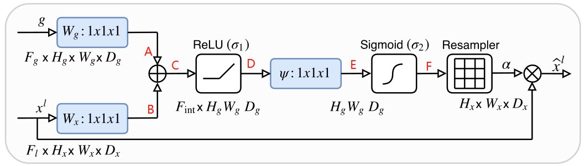{width="4.543872484689413in"
height="1.2923862642169728in"}

图2-5 注意力门^\[74\]^

## 2.3开发环境及工具介绍 {#开发环境及工具介绍 .Title}

### 2.3.1开发环境 {#开发环境 .三级标题}

本文在Windows
10操作系统下，采用Java和Python语言进行开发。在树木图像分割部分使用PyTorch框架^\[76\]^下搭建MidasNet和改进的Attention-UNet网络模型，在三维点云构建和立木点云提取部分结合了Open3D和OpenCV工具库完成相关操作，在树高测量APP部分调用对应的API进行开发。

开发系统：Windows 10

系统硬件：Intel(R) Core(TM) i5-8250U CPU @ 1.60GHz 1.80 GHz；机带RAM
12.0 GB (11.9 GB 可用)

开发工具：Anaconda3、VS Code 1.55.2、Android Studio 4.2

虚拟环境主要的库：Python3.7.4、Torch
1.8.1、Torchvision0.9.1、Numpy1.20.0、Opencv-python4.7.0、Open3D0.16.0

### 2.3.2实验手机 {#实验手机 .三级标题}

本文实验中使用的客户端测试手机是华为荣耀10手机，型号为COL-AL10，HarmonyOS版本为2.0.0，其屏幕和摄像头的主要技术参数如表2-1所示。

表2-1 实验手机主要技术参数

+:----------------:+:-------------------------------------------------:+
| COL-AL10         | 主要参数                                          |
+------------------+---------------------------------------------------+
| CPU              | HiSilicon Kirin 970                               |
+------------------+---------------------------------------------------+
| RAM容量          | 6.0GB                                             |
+------------------+---------------------------------------------------+
| ROM容量          | 128GB                                             |
+------------------+---------------------------------------------------+
| 屏幕             | 屏幕：5.84英寸                                    |
|                  |                                                   |
|                  | 主屏分辨率：2160像素x1080像素                     |
|                  |                                                   |
|                  | 屏幕像素密度：403ppi                              |
+------------------+---------------------------------------------------+
| 摄像头           | 后置：1600万(彩色)+2400万(黑白)像素               |
|                  |                                                   |
|                  | 前置：2400万像素                                  |
|                  |                                                   |
|                  | 光圈：F/2.0光圈镜头                               |
|                  |                                                   |
|                  | 支持自动对焦                                      |
+------------------+---------------------------------------------------+

## 2.4 Android开发 {#android开发 .Title}

本文构建的立木树高测量系统的前端为Android
App，采用Java编写。Android含有许多代码库，本文主要使用ARCore、OkHttp3、Gson和OpenGL进行系统开发。

ARCore是谷歌推出的一款增强现实开发代码库，为开发者构建高质量的、能够在移动设备上运行的AR应用程序提供所需的关键技术和API。ARCore
支持Android
和iOS，它利用摄像头、VIO和计算机视觉技术，实现深度估计、三维重建、增强现实等功能。其中深度估计API利用单个摄像头和DfM算法，通过分析图像信息来计算距离，并返回每个像素点对应的深度，以更准确地根据实际物体的位置和距离来渲染虚拟内容，使得虚拟内容更加贴合现实场景。

OkHttp3是一个处理网络请求的开源代码库，支持HTTP/2以及WebSocket协议。OkHttp3提供了简单易用的API接口，使开发者能够更加轻松地完成HTTP请求和响应处理的工作。该框架能够自动重试失败的请求，并且支持连接池管理，可以重用已经建立的连接以提高性能。支持拦截器机制，可以在HTTP请求和响应过程中添加自定义的逻辑，比如统一认证、加解密等。支持异步请求和响应，可以把耗时的网络请求放到后台线程中处理，避免阻塞主线程，是一款高效、可靠、易于使用的数据传输框架。

Gson用于将Java对象和JSON数据进行相互转换，可以将Java中的任意复杂对象序列化为JSON格式的字符串，包括嵌套的对象、数组和集合等，也可以将JSON格式的数据反序列化为Java对象。允许开发者自定义类型适配器，通过实现JsonSerializer和JsonDeserializer接口来控制Java对象和JSON数据之间的转换过程，是一款强大、灵活、易用的代码库。

OpenGL是一种跨平台的图形库，被广泛应用于Android等操作系统中的图形渲染和游戏开发，支持3D图形渲染，提供了丰富的API接口，可以用于将处理得到的树木点云显示到手机屏幕上，并且可以进行手势控制。

## 2.5 Flask框架 {#flask框架 .Title}

本文构建的立木树高测量系统的后端通过Flask框架实现数据传输。Flask是一款的轻量级Web开发框架，能够实现数据通信请求。Flask内置了Jinja2模板引擎，支持模板继承、过滤器、宏等功能，可以方便地与模板进行交互。提供了简单易用的路由系统，可以快速地设置URL地址与视图函数之间的映射关系。基于WSGI标准，支持与各种Web服务器进行集成。拥有丰富的扩展库，包括表单验证、邮件发送等。

## 2.5本章小结 {#本章小结 .Title}

本章首先介绍了单目深度估计相关理论，依次介绍了DfM算法和MidasNet模型。其次介绍了Attention-UNet图像分割模型。随后介绍了系统的开发环境。最后对立木树高测量模型前端使用的ARCore、OkHttp3、Gson和OpenGL库和后端使用的Flask框架进行了简单的介绍。

# 基于三维重建的立木树高测量方法

## 3.1结合DfM和MidasNet的绝对深度估计方法 {#结合dfm和midasnet的绝对深度估计方法 .Title}

深度估计是一项计算机视觉任务，主要目的是从2D图像中获取对象在3D空间中的深度信息。这个任务依赖于输入图像的RGB信息，输出预测的深度图像，表示从相机到物体之间的距离信息。为了对立木场景进行三维重建，深度估计必不可少。

### 3.1.1 DfM绝对深度估计实现 {#dfm绝对深度估计实现 .三级标题}

DfM算法分为五个步骤：
6DoF姿态和灰度图像序列获取、关键帧筛选、立体校正、立体匹配和密集深度图生成。本文选用ARCore平台实现DfM算法，估计绝对深度。本节将介绍各步骤的实现过程。

#### 3.1.1.1 6DoF姿态获取 {#dof姿态获取 .四级标题}

视觉惯性里程计（Visual-Inertial
Odometry，VIO）算法首先通过将惯性测量单元（Inertial Measurement
Unit，IMU）估计的位姿序列和相机估计的位姿序列对齐，估计出相机轨迹的真实尺度，并预测出图像帧的位姿以及上一时刻特征点在下帧图像的位置，提高特征跟踪算法的匹配速度。

使用VIO算法获取6DoF位姿的流程如图3-1所示，可分为五个阶段：数据预处理、初始化、局部非线性优化、回环检测和全局优化。

在数据预处理阶段，首先使用Harris角点检测算法^\[77\]^提取特征点，再使用金字塔迭代KLT算法^\[78\]^估计光流，跟踪特征点。金字塔迭代KLT算法该算法将原图像分割成一系列不同分辨率的子图像，构成图像金字塔，在金字塔的每一层上运行一个基于KLT（Kanade-Lucas-Tomasi）算法^\[79\]^的光流估计器，以获取当前层的位移偏移量，用于下一层的初始化，然后在上一层的邻域内进行优化以获得更精确的位移偏移量。KLT算法基于三个假设：一是亮度恒定，即图像中某一像素点的亮度在连续帧之间保持不变；二是短时小运动，即极短时间内物体只有微小运动；三是空间一致性，即当前帧中的相邻像素在相邻帧中仍然相邻。

图3-1 VIO算法流程图

KLT算法设一个像素点a在t时刻的坐标为(x,y)，亮度为I(x,y,t)，在很短的时间dt内，点a移动到(x+dx,y+dy)，此时其亮度为I(x+dx,y+dy,t+dt)，根据亮度恒定假设，可得公式(3-1)：

  ------------------------------------------------------------- ---------
             $$I(x,y,t) = I(x + dx,y + dy,t + dt)$$                 (3-1)

  ------------------------------------------------------------- ---------

对上式进行一阶泰勒展开得到公式(3-2)：

  ---------------------------------------------------------------------------------------------------------------------------------------------- ---------
   $$I(x + dx,y + dy,t + dt) = I(x,y,t) + \frac{\partial I}{\partial x}dx + \frac{\partial I}{\partial y}dy + \frac{\partial I}{\partial t}dt$$      (3-2)

  ---------------------------------------------------------------------------------------------------------------------------------------------- ---------

由此可得公式(3-3)：

  ------------------------------------------------------------------------------------------------------------------------------------------------------------------------------------------------------------------------------------------------------- ---------
   $$\frac{\partial I}{\partial x}dx + \frac{\partial I}{\partial y}dy + \frac{\partial I}{\partial t}dt = 0 \Leftrightarrow \frac{\partial I}{\partial x}\frac{dx}{dt} + \frac{\partial I}{\partial y}\frac{dy}{dt} = - \frac{\partial I}{\partial t}$$      (3-3)

  ------------------------------------------------------------------------------------------------------------------------------------------------------------------------------------------------------------------------------------------------------- ---------

令$(u,v) = (\frac{dx}{dt},\frac{dy}{dt})$，即为所要求解的像素光流；令$(I_{x},I_{y}) = (\frac{\partial I}{\partial x},\frac{\partial I}{\partial y})$，即为像素灰度空间微分；令$I_{t} = \frac{\partial I}{\partial t}$，即为像素坐标点的时间灰度微分，整理为矩阵形式可得公式(3-4)：

  ------------------------------------------------------------- ---------
                        $$\begin{bmatrix}                           (3-4)
                          I_{x} & I_{y}                         
                  \end{bmatrix}\begin{bmatrix}                  
                              u \\                              
                                v                               
                    \end{bmatrix} = - I_{t}$$                   

  ------------------------------------------------------------- ---------

根据空间一致性假设，对像素点a周围的多个点，有公式(3-5)：

  ------------------------------------------------------------- ---------
                        $$\begin{bmatrix}                           (3-5)
                       I_{x1} & I_{y1} \\                       
                       I_{x2} & I_{y2} \\                       
                         \begin{matrix}                         
                            I_{x3} \\                           
                             \vdots                             
                  \end{matrix} & \begin{matrix}                 
                            I_{y3} \\                           
                             \vdots                             
                          \end{matrix}                          
                  \end{bmatrix}\begin{bmatrix}                  
                              u \\                              
                                v                               
                \end{bmatrix} = - \begin{bmatrix}               
                            I_{t1} \\                           
                            I_{t2} \\                           
                         \begin{matrix}                         
                            I_{t3} \\                           
                             \vdots                             
                          \end{matrix}                          
   \end{bmatrix} \Longleftrightarrow A\overrightarrow{d} = b$$  

  ------------------------------------------------------------- ---------

若在这些点构成的窗口中包含两条以上的边缘，则上式可解。通过公式(3-6)求解最小化的$\left\| Ad - b \right\|^{2}$：

  ------------------------------------------------------------- ---------
               $$\left( A^{T}A \right)d = A^{T}b$$                  (3-6)

  ------------------------------------------------------------- ---------

由公式(3-6)可得像素光流，即像素点在x和y方向上的位移量，当(ATA)可逆时，像素光流的解如公式(3-7)所示：

  ------------------------------------------------------------- ---------
                        $$\begin{bmatrix}                           (3-7)
                              u \\                              
                                v                               
       \end{bmatrix} = \left( A^{T}A \right)^{- 1}A^{T}b$$      

  ------------------------------------------------------------- ---------

上式中A^T^A称作空间梯度矩阵，A^T^b称作图像差矩阵。

金字塔迭代 KLT
算法迭代地使用KLT算法，在图像J中找到图像I中某坐标点x的对应点，实现特征点跟踪，其伪代码总结在算法1中：

+---------------------------------------------------------------------------------------------------------------------------------------------------------------------------------------------------+
| **算法1 金字塔迭代 KLT 算法伪代码**                                                                                                                                                               |
+---------------------------------------------------------------------------------------------------------------------------------------------------------------------------------------------------+
| **输入：**图像I中某坐标点x                                                                                                                                                                        |
|                                                                                                                                                                                                   |
| **输出：**图像J中的对应点$x'$                                                                                                                                                                     |
|                                                                                                                                                                                                   |
| 1.  建立图像金字塔{I^L^}，{J^L^}，L=0,1,...,L~m~                                                                                                                                                  |
|                                                                                                                                                                                                   |
| 2.  初始化光流在金字塔之间的传递值$f^{L_{m}} = {\lbrack f_{x}^{L_{m}},f_{y}^{L_{m}}\rbrack}^{T} = {\lbrack 0,0\rbrack}^{T}$                                                                       |
|                                                                                                                                                                                                   |
| 3.  for(L=L~m~;L≥0;L-=1){                                                                                                                                                                         |
|                                                                                                                                                                                                   |
| 4.  计算空间梯度矩阵M                                                                                                                                                                             |
|                                                                                                                                                                                                   |
| 5.  初始化KLT迭代值$\alpha^{0} = {\lbrack 0,0\rbrack}^{T}$                                                                                                                                        |
|                                                                                                                                                                                                   |
| 6.  for(k=1;k≤K或$\left\| \beta^{k} \right\|$\<预设阈值;k+=1){                                                                                                                                    |
|                                                                                                                                                                                                   |
| 7.  计算图像差矩阵$E_{k} = I^{L}\left( X^{L} \right) - J^{L}\left( X^{L} \right) = I^{L}(x,y) - J^{L}(x + f_{x}^{L} + \alpha_{x}^{k - 1},y + f_{y}^{L} + \ \ \ \ \ \ \ \ \ \ \alpha_{y}^{k - 1})$ |
|                                                                                                                                                                                                   |
| 8.  计算光流$\beta^{k} = M^{- 1}E_{k}$                                                                                                                                                            |
|                                                                                                                                                                                                   |
| 9.  更新下次迭代的初值$\alpha^{k} = \alpha^{k - 1} + \beta^{k}$                                                                                                                                   |
|                                                                                                                                                                                                   |
| 10. }                                                                                                                                                                                             |
|                                                                                                                                                                                                   |
| 11. 第L层金字塔的光流$\mathbb{d}^{L} = \alpha^{k}$                                                                                                                                                |
|                                                                                                                                                                                                   |
| 12. 初始化第L−1层金字塔的光流$f^{L - 1} = {\lbrack f_{x}^{L - 1},f_{y}^{L - 1}\rbrack}^{T} = 2(f^{L} + d^{L})$                                                                                    |
|                                                                                                                                                                                                   |
| 13. }                                                                                                                                                                                             |
|                                                                                                                                                                                                   |
| 14. 最终的光流结果$d = f^{0} + d^{0}$                                                                                                                                                             |
|                                                                                                                                                                                                   |
| 15. 对应的图像J上的坐标点$x' = x + d$                                                                                                                                                             |
+---------------------------------------------------------------------------------------------------------------------------------------------------------------------------------------------------+

对IMU数据进行预积分，得到当前时刻的位姿、速度和角速度，同时计算在后续优化中所需的相邻帧间的预积分增量。

在初始化阶段，首先进行视觉初始化，解算出相机的相对位姿，随后与IMU预积分进行对齐，进一步求解初始化参数。

在局部非线性优化阶段，通过最小化包含当前帧和之前 n
帧的窗口中所有变量的大目标函数来同时考虑视觉约束和 IMU
约束。这个优化过程将对所有变量进行迭代求解，以输出较为精确的相机位姿。

在回环检测阶段，保存之前筛选的图像关键帧，当相机再次经过相同区域时，通过特征点的匹配关系判断是否访问过此区域。关键帧的选择标准是当前帧相对上一帧的位移量超过设定的阈值或匹配的特征点数小于预设的阈值。

全局优化是在回环检测阶段，使用相机约束、IMU约束和回环检测约束来对之前的所有相机位姿进行非线性优化。全局优化是基于局部优化进行的，能够输出更加精确的相机位姿。

#### 3.1.1.2关键帧筛选 {#关键帧筛选 .四级标题}

DfM算法需要维护一个固定容量的潜在关键帧池，如果六自由度姿态跟踪成功，就将每个新捕获的帧添加到该池中，替换过时的帧。为了从池中选择最佳关键帧，使用以下成本度量标准定义一个间接成本函数：

该多维成本函数从关键帧池K中选择与最新参考图像r配对的关键帧k，使总成本最小，如公式(3-8)所示：

  --------------------------------------------------------------------------------------------------------------------- ---------
   $$\underset{k \in K}{argmin}\frac{\omega_{b}}{b_{r,k}} + \omega_{a}\left( 1 - a_{r,k} \right) + \omega_{e}e_{r,k}$$      (3-8)

  --------------------------------------------------------------------------------------------------------------------- ---------

其中，b~r,k~是帧r与k之间的基线距离，此变量越大越好；权重ω~b~设置为0.4，严格限制允许的最小基线距离为4厘米；a~r,k~是帧r和k的重叠部分的大小，这个值被期望最大化，使用ω~a~进行加权。尽管仅有部分重叠的帧也可能匹配成功，但是更大的重叠区域可以减少对深度值向目标图像的其他部分外推的需求，因此设置ω~a~
=
0.8，并且设定了允许的最小重叠阈值为40%；e~r,k~是两帧的姿态跟踪误差，该变量越小越好。如果某一帧对应的6DoF姿态具有较低的置信度，则该帧不会被添加到关键帧池中，然而即使具有高置信度的候选关键帧与最新参考帧也会存在相对误差，因此设置权重ω~e~为0.5，以确保所选关键帧与最新参考帧之间的测量速度方差不超过5×10^−4^m/s，且测量加速度偏差不超过0.2m/s^2^。接下来对选择的关键帧进行立体校正。

#### 3.1.1.3立体校正 {#立体校正 .四级标题}

给定两个相机及其各自的姿态，可以通过估计其基础矩阵F来描述它们对应于真实世界中的一点X的像素之间的关系。对于来自点X投影的两个对应像素x和x′，可以观察到x′在直线l′=Fx上，进而将对应点搜索问题限制在一维。双目视觉中的极点可以通过对基础矩阵进行奇异值分解来计算，而在单目视觉中，由于只有一个图像，极点可以位于任意位置，传统的平面校正可能无法处理，因此使用极坐标校正技术^\[80\]^。极坐标校正算法根据一对图像及其相对位姿，将这些图像校正为极线平行，并且对应的极线具有相同的垂直坐标。

立体匹配假设对于左矫正图像中的点(x，y)，其对应点在右矫正图像中的坐标为(x\'，y)，满足x\'\<x并且τ~min~\<x−x\'\<τ~max~，即存在预定义的视差值范围\[τ~min~,
τ~max~\]，其中τ~min~$\in$\[5,10\]，τ~max~是最大视差，此处为40。然而，使用极坐标校正后的图像可能会得到负的视差，如图3-2所示，或者出现视差超过τ~max~的情况，导致这个假设被打破，因此需要进行一次位移，使视差值落在有效范围内。首先，给定预期的视差范围\[τ~min~,
τ~max~\]，从基础矩阵中估计用左或右图像作为参考图像时所需的视差范围\[τ^L^~min~,
τ^L^~max~\]和\[τ^R^~min~,
τ^R^~max~\]，然后根据哪种配置需要最小的位移量和估计的视差符号这两个因素，在两张图像中选择一张作为参考图像，确定所需的水平位移量，以使图像的视差范围适合于预期的\[τ~min~，τ~max~\]视差范围内，如果预期的视差范围太小而不足以容纳当前图像对，可以相应地调整校正后的图像大小。接着将另一张图像中的所有特征点投影到参考图像上得到极线，对于每条极线，在参考图像和非参考图像中找到其对应的区域，使得两个区域之间具有最大的相关性，求出位于极线上的中心点。通过这些中心点计算仿射变换，将非参考图像中的所有像素映射到参考图像上，最后消除校正过程中产生的重叠区域，生成校正后的图像。整个处理过程采用的是极坐标参数化形式，可以在不考虑物体深度的情况下完成矫正，适用于各种不同的相机运动和场景。

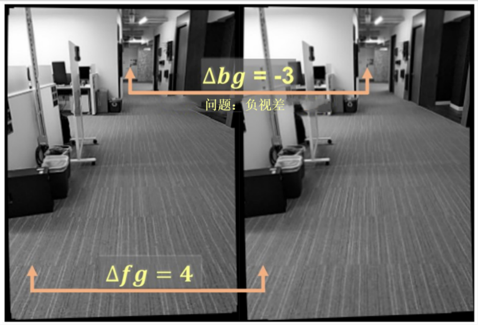{width="4.25in"
height="2.892361111111111in"}

图3-2 负视差情况

当极点位于图像内部时，由于极点周围的像素点容易导致匹配错误，因此要事先将极点周围的一部分像素设置成无效像素，不参与视差计算，此处设置这个像素区域的半径为20个像素。在这个阶段，无论智能手机所经过的轨迹如何，都会得到一组校正后的图像。下一部分介绍如何对这些校正后的图像进行立体匹配。

#### 3.1.1.4立体匹配 {#立体匹配 .四级标题}

在立体深度估计中，假设解的可信度可以由指数族条件概率获得，如公式(3-9)所示：

  --------------------------------------------------------------- ---------
   $$P\left( Y \middle| D \right) = \frac{1}{Z(D)}e^{- E(Y|D)}$$      (3-9)

  --------------------------------------------------------------- ---------

其中E(Y\|D)可分解为公式(3-10)：

  ------------------------------------------------------------------------------------------------------------------------------------------------------------------------------ ---------
   $$E\left( Y \middle| D \right) = \sum_{i}^{}{\Psi_{u}\left( y_{i} = l_{i} \right) +}\sum_{i}^{}{\sum_{j \in N_{i}}^{}{\Psi_{p}\left( y_{i} = l_{i},y_{j} = l_{j} \right)}}$$     (3-10)

  ------------------------------------------------------------------------------------------------------------------------------------------------------------------------------ ---------

公式(3-10)称作成对条件随机场（pairwise-CRF），其中Y:={y~1~,...,y~n~}是与像素{x~1~,...,x~n~}关联的潜在变量集合，每个y~i~$\in$Y可以取L中的值，L是R的子集，对应于视差；N~i~是相邻于像素i的像素集；ψ~u~是一元势（unary
potential），在通过立体匹配估计深度时，衡量像素是否可能对应；ψ~p~称为成对势（pairwise
potential），并作为一个正则化项，鼓励分段平滑的解，使得相邻像素之间的视差值差异不会过于剧烈，而是趋于连续。这种分解方法使得属于同一水平线（如图3-3中绿色部分所示）的任何像素相互独立。对于像素p，可以通过评估当前在p处的粒子以及p的邻居处的粒子（如图3-3中黑色部分所示）来更新其预测值，更新后的解是最小化该局部CRF的粒子。

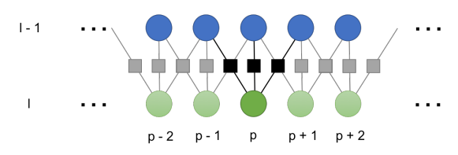{width="5.349009186351706in"
height="1.8134853455818023in"}

图3-3 分解方法图示

DfM算法采用一种专为现代CPU指令集量身定制的传播策略，依赖单指令多数据（SIMD）指令集结构实现立体匹配的高效运行，并使用HashMatch^\[81\]^的一元势，使用截断线性成对势作为成对势，并使用HashMatch和PatchMatch^\[82\]^的混合形式来优化E(Y\|D)，适合SIMD架构。该算法顺序执行k（k$\in$\[2,
4\]）个传播通道，每个通道都利用底层向量体系结构的数据并行性。在偶数通道中，每个像素会考虑其上方三个邻居的假设，例如像素(x，y)会考虑来自(x-1，y-1)、(x，y-1)和(x+1，y-1)的假设，以及当前存储的假设。在奇数通道中，每个像素会考虑其下方三个邻居，以及当前存储的假设。行被依次处理，从偶数通道的图像顶部开始，到奇数通道的底部结束。因此给定行中的所有像素都与该行中的所有其他像素无关，可以进行并行处理。

通过对成对CRF进行近似最大后验概率（approximate maximum a
posteriori，aMAP）推理，可以为图像中的每个像素估计一个视差值。然而，当场景缺乏纹理（如白色墙壁）或包含重复纹理时，相应像素的MAP解可能会出现错误，因此使用Ultrastereo匹配算法^\[83\]^中的遮挡惩罚损失技术（Occlusion-aware
loss）来使这样的像素，即视差空间中的小连通区域无效，从而得到稳定的深度图，如图3-4所示，其中图(a)是立体校正后的图像，图(b)使用成对CRF推理得到的视差图，图(c)是进行连通区域无效后的视差图。遮挡惩罚损失技术将此无效操作建模为一个分类问题，将有效像素标记为1，无效像素标记为-1，只有被标记为1的像素会被用来计算损失函数，而其他的像素则被忽略。

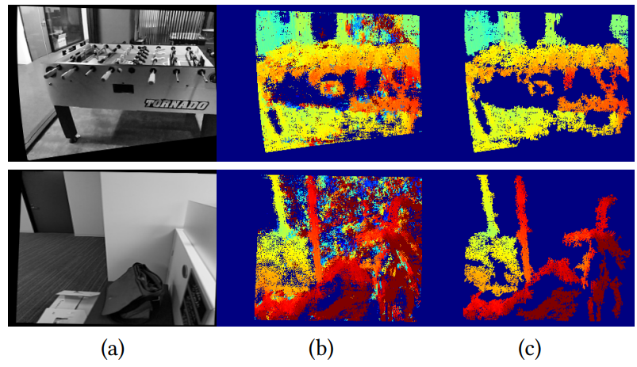{width="4.357273622047244in"
height="2.511959755030621in"}

图3-4 对视差空间进行连通区域无效操作

DfM算法运用决策树^\[84\]^确定哪些像素应该被无效化，进而实现连通区域无效操作，以最小化所需的计算资源。决策树由分裂的节点和叶子组成，每个分裂节点n存储一个"弱学习器"。为了对像素p进行推理，从树的根开始计算，如公式(3-11)所示：

  ------------------------------------------------------------- ---------
               $$s(p,n) = \left\{ \begin{array}{r}                 (3-11)
          1,f\left( p,\theta_{n} \right) > \tau_{n} \\          
          - 1,f\left( p,\theta_{n} \right) \leq \tau_{n}        
                     \end{array} \right.\ $$                    

  ------------------------------------------------------------- ---------

其中，f(p,$\theta_{n}$)表示由当前像素点p和光流方向$\theta_{n}$计算得到的运动响应，$\tau_{n}$是一个阈值，用于控制对运动响应的筛选。因此，当运动响应不超过阈值时，表示当前像素点与光流方向的运动强度较小，被认为是无效的像素点，指示函数就会返回-1，推断将在节点n的左子节点继续进行，否则在右子节点上进行，重复此过程直到叶子节点，其中包含了对预测空间的二元概率分布，如此进行无效化。

选择f作为位于p周围的两个像素索引的值之间的点积。$\theta_{n}$和$\tau_{n}$的值被贪心优化以最大化信息增益，如公式(3-12)所示：

  ------------------------------------------------------------------------------------------------------------------- ---------
   $$IG\left( \theta_{n},\ \tau_{n} \right) = E(S) - \sum_{c \in L,R}^{}{\frac{\left| S_{c} \right|}{|S|}E(S_{d})}$$     (3-12)

  ------------------------------------------------------------------------------------------------------------------- ---------

其中，E表示信息熵，L和R分别为节点n的左右子节点。最后，每个叶子节点存储每个像素有效或无效的概率。

得到无异常值的视差图后，就可以推断深度了。当使用平面校正时，假设有一个视差d、一个基线b和一个焦距f，深度Z通过公式(3-13)计算得到。

  ------------------------------------------------------------- ---------
                      $$Z = \frac{bf}{d}$$                         (3-13)

  ------------------------------------------------------------- ---------

然而，在极点校正的情况下，无法使用这种闭式解，DfM算法采用文献\[85\]中一种视差到深度的线性转换方法解决此问题。该线性方法假设相机的投影矩阵和基础矩阵已知，并使用视差进行线性加权，以快速计算每个像素点的深度值。

#### 3.1.1.5密集深度图生成 {#密集深度图生成 .四级标题}

前述部分从关键帧序列计算得到高精度的深度图，但是这些深度图是稀疏的，且存在仅包含强纹理区域的信息、时间不一致、与彩色图边缘不对齐的问题。本节使用平面双边滤波器生成密集，时间稳定和边缘对齐的深度图。

DfM算法使用改进的"硬件友好"变体双边滤波器^\[86\]^，在极低延迟输出的同时保持边缘感知性能。双边滤波器被定义为一个关于参考图像r（来自相机的灰度图像）、带有噪声观测值的目标图像t（噪声深度图）和置信图像c（决策树生成的无效化轮廓的逆）的优化问题，如公式(3-14)所示：

  ----------------------------------------------------------------------------------------------------------------------------------------------- ---------
   $$\underset{x}{minimize}{\frac{\lambda}{2}\sum_{i,j}^{}{{\widehat{W}}_{i,j}{(x_{i} - x_{j})}^{2} +}}\sum_{i}^{}{c_{i}{(x_{i} - t_{j})}^{2}}$$     (3-14)

  ----------------------------------------------------------------------------------------------------------------------------------------------- ---------

其中，第一项鼓励所有像素对(i,
j)根据双边亲和矩阵${\widehat{W}}_{i,j}$和平滑参数λ（在实验中设置为4）进行平滑。当c~i~较大时，第二项鼓励每个x~i~接近每个t~i~。$\widehat{W}$矩阵是双边亲和矩阵W的双随机形式，其中每个W~i,\ j~定义为公式(3-15)：

  -------------------------------------------------------------------------------------------------------------------------------------------------------------- ---------
   $$W_{i,j} = exp( - \frac{{(p_{i}^{x} - p_{j}^{x})}^{2} + {(p_{i}^{y} - p_{j}^{y})}^{2}}{2\sigma_{xy}^{2}} - \frac{{(r_{i} - r_{j})}^{2}}{2\sigma_{r}^{2}})$$     (3-15)

  -------------------------------------------------------------------------------------------------------------------------------------------------------------- ---------

其中对于每个像素i， ($p_{i}^{x}$, $p_{i}^{y}$)是它的(x,
y)位置，r~i~是它在参考图像r中的灰度，这些空间和强度维度由带宽参数$\sigma_{xy}$和$\sigma_{r}$调制，在实验中均设置为16，exp()表示以自然常数e为底的指数函数。

大而密集的双随机双边亲和矩阵可以用双边网格的紧凑分解来表示，见公式(3-16)：

  ------------------------------------------------------------- ---------
   $$\widehat{W} = S^{T}diag(\frac{n}{m})Bdiag(\frac{n}{m})S$$     (3-16)

  ------------------------------------------------------------- ---------

其中矩阵S用于下采样（splat）形成双边网格；B用于沿双边网格的三个维度进行模糊滤波，其值为\[1,2,1\]；矩阵ST用于上采样（slice）提高双边网格的分辨率；向量m和n诱导归一化，使$\widehat{W}$近似为双随机；diag()表示构建对角矩阵。通过这种分解，可以执行从像素空间到双边空间的变量替换，如公式(3-17)所示：

  ------------------------------------------------------------- ---------
                         $$x = S^{T}y$$                            (3-17)

  ------------------------------------------------------------- ---------

其中x包含每个像素的值，y包含每个双边网格顶点的值。

将公式(3-14)中昂贵的像素空间优化问题转化为可处理的双边空间优化问题，见公式(3-18)\~(3-21)：

  -------------------------------------------------------------------- ---------
       $$\underset{y}{minimize}\frac{1}{2}y^{T}Ay - b^{T}y + c$$          (3-18)

   $$A = \lambda\left( diag(m) - diag(n)Bdiag(n) \right) + diag(Sc)$$     (3-19)

                          $$b = S(c \circ t)$$                            (3-20)

                 $$c = \frac{1}{2}{(c \circ t)}^{T}t$$                    (3-21)
  -------------------------------------------------------------------- ---------

其中，y为问题在双边空间中的解，◦为哈达玛积。通过求解一个稀疏线性矩阵，并进行变量替换以得到原始问题的解，最终得到公式(3-22)：

  ------------------------------------------------------------- ---------
                $$\widehat{x} = S^{T}(A^{- 1}b)$$                  (3-22)

  ------------------------------------------------------------- ---------

双边滤波器生成每个像素的标签，表示该像素属于哪个平面，该标签与数据项一起最小化空间上相邻且具有相似灰度的像素的平方距离。因此，该求解器的输出（忽略数据项）是包含单个恒定值的图像，在立体成像环境下这意味着该求解器会强烈地偏向产生前后平行的深度图。这种偏向是有问题的，因为真实世界的环境经常包含光滑或平坦但不是前后平行的表面，如地板、墙壁和天花板。如果存在这种表面，双边滤波器的输出可能会出现明显错误，导致缩短的表面被错误地恢复为面向相机的垂直平面，如图3-5(c)所示。

  -------------------------------------------------------------- --------------------------------------------------- ------------------------------------------------------------- --------------------------------------------------------------
  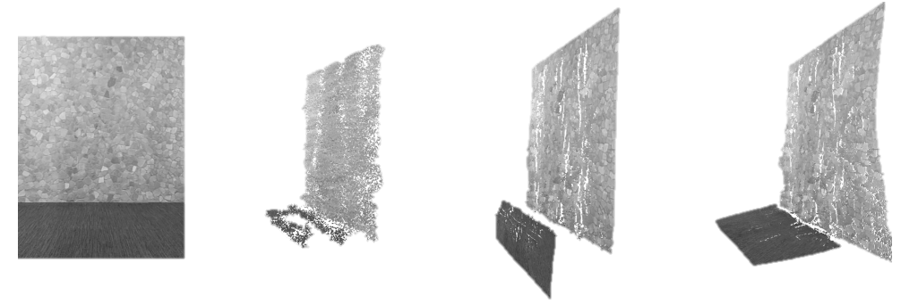{width="1.6611111111111112in"   {width="1.21875in"   {width="1.570138888888889in"   {width="1.5229166666666667in"
  height="2.214583333333333in"}                                  height="2.214583333333333in"}                       height="2.09375in"}                                           height="2.03125in"}

  (a)输入图像                                                    (b)稀疏点云                                         (c)双边滤波器的输出                                           (d)平面双边滤波器的输出
  -------------------------------------------------------------- --------------------------------------------------- ------------------------------------------------------------- --------------------------------------------------------------

图3-5 双边滤波器与平面双边滤波器输出对比

DfM算法将双边滤波器嵌入到每个像素平面拟合算法中，双边滤波器的最小一阶变化假设会导致该算法的最终输出具有较低的二阶变化，该方法称作平面双边滤波器。通过使用双边滤波器作为聚合平面拟合信息的引擎，可以进行全局和边缘感知的平面拟合，使得恢复的深度图将缩短的表面解释为斜面。

此外，DfM算法使用类似因果型无限脉冲响应（causal
IIR）的方法实现时间连续性，即相邻帧之间的视觉一致性，跟踪估计得到的深度的双边网格，并使用双边滤波器在每个输入帧上的输出重复更新该双边网格，这种方法可以实时运行。

本文使用ARCore提供的API估计绝对深度，获取与当前帧相对应的深度图。深度图的格式为HardwareBuffer.D_16，是一个索引为0的16位平面，以小端格式存储。每个像素的值即为物体到相机平面的距离（以毫米为单位），可表示的深度范围在0毫米到65535毫米之间，即大约65米，可以满足树木三维重建的需要。

使用DfM算法估计得到的绝对深度图如图3-6所示，虽然该算法能得到准确的深度，但是由于其使用平面双边滤波器对立体匹配得到的稀疏深度图进行密集化，导致深度图中物体边缘较模糊。

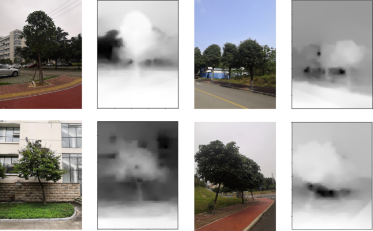{width="3.9493055555555556in"
height="2.4479166666666665in"}

图3-6 粗糙绝对深度图

实验证明，直接使用粗糙绝对深度图重建出的三维模型无法正确反应现实世界的树木场景，并影响最终的树高测量精度，如图3-7所示。

  -------------------------------------------------------------- -------------------------------------------------------------
  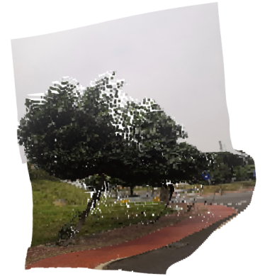{width="1.7137117235345583in"   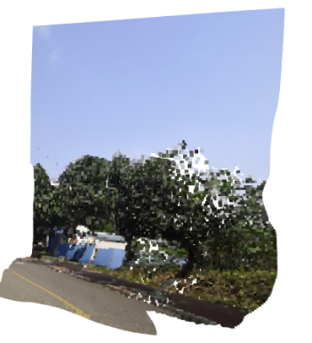{width="1.605984251968504in"
  height="1.7833234908136484in"}                                 height="1.7591218285214347in"}

  -------------------------------------------------------------- -------------------------------------------------------------

图3-7 失真的三维模型

### 3.1.2 MidasNet相对深度估计模型训练 {#midasnet相对深度估计模型训练 .三级标题}

针对DfM算法估计的绝对深度图的边缘模糊问题，本文选用MidasNet模型获取边缘清晰的相对深度图，用于生成边缘明确的绝对深度图，从而提高三维重建的精度。

#### 3.1.2.1数据集预处理 {#数据集预处理 .四级标题}

目前已有各种公开的单目深度数据集，这些数据集在场景、深度获取方式、深度数据单位、图像尺寸等方面都存在差异。为了确保深度估计模型的准确性和鲁棒性，本文使用多种单目相对深度数据集，包括MegaDepth^\[87\]^、ReDWeb^\[88\]^和WSVD^\[89\]^，这些数据集的特征如表3-1所示。

表3-1 数据集特征

  ----------- ---------- ---------- ------------ --------------
    数据集     室内场景   室外场景   密集深度图   深度获取方式

   MegaDepth      无         有          是           SfM

    ReDWeb        有         有          是          光流法

     WSVD         有         有          是          光流法
  ----------- ---------- ---------- ------------ --------------

由于不同数据集的深度尺度各异，需要进行归一化处理，如公式(3-22)所示：

  ------------------------------------------------------------- ---------
           $$d_{norm} = \frac{d}{max(d)} \times 255$$              (3-22)

  ------------------------------------------------------------- ---------

其中，d是原始深度，其取值范围为\[0,+∞)
，d~norm~是归一化的深度，其取值范围为
\[0,255\]。预处理后的部分数据如图3-8所示。

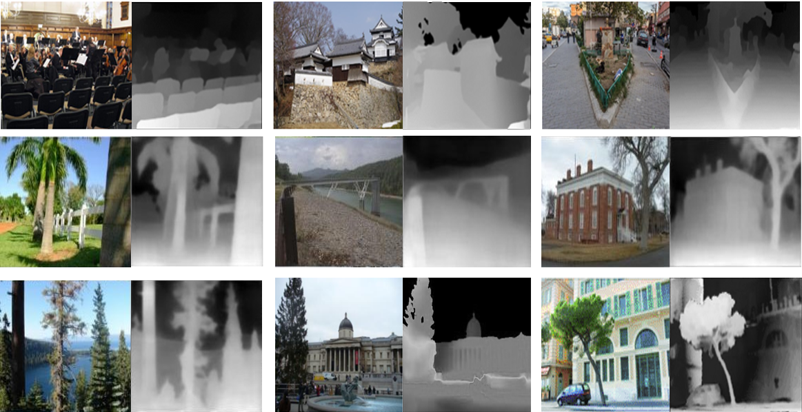{width="6.536111111111111in"
height="3.3645833333333335in"}

图3-8 部分深度估计数据

#### 3.1.2.2模型训练 {#模型训练 .四级标题}

编码器的主要任务是从输入图像中提取有意义的特征表示，而这些特征表示对于不同的视觉任务是通用的。因此使用在
ImageNet
图像分类数据集上预训练的模型权重来初始化编码器，帮助网络更快地学习到图像通用的特征表示，从而提高训练效果。相比之下，解码器负责将编码器提取的特征映射还原成深度图，因此对其使用与深度估计任务无关的预训练权重初始化不会带来显著的性能提升，反而可能会影响预测的准确性，故对解码器进随机初始化。

由于编码器已经学习到了大量的通用特征和知识，因此设置学习率为10^-5^，防止过拟合，而解码器是随机初始化的，因此需要更大的学习率来调整其权值，设置为10^-4^，以使其更好地适应深度估计任务。使用Adam进行随机梯度下降，并将指数衰减率设置为β~1~=0.9和β~2~=0.999。批大小设置为8，迭代次数设置为300，按照8:1:1的比例划分数据集，得到训练集、验证集和测试集的样本数分别为2880、360、360。训练过程中应用图像增强，使图像以50%的概率水平翻转，随机裁剪并调整尺寸为384×384。采用尺度和移位不变损失函数，提高信息利用率。

设M表示具有有效真值的图像中的像素数，$\widehat{d}$和${\widehat{d}}^{\ast}$分别是深度的预测值和真实值。将尺度和移位不变损失函数定义为公式(3-23)：

  ----------------------------------------------------------------------------------------------------------------------------------------- ---------
   $$L\left( \widehat{d},{\widehat{d}}^{\ast} \right) = \frac{1}{2M}\sum_{i = 1}^{M}{({\widehat{d}}_{i} - {\widehat{d}}_{i}^{\ast})}^{2}$$     (3-23)

  ----------------------------------------------------------------------------------------------------------------------------------------- ---------

训练过程中损失值和精度的变化如图3-9所示。

  -------------------------------------------------- --------------------------------------------------------------
  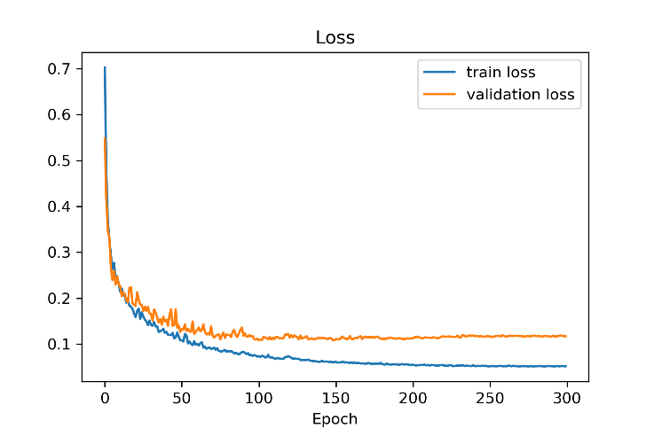{width="3.1875in"   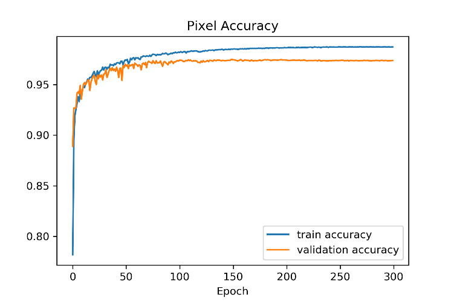{width="3.1743055555555557in"
  height="2.2708333333333335in"}                     height="2.2604166666666665in"}

  (a)损失函数变化趋势                                (b)精度变化趋势
  -------------------------------------------------- --------------------------------------------------------------

图3-9 模型训练过程

#### 3.1.2.3相对深度估计测试 {#相对深度估计测试 .四级标题}

在深度估计有三个常用的阈值1.25、1.25^2^和1.25^3^，在比较预测的深度d和真实的深度d\*时，本文采用阈值精度（Accuracy
with threshold）作为深度估计结果的评价指标，选取d/d\* 和
d\*/d中的最大值，再选择大于该值的阈值thr，计算所有\|d-d\*\|小于thr的像素点占总体像素点的百分比，即为阈值精度，其值越大说明估计效果越好。当阈值更低时，阈值精度会降低，但这并不代表模型表现差，而是因为更低的阈值对应着更小的深度误差范围。经过训练后，当阈值为1.25时，MidasNet模型在测试集上的阈值精度达到了91.21%，预测效果较准确。部分相对深度估计结果如图3-10所示，可以观察到相对于3.1.1节得到的绝对深度图，相对深度图的边缘更加清晰。

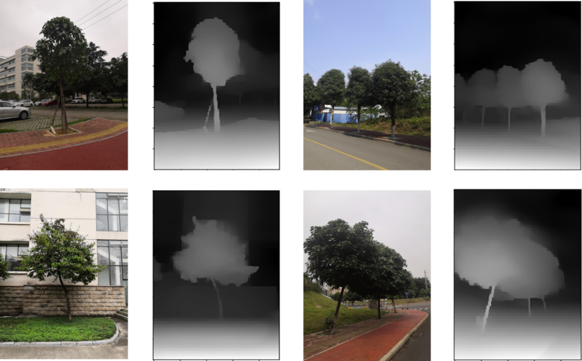{width="4.715972222222222in"
height="2.9270833333333335in"}

图3-10 精细相对深度图

### 3.1.3 绝对深度与相对深度的融合 {#绝对深度与相对深度的融合 .三级标题}

使用DfM算法得到的深度图可以正确反应物体表面到相机的距离，但是边缘模糊，不利于三维重建，使用MidasNet模型估计的深度图可以较好的保留边缘信息，但是深度的尺度未知，无法恢复树木的真实尺寸。因此本文结合两者的优势，提出一种使用绝对深度图校准相对深度图尺度的方法。

相对深度和绝对深度存在一种映射关系，如公式(3-24)所示：

  ------------------------------------------------------------- ---------
                  $$A = scale \cdot R + swift$$                    (3-24)

  ------------------------------------------------------------- ---------

其中A表示绝对深度，R表示相对深度，scale表示缩放比例，swift表示位移系数，缩放比例和位移系数是需要求解的参数，本文通过对3.1节和3.2节得到的两张深度图进行数据拟合来获取这两个参数，再代入公式(3-24)即可得到校准深度图A~1~。图3-11是A与A~1~中同一列像素深度的变化曲线，其中aligned
depth是由相对深度经过缩放和位移得到的校准深度，而absolute
depth是DfM得到的绝对深度，可见校准深度已经和绝对深度具有相同的尺度。

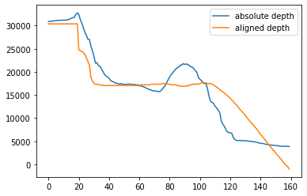{width="3.8986953193350833in"
height="2.4919466316710412in"}

图3-11 深度校准结果

A~1~同时具有A的深度尺度确定性和R的物体边缘明确性，能够与彩色图融合得到较好的三维重建结果。图3-12对比了三种深度图，其中，精细绝对深度图的像素值在尺度上和粗糙绝对深度图相同，而在外观上与精细相对深度图类似。

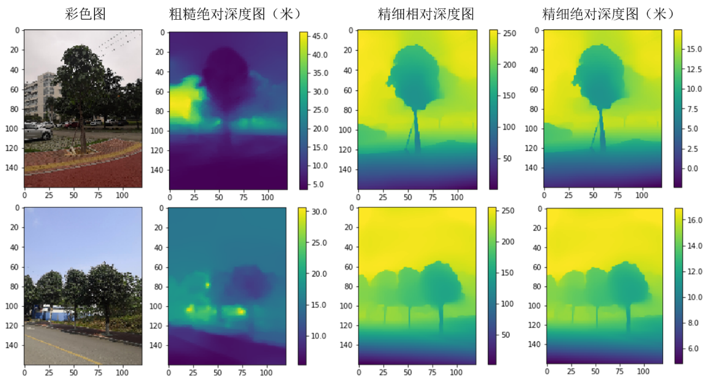{width="6.125in"
height="3.3020833333333335in"}

图3-12 深度图对比

## 3.2改进Attention-UNet的树木图像分割模型 {#改进attention-unet的树木图像分割模型 .Title}

通过图像分割得到树木轮廓，就可以从三维点云中提取相应的立木点云以测量树高。图像分割直接影响到提取得到的立木点云的准确性和完整性，最终影响树高测量的结果，因此实现精确的树木图像分割是十分重要的。Attention-UNet模型虽然通过引入注意力机制突出局部特征，可以在一定程度上缓解复杂背景对树木分割的影响，但是当两棵树的树冠出现局部交错或遮挡情况时，Attention-UNet模型通常无法正确分割，影响树高测量精度，因此本节对该模型进行改进，提高其在树木图像分割任务上的性能。

### 3.2.1 Attention-UNet图像分割模型的改进 {#attention-unet图像分割模型的改进 .三级标题}

本文根据树木之间存在深度差异的特征，引入深度信息作为Attention-UNet的输入，进行多模态特征融合，为模型提供更丰富的信息，通过强调树冠间的深度差异缓解树冠交错对树木图像分割的干扰，改进后的模型称作Depth-Attention-UNet，其结构如图3-13所示。Attention-UNet仅有一个彩色图输入，本文引入深度图作为网络的另一个输入，即虚线框中的部分。编码器分别接收并处理彩色图和深度图，在每一层中，先分别进行两次卷积和激活操作得到RGB
特征图和深度特征图，再进行一次特征融合，但融合结果不输入下一层，而是在每一个阶段都以跳跃连接的方式传送到解码器的注意力门，对两种模态特征进行互补利用，提高重要特征的筛选能力。

图3-13 Depth-Attention-UNet模型结构图

### 3.2.2数据集的制作 {#数据集的制作 .三级标题}

#### 3.2.2.1原始图片采集和预处理 {#原始图片采集和预处理 .四级标题}

本文首先使用智能手机在校园内拍摄了300张不同环境下的不同种类的树，图片原始尺寸为3456×4608。为提高模型训练效率，对原始图像进行缩小和添加灰色区域操作，得到尺寸为512×512的图像，部分数据如图3-14所示。

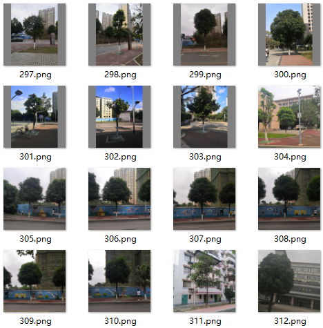{width="3.579261811023622in"
height="3.6327963692038496in"}

图3-14 部分树木彩色图像

#### 3.2.2.2数据标注 {#数据标注 .四级标题}

本文采用Labelme标注彩色图像中的树木区域，标签设置为"tree"，Labelme自动生成该图片对应的JSON文件。如图3-15所示。

  ------------------------------------------------------------- --------------------------------------------------------------
  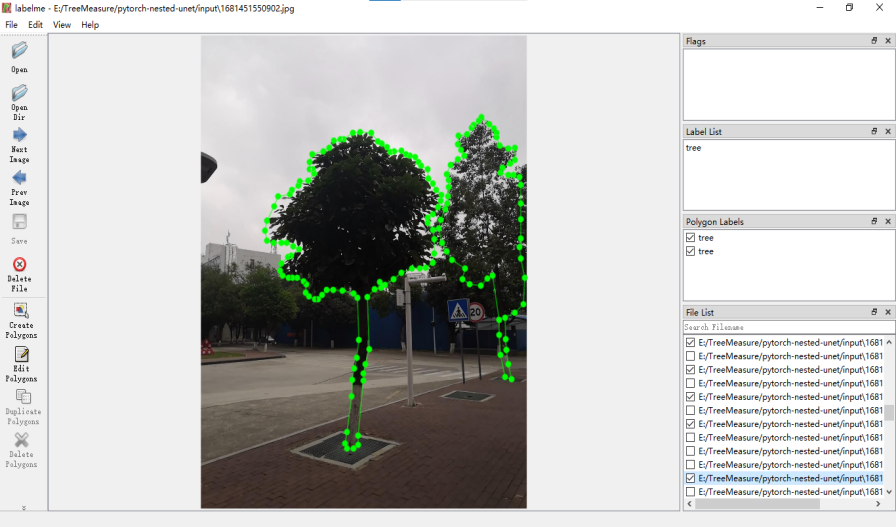{width="4.114437882764655in"   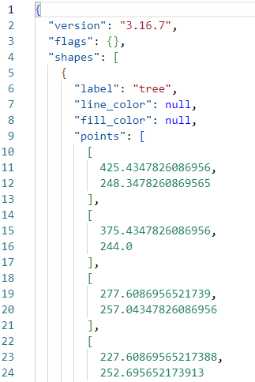{width="1.8936132983377079in"
  height="2.4195559930008748in"}                                height="2.8351334208223973in"}

  \(a\) labelme标注                                             (b)JSON文件
  ------------------------------------------------------------- --------------------------------------------------------------

图3-15 标注数据集

JSON文件不能直接作为模型输入，还需要将其转换成二值图像，其中树木区域的像素值为255，背景区域像素值为0。首先从标注得到的JSON文件中读取图像数据，并将其编码为base64格式，再转换为数组。对标注信息进行处理，将标注信息中的每一种标签映射为一个唯一的整数值，生成二值轮廓图像，处理得到的部分图像如图3-16所示。

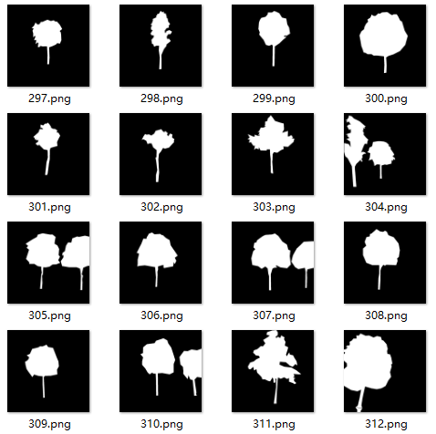{width="3.3452110673665794in"
height="3.3312160979877516in"}

图3-16图像分割标注数据

因为本文增加了深度信息作为图像分割模型的数据，所以需要相应地增加深度标注数据，使用训练好的MidasNet生成相对深度图，每个像素的取值范围为\[0,
255\]，部分图像如图3-17所示。

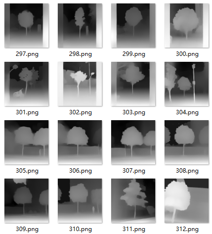{width="3.50257217847769in"
height="3.858490813648294in"}

图3-17深度标注数据

综上，每组训练数据包含三张图像：彩色图、相对深度图和轮廓，如图3-18所示。

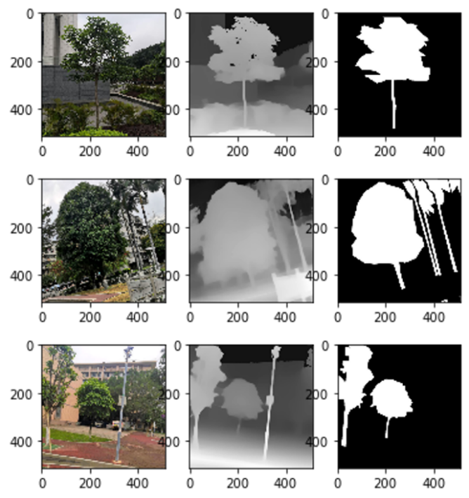{width="3.067361111111111in"
height="3.2708333333333335in"}

图3-18 训练数据示例

#### 3.2.2.3数据增强 {#数据增强 .四级标题}

为了提高Depth-Attention-UNet模型的鲁棒性，本文使用数据增强将树木数据集由300张扩充到1000张，即平均每张图片产生3.3张新图像。对于每张图像，其有50%的概率被水平翻转，100%的概率被调整亮度和对比度，50%的概率被平移、缩放和旋转，亮度和对比度的变化率均在\[-0.2，0.2\]范围内，位移量在 \[-0.0625,
0.0625\]范围内，缩放率在\[-0.1, 0.1\]范围内，旋转角度在\[-15°,
15°\]范围内。对一组数据进行变化时，对彩色图执行所有操作，对轮廓和深度图只执行翻转、平移、缩放和旋转操作，数据增强效果如图3-19所示，其中第一行为原始数据，第二、三行为进行变换得到的数据。

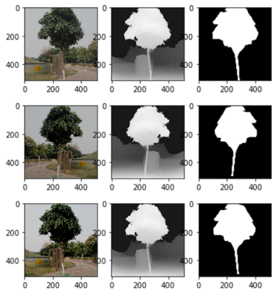{width="2.577777777777778in"
height="2.7395833333333335in"}

图3-19 数据增强示例

### 3.2.3 Depth-Attention-UNet图像分割模型训练 {#depth-attention-unet图像分割模型训练 .三级标题}

准备好数据集后，以8:1:1的比例划分出训练集、验证集和测试集，即可开始进行模型训练。超参数、损失函数、梯度下降优化算法和学习率调度策略的设置影响神经网络的学习能力和收敛速度，因此进行合理的配置对提高模型性能有重要意义，本文设置模型训练的批大小（batch
size）为8，迭代次数（epochs）为200，学习率为0.001。

本文使用BCEDiceLoss作为图像分割损失函数，其全称为Binary Cross Entropy
Dice Loss，即二元交叉熵Dice损失，是Binary Cross Entropy Loss和Dice
Loss^\[90\]^的结合体，既考虑了像素级的二分类问题，又通过Dice系数度量预测结果和真实标签的相似度，使得模型在处理图像分割任务时更具鲁棒性。计算方式如公式(3-25)所示。

  ------------------------------------------------------------- ---------
              $$BCEDiceLoss = BCELoss + DiceLoss$$                 (3-25)

  ------------------------------------------------------------- ---------

其中，BCELoss是二元交叉熵损失，DiceLoss是Dice系数的误差，BCELoss计算方式如公式(3-26)所示：

  ----------------------------------------------------------------------------------------------------------------------- ---------
   $$BCELoss = - \frac{1}{N}\sum_{i = 1}^{N}{(y_{i}\log\left( p_{i} \right) + \left( 1 - y_{i} \right)log(1 - p_{i}))}$$     (3-26)

  ----------------------------------------------------------------------------------------------------------------------- ---------

其中y~i~表示第i个像素点的真实标签值，p~i~表示第i个像素点的预测值，N是总像素数。

DiceLoss可表示为公式(3-27)：

  ------------------------------------------------------------- ---------
                     $$DiceLoss = 1 - Dice$$                       (3-27)

  ------------------------------------------------------------- ---------

Dice系数的计算方式如公式(3-28)所示：

  ------------------------------------------------------------- ---------
           $$Dice = - \frac{2|X \cap Y|}{|X| + |Y|}$$              (3-28)

  ------------------------------------------------------------- ---------

其中X和Y分别表示真实标签区域和预测结果区域，\|·\|
表示该区域内像素的个数。

本文采用Nesterov动量法^\[91\]^来进行随机梯度下降。首先在传统Momentum算法的基础上计算出一个临时变量v，然后利用这个临时变量计算下一步的梯度，最后再利用这个梯度进行参数更新。其次选用余弦退火学习率调度方法^\[92\]^（Cosine
Annealing Learning
Rate）在训练过程中调节学习率。在每次迭代中根据余弦曲线对学习率进行周期性的调整，从而在训练过程中逐渐降低学习率，防止模型陷入局部极小值，可以让神经网络在较早的训练时期快速收敛，而在后期训练时则更为稳定。此外，使用PA（Pixel
Accuracy，像素级分割精度）评价模型的分割效果，计算方法如公式(3-29)所示。

  ------------------------------------------------------------- ---------
                   $$PA = \frac{TP}{TP + FP}$$                     (3-29)

  ------------------------------------------------------------- ---------

其中TP表示真实结果为正且预测结果为正的样本数，FP表示真实结果为负且预测结果为正的样本数。

基于上述配置，Depth-Attention-UNet在树木数据集上进行训练，训练过程如图3-20所示，可见经过20次迭代之后模型开始收敛，在训练集和验证集的像素级分割精度均达到97%以上，模型训练效果较好。

  -------------------------------------------------------------- -------------------------------------------------------------
  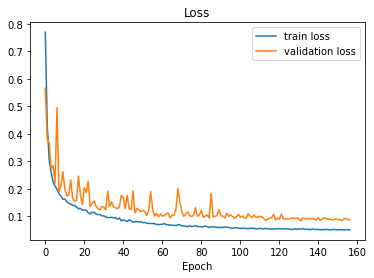{width="3.0861111111111112in"   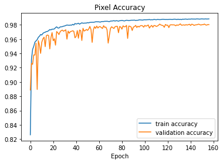{width="3.138888888888889in"
  height="2.0256944444444445in"}                                 height="2.0256944444444445in"}

  (a)损失值变化趋势                                              (b)像素级分割精度变化趋势
  -------------------------------------------------------------- -------------------------------------------------------------

图3-20 模型训练过程

### 3.2.4图像分割测试 {#图像分割测试 .三级标题}

使用测试集对模型的树木图像分割性能进行测试。在语义分割任务中，除了使用PA评价模型的训练效果之外，通常还使用MIoU（平均交并比）作为评价指标，其对于每一个类分别计算其分割预测值和真实值之间的交并集的比例，再将其进行平均得到平均交并比，如公式(3-30)所示：

  --------------------------------------------------------------------------------------------------------------------- ---------
   $$MIoU = \frac{1}{k + 1}\sum_{i = 0}^{k}\frac{p_{ii}}{\sum_{j = 0}^{i}p_{ij} + \sum_{j = 0}^{k}{p_{ji} - p_{ii}}}$$     (3-30)

  --------------------------------------------------------------------------------------------------------------------- ---------

其中*k*代表分割的类别，*i*和*j*分别表示真实值和预测值，*p*~ij~表示将*i*预测成*j*。

Depth-Attention-UNet在测试集上的MIoU为95.31%，PA为98.14%，证明模型在树木图像分割上具有较高的精确率，图像分割结果如图3-21所示，可见改进后的模型可以较好地应对树木背景复杂、树冠交错和遮挡等情况。

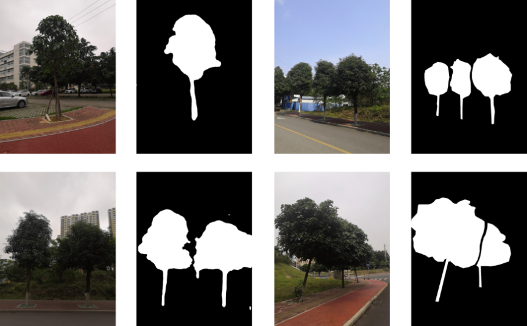{width="3.9305555555555554in"
height="2.433333333333333in"}

图3-21树木图像分割结果

### 3.2.5与Attention-UNet对比 {#与attention-unet对比 .三级标题}

为了验证本文对Attention-UNet的改进方法的有效性，在相同的训练环境下训练Attention-UNet，即超参数、损失函数、学习率调度策略、梯度下降优化算法均与3.2.3节中的实验设置一致，使用3.2.2节中的树木数据集，但不使用深度图。对比训练后的模型在树木图像分割任务中的性能，如图3-22所示，由于没有深度信息，Attention-UNet会将与树木重叠且颜色较深的柱状物体，比如灯柱，视作树干，或者当树木的树冠交错时将其视为一棵树，导致边界粘连模糊的问题。而Depth-Attention-UNet会根据深度特征排除非树区域并区分不同的树木，从而更准确地进行图像分割，说明引入深度信息进行特征融合能够有效缓解树木交错情况对图像分割的干扰，提高复杂环境下的树木图像分割性能。

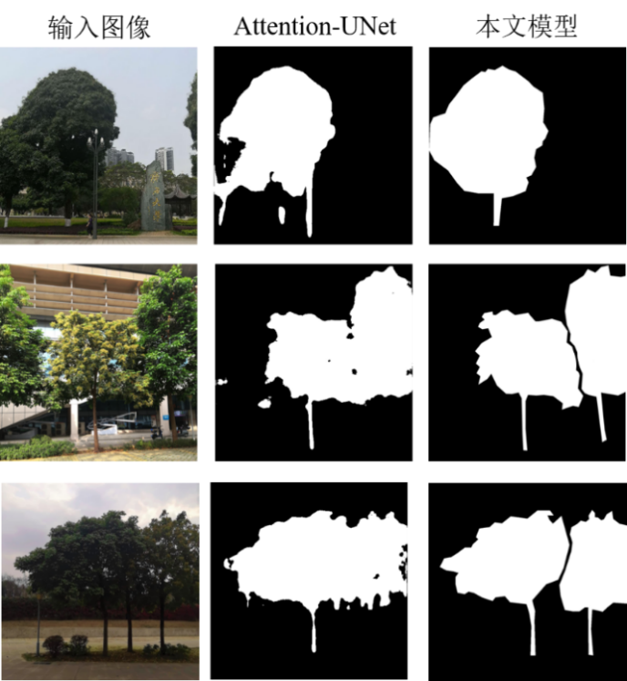{width="3.125in"
height="3.3958333333333335in"}

图3-22 树木图像分割性能对比

使用PASCAL VOC（Visual Object Classes）
2007数据集分别训练和测试Attention-UNet和改进后的模型，即Depth-Attention-UNet，进一步验证新增网络结构的有效性。VOC2007数据集共有9963张图片，其中训练集和验证集有5011张，测试集有4952张，包含了20个类别。为了训练Depth-Attention-UNet模型，还需要使用MidasNet为每张图片生成相应的深度图，部分数据如图3-23所示。

  ------------------------------------------------------------- --------------------------------------------------------------
  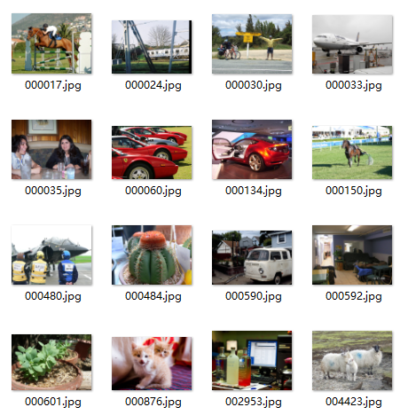{width="2.686370297462817in"   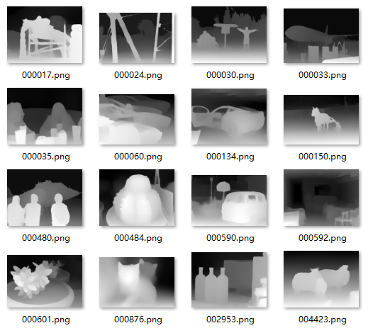{width="3.0236953193350833in"
  height="2.7502055993000876in"}                                height="2.697438757655293in"}

  (a)彩色图                                                     (b)深度图
  ------------------------------------------------------------- --------------------------------------------------------------

图3-23 训练数据示例

设置迭代次数为100，批大小为8，采用Nesterov动量法、余弦退火学习率调度策略和数据增强，分别对Attention-UNet和改进后的模型进行训练，训练过程如图3-24所示，可见改进后的模型比Attention-UNet收敛速度更快，且在验证集上达到的PA更高。

  -------------------------------------------------------------- --------------------------------------------------------------
  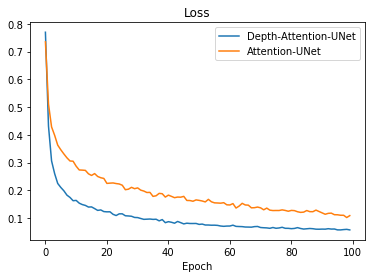{width="2.8460947069116362in"   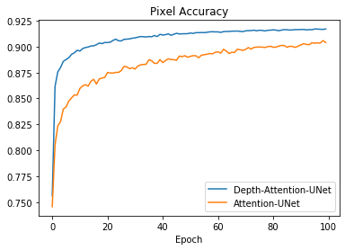{width="2.9496478565179354in"
  height="1.9082874015748033in"}                                 height="1.9064709098862642in"}

  (a)损失值变化趋势对比                                          (b)像素级分割精度变化趋势对比
  -------------------------------------------------------------- --------------------------------------------------------------

图3-24 模型训练过程对比

两种模型在测试集上的PA和IoU如表3-2所示，可以看出Depth-Attention-UNet
在绝大部分类别上的
PA均超过90%，IoU都高于75%，MPA为86.35%，MIoU为75.06%，相对于Attention-UNet，虽然在某些类别上的分割效果稍微有所下降，但整体性能有一定的提升。

表3-2 VOC2007数据集图像分割性能对比

+:-----------:+:----------:+:----------:+:------------:+:------------:+
| 类别        | Attention-UNet          | **Depth-Attention-UNet**    |
|             +------------+------------+--------------+--------------+
|             | PA         | IoU        | PA           | IoU          |
+-------------+------------+------------+--------------+--------------+
| 飞机        | 0.9250     | 0.8590     | **0.9450**   | **0.8750**   |
+-------------+------------+------------+--------------+--------------+
| 自行车      | 0.8900     | 0.7390     | **0.9150**   | **0.8000**   |
+-------------+------------+------------+--------------+--------------+
| 鸟          | 0.8750     | 0.7350     | **0.9050**   | **0.7750**   |
+-------------+------------+------------+--------------+--------------+
| 船          | 0.8200     | 0.5850     | **0.8600**   | **0.7150**   |
+-------------+------------+------------+--------------+--------------+
| 瓶子        | 0.7050     | 0.4360     | **0.7350**   | **0.5800**   |
+-------------+------------+------------+--------------+--------------+
| 公交车      | 0.9300     | 0.8570     | **0.9400**   | **0.8900**   |
+-------------+------------+------------+--------------+--------------+
| 汽车        | **0.9350** | **0.8600** | 0.9200       | 0.8440       |
+-------------+------------+------------+--------------+--------------+
| 猫          | 0.9000     | 0.7940     | **0.9200**   | **0.8300**   |
+-------------+------------+------------+--------------+--------------+
| 椅子        | 0.6000     | 0.3360     | **0.6850**   | **0.4600**   |
+-------------+------------+------------+--------------+--------------+
| 牛          | 0.8550     | 0.7080     | **0.8750**   | **0.7700**   |
+-------------+------------+------------+--------------+--------------+
| 餐桌        | **0.7800** | **0.6300** | 0.7700       | 0.5830       |
+-------------+------------+------------+--------------+--------------+
| 狗          | 0.8900     | 0.7520     | **0.9100**   | **0.8100**   |
+-------------+------------+------------+--------------+--------------+
| 马          | 0.8850     | 0.7990     | **0.9150**   | **0.8550**   |
+-------------+------------+------------+--------------+--------------+
| 摩托车      | 0.9100     | 0.8040     | **0.9300**   | **0.8500**   |
+-------------+------------+------------+--------------+--------------+
| 人          | 0.8950     | 0.7880     | **0.9100**   | **0.8200**   |
+-------------+------------+------------+--------------+--------------+
| 盆栽植物    | 0.5350     | 0.2990     | **0.6050**   | **0.4300**   |
+-------------+------------+------------+--------------+--------------+
| 羊          | 0.8350     | 0.6780     | **0.8700**   | **0.7500**   |
+-------------+------------+------------+--------------+--------------+
| 沙发        | 0.8700     | 0.7210     | **0.9000**   | **0.7900**   |
+-------------+------------+------------+--------------+--------------+
| 火车        | 0.9250     | 0.8720     | **0.9450**   | **0.8950**   |
+-------------+------------+------------+--------------+--------------+
| 电视/显示器 | 0.8150     | 0.6230     | 0.8150       | **0.6900**   |
+-------------+------------+------------+--------------+--------------+
| 平均值      | 0.8388     | 0.6938     | **0.8635**   | **0.7506**   |
+-------------+------------+------------+--------------+--------------+

部分图像分割结果如图3-25所示，说明增加深度特征通道和多模态特征融合可以有效提升Attention-UNet在物体密集分布条件下的图像分割性能。

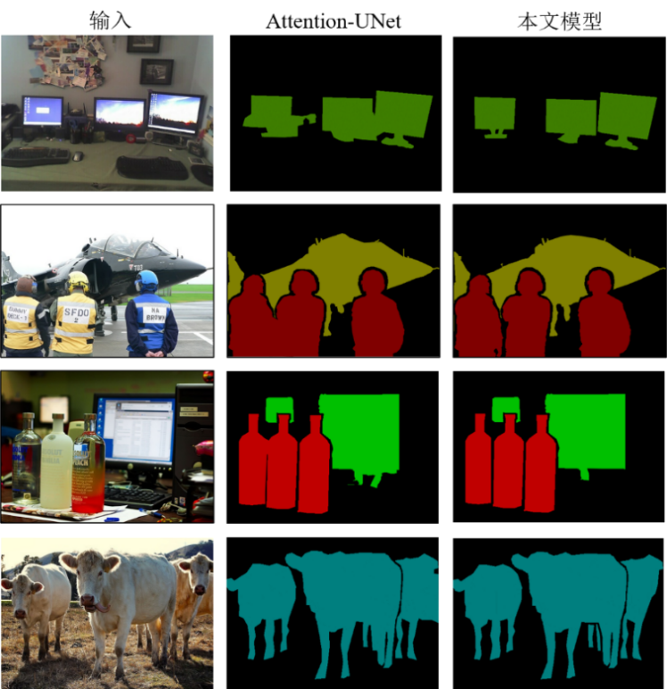{width="3.4in"
height="3.5104166666666665in"}

图3-25 部分图像分割结果对比

## 3.3立木三维点云的生成 {#立木三维点云的生成 .Title}

为了测量立木的树高，需要利用二维信息恢复树木的三维结构，本文使用的方法是融合彩色图、深度图和相机内参得到场景三维点云，接着使用图像分割结果从三维点云中滤除背景，最后进行去噪，得到最终的树木点云用于树高测量。

### 3.3.1点云生成 {#点云生成 .三级标题}

根据相机成像原理，三维点云坐标与像素坐标的关系如公式(3-31)\~(3-33)所示：

  ------------------------------------------------------------- ---------
           $$x = - \frac{(u - c_{x}) \cdot z}{f_{x}}$$             (3-31)

           $$y = - \frac{(v - c_{y}) \cdot z}{f_{y}}$$             (3-32)

                    $$z = - \frac{d}{scale}$$                      (3-33)
  ------------------------------------------------------------- ---------

其中，d为深度值，单位为毫米；scale为深度值的缩放倍数，此处取值为1000；(u,v)为像素坐标，(x,
y, z)为像素对应的三维点云坐标；(f~x~, f~y~)为相机焦距，(c~x~,
c~y~)为相机的光学中心，相机内参由这两个参数组成，在APP访问相机时即可获得。

使用上述公式从深度图计算得到每个像素点在三维空间的坐标，再结合彩色图对应像素的颜色得到的三维点云，如图3-26所示，与图3-7对比可知，使用校准深度图能够更好地恢复树木的三维结构。

  ------------------------------------------------------------ -------------------------------------------------------------- --------------------------------------------------------------
  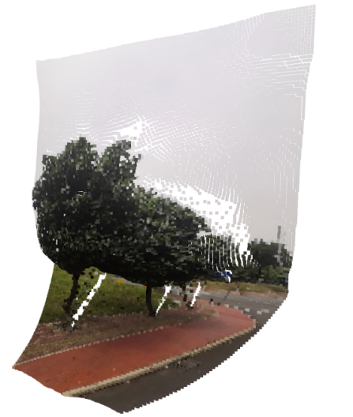{width="2.03965113735783in"   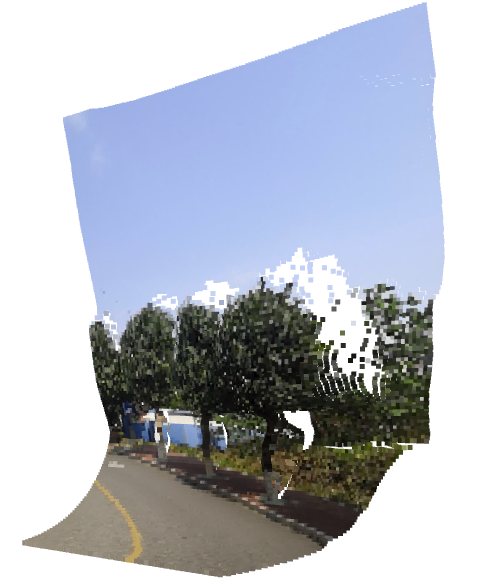{width="2.0497134733158355in"   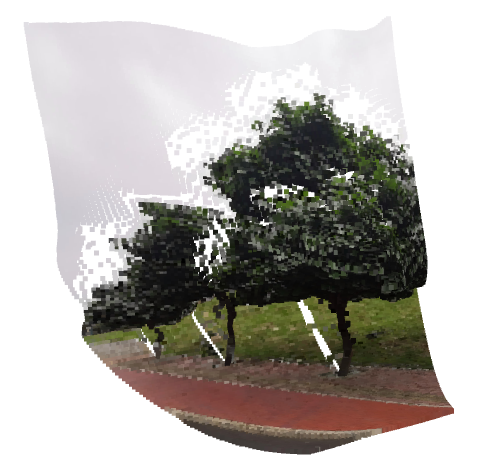{width="2.2982392825896762in"
  height="2.4091786964129485in"}                               height="2.4651290463692037in"}                                 height="2.216504811898513in"}

  ------------------------------------------------------------ -------------------------------------------------------------- --------------------------------------------------------------

图3-26三维点云

### 3.3.2点云分割 {#点云分割 .三级标题}

为了测量树高，需要借助图像分割结果将树木点云提取出来，由于点云中的每个点与彩色图中的每个像素一一对应，因此可以很容易地进行点云的分割。

本节要解决的是树木最高点被遮挡的问题。目前已有学者研究了立木生长模型^\[93,94\]^以及树高-胸径模型^\[95,96\]^，通过可测量的胸径预测树高，以实现最高点被遮挡时的立木树高测量。但是这些方法都是针对某一树种建立的，且需要大量立木因子数据，没有普适的方法。因此，本文提出一种通过拟合树冠曲线来估计最高点的方法，补全图像分割得到的树木轮廓从而获取被遮挡树木的完整点云。接下来以图3-26中的第3个点云为例介绍处理流程。该点云对应的彩色图和分割结果如图3-27所示，可见该图中含有三棵树，且有两棵树的最高点被遮挡，但是树冠的可见部分可以用于拟合。

  --------------------------------------------------------------- --------------------------------------------------------------
  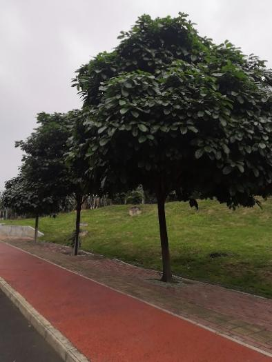{width="1.7916666666666667in"   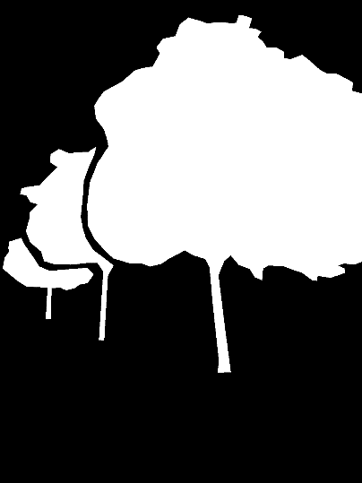{width="1.8229166666666667in"
  height="2.3881944444444443in"}                                  height="2.4298611111111112in"}

  (a)彩色图                                                       (b)图像分割结果
  --------------------------------------------------------------- --------------------------------------------------------------

图3-27树木最高点被遮挡示例

以中间的树木为例，基于树木最高点通常与树干共线这一特征，需要找到树干的拟合直线和树冠的拟合曲线，首先将树木分为树干和树冠两部分，分别进行拟合。根据树冠和树干宽度差异较大这一特点，从下往上扫描轮廓，直到轮廓宽度变化超过阈值时停止，实验中设置阈值为5。该分界线以下部分即为树干，以上部分即为树冠，用不同颜色表示，如图3-29所示。

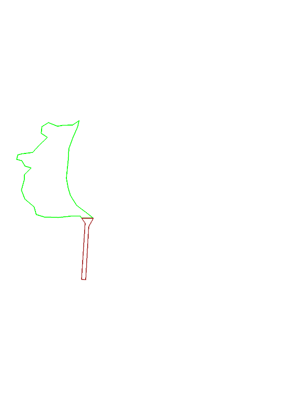{width="1.3541666666666667in"
height="1.9465277777777779in"}

图3-29树木划分结果

由于树干形状存在不规则和倾斜的情况，首先对树干进行椭圆拟合，估计其倾斜角度$\theta$，如图3-30所示。椭圆拟合的原理是找到一个椭圆，使待拟合形状轮廓上的所有点到椭圆的距离之和最小，即整体误差最小化，一些少量的干扰点不会对拟合结果产生显著影响。采用该方法拟合树干轮廓时，由于一些小的干扰轮廓在整体轮廓中占比极小，对最终的拟合结果影响十分有限，所以拟合椭圆的形状和旋转角度可以正确反映树干整体的变化趋势。

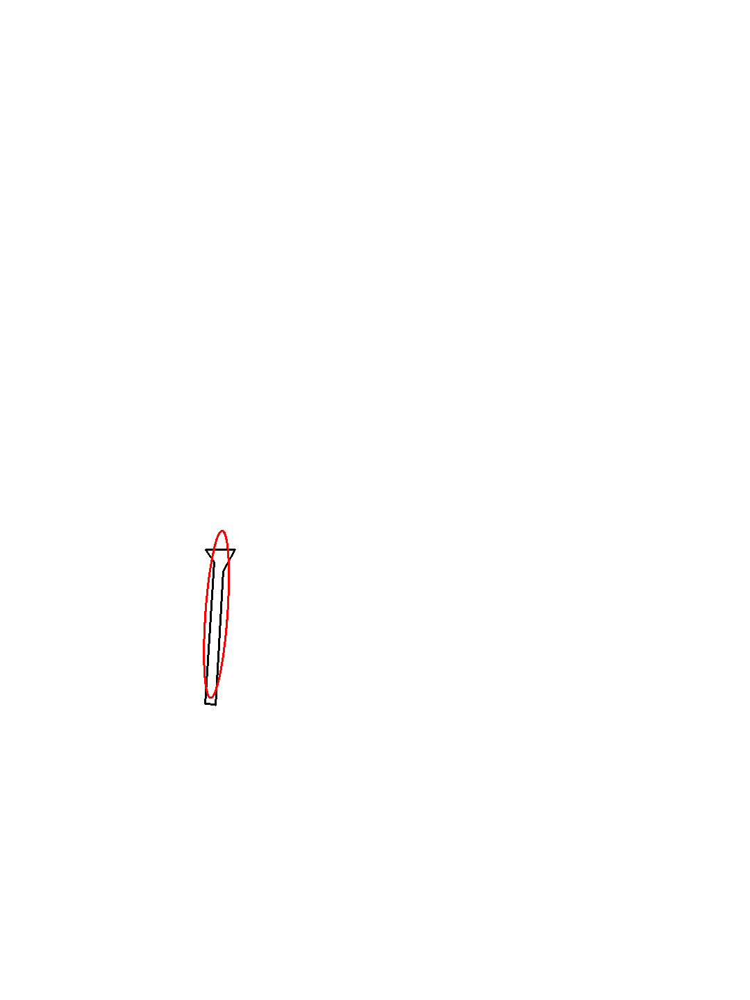{width="1.8305555555555555in"
height="2.3958333333333335in"}

图3-30树干拟合结果

接着绕拟合椭圆的圆心c(u,
v)，将树木轮廓旋转-$\theta$度，使树干与水平面垂直，并过点c画一条垂直于水平面的线段L，其长度与树木轮廓相等，如图3-31所示。将树冠分为四等分，若最上面的部分与线段L无交点，则认为该树最高点被遮挡。

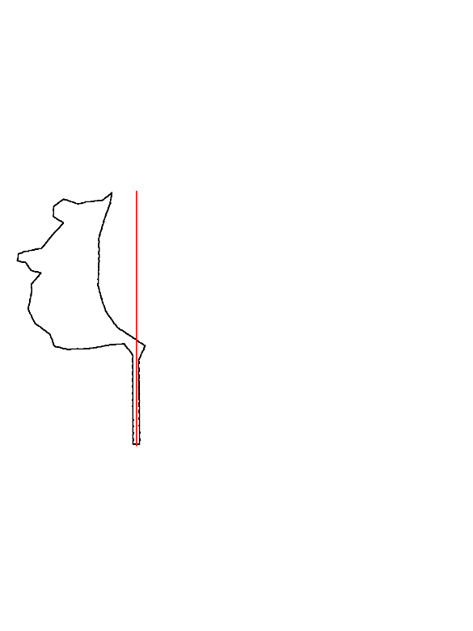{width="1.5416666666666667in"
height="1.9770833333333333in"}

图3-31树干拟合直线

若发现树木最高点不可见，则需要进一步拟合树冠曲线。首先需要把树木轮廓恢复到原来的倾斜角度，即以点c为中心将树木轮廓旋转$\theta$度，如图3-32(a)所示。接着在树冠的二分之一处从左往右扫描，记录第一次遇到树木轮廓的坐标x，如果x\<u，则说明可见的是左侧树冠，反之可见的是右侧树冠。从上到下提取和记录树冠轮廓上的像素坐标，如果可见的是左侧树冠，则当像素横坐标开始增大时停止，否则当像素横坐标开始减小时停止。对提取到的像素坐标进行二次拟合，从而预测树冠在被遮挡区域的变化趋势，如图3-32(b)所示。

  -------------------------------------------------------------- -------------------------------------------------------------
  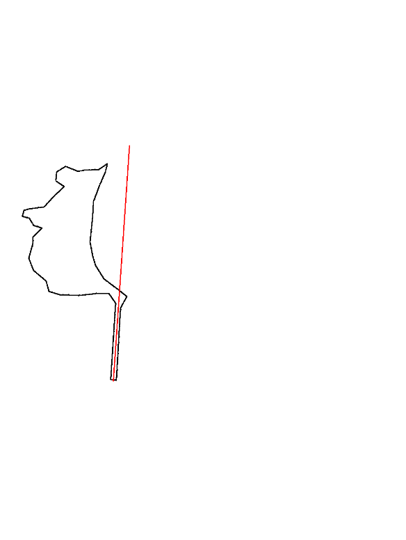{width="1.6555555555555554in"   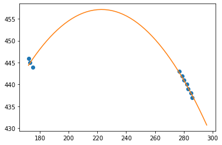{width="3.035416666666667in"
  height="2.1444444444444444in"}                                 height="1.9895833333333333in"}

  (a)恢复树木倾斜角                                              (b)拟合树冠曲线
  -------------------------------------------------------------- -------------------------------------------------------------

图3-32 拟合树冠过程

接下来，将拟合得到的树冠加入原始的树木轮廓中，如图3-33所示。

  -------------------------------------------------------------- -----------------------------------------------
  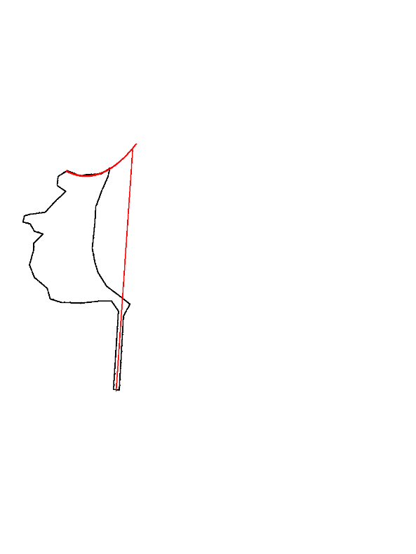{width="1.4791666666666667in"   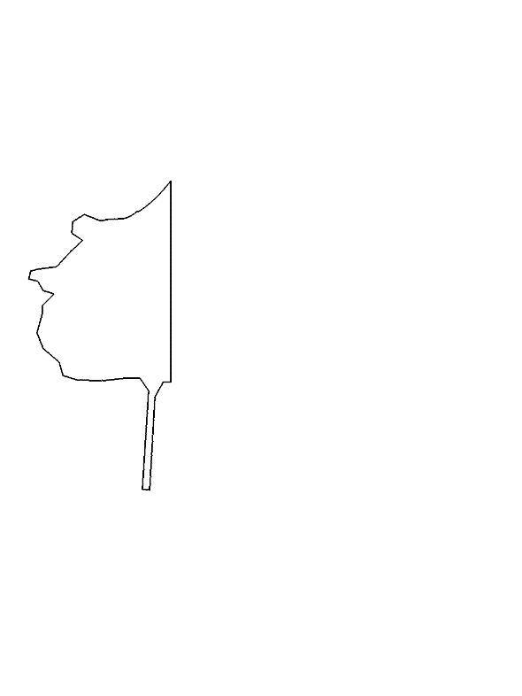{width="1.5in"
  height="2.176388888888889in"}                                  height="2.173611111111111in"}

  -------------------------------------------------------------- -----------------------------------------------

图3-33补全树冠遮挡部分

经过树木最高点遮挡检测与处理后，使用补全树冠的轮廓对图3-26中的第3个点云进行分割，分别得到三棵树的三维点云，结果如图3-34所示。

  -------------------------------------------------------------- -------------------------------------------------------------- --------------------------------------------------------------
  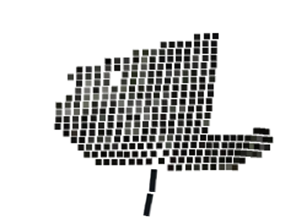{width="1.9166666666666667in"   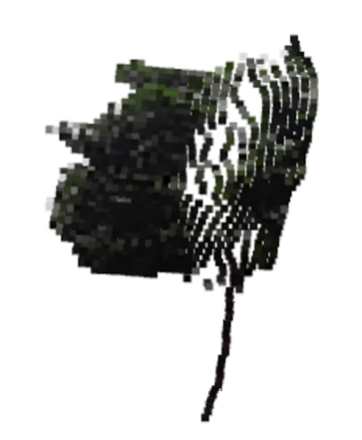{width="1.6458333333333333in"   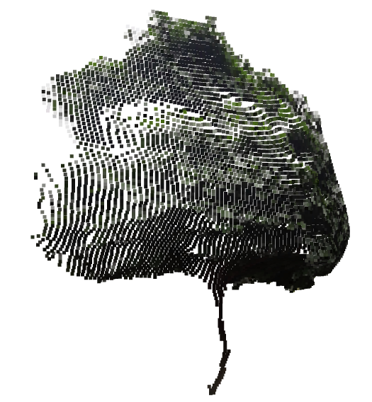{width="1.8631189851268593in"
  height="1.645138888888889in"}                                  height="1.9979166666666666in"}                                 height="2.0157174103237097in"}

  -------------------------------------------------------------- -------------------------------------------------------------- --------------------------------------------------------------

图3-34树木点云

为验证所提出的树冠拟合方法的可靠性，对20株树木从不同角度进行拍摄测量，采集最高点被遮挡和未被遮挡情况下的图像，使用本文方法进行测量，结果如表3-3所示。最高点可见和不可见时，树高测量值的平均相对误差为1.69%，可见通过拟合树冠曲线和树干直线并求交点的方法可以较准确地恢复出被遮挡树木的最高点。

表3-3 最高点未遮挡和遮挡情况下的树木测量数据

+:------:+:------:+:-----:+:--------:+:--------:+
| 样本号 | 树高/m         | 绝对误差 | 相对误差 |
|        +--------+-------+          |          |
|        | 未遮挡 | 遮挡  |          |          |
+--------+--------+-------+----------+----------+
| 1      | 3.75   | 3.72  | 0.03     | 0.80%    |
+--------+--------+-------+----------+----------+
| 2      | 4.57   | 4.55  | 0.02     | 0.44%    |
+--------+--------+-------+----------+----------+
| 3      | 4.76   | 4.8   | 0.04     | 0.84%    |
+--------+--------+-------+----------+----------+
| 4      | 4.84   | 4.76  | 0.08     | 1.65%    |
+--------+--------+-------+----------+----------+
| 5      | 5.25   | 5.33  | 0.08     | 1.52%    |
+--------+--------+-------+----------+----------+
| 6      | 5.86   | 5.93  | 0.07     | 1.19%    |
+--------+--------+-------+----------+----------+
| 7      | 5.91   | 5.73  | 0.18     | 3.05%    |
+--------+--------+-------+----------+----------+
| 8      | 6.23   | 6.34  | 0.11     | 1.77%    |
+--------+--------+-------+----------+----------+
| 9      | 6.35   | 6.46  | 0.11     | 1.73%    |
+--------+--------+-------+----------+----------+
| 10     | 6.42   | 6.36  | 0.06     | 0.93%    |
+--------+--------+-------+----------+----------+
| 11     | 6.65   | 6.73  | 0.08     | 1.20%    |
+--------+--------+-------+----------+----------+
| 12     | 7.34   | 7.54  | 0.20     | 2.72%    |
+--------+--------+-------+----------+----------+
| 13     | 8.62   | 8.93  | 0.31     | 3.60%    |
+--------+--------+-------+----------+----------+
| 14     | 8.87   | 8.68  | 0.19     | 2.14%    |
+--------+--------+-------+----------+----------+
| 15     | 9.10   | 9.35  | 0.25     | 2.75%    |
+--------+--------+-------+----------+----------+
| 16     | 11.23  | 11.42 | 0.19     | 1.69%    |
+--------+--------+-------+----------+----------+
| 17     | 11.33  | 11.63 | 0.30     | 2.65%    |
+--------+--------+-------+----------+----------+
| 18     | 13.57  | 13.49 | 0.08     | 0.59%    |
+--------+--------+-------+----------+----------+
| 19     | 14.25  | 14.12 | 0.13     | 0.91%    |
+--------+--------+-------+----------+----------+
| 20     | 15.68  | 15.42 | 0.26     | 1.66%    |
+--------+--------+-------+----------+----------+
| 平均值                  | 0.14     | 1.69%    |
+-------------------------+----------+----------+

此外，使用人工处理方法制作最高点被遮挡的树木图像，使用上述方法估计树木的最高点，部分结果如图3-35所示，证明所提出的树木最高点估计方法具有较好的性能。

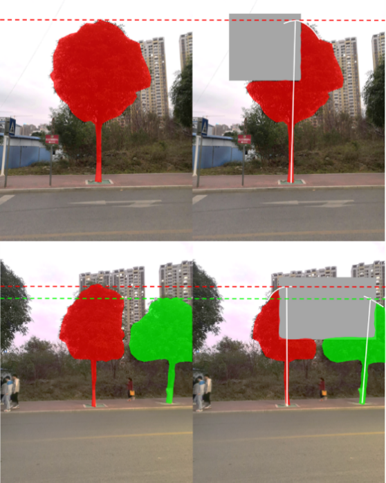{width="2.540277777777778in"
height="3.1770833333333335in"}

图3-35估计被遮挡树木最高点

### 3.3.3点云去噪 {#点云去噪 .三级标题}

由于图像分割模型存在一定误差，会将部分背景预测为树木，导致三维重建结果存在噪声，对树高测量的精度产生干扰，如图3-36(a)所示。因此本文采用半径滤波，计算每个点在其1.5米的半径范围内其他点的个数，少于10个的点将被滤除，得到如图3-36(b)所示的三维点云。

  --------------------------------------------------- --------------------------------------------------------------
  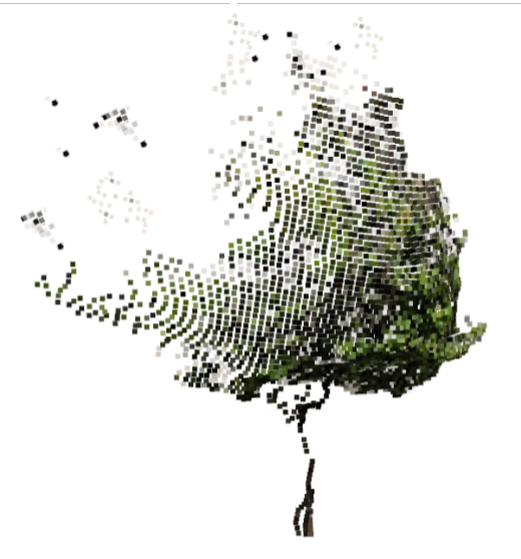{width="2.36875in"   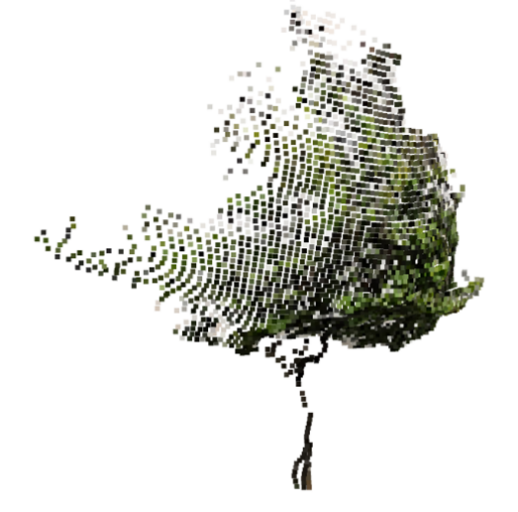{width="2.3541666666666665in"
  height="2.5416666666666665in"}                      height="2.3270833333333334in"}

  (a)去噪前的点云                                     (b)去噪后的点云
  --------------------------------------------------- --------------------------------------------------------------

图3-36点云去噪前后对比

## 3.4树高计算 {#树高计算 .Title}

得到了树木的三维点云后，对其提取轴对齐包围盒，即盒体的每个面都与一条世界坐标轴垂直的六面体，如图3-37所示，盒体在Y方向的长度即为树木在现实世界中的树高，单位为m。

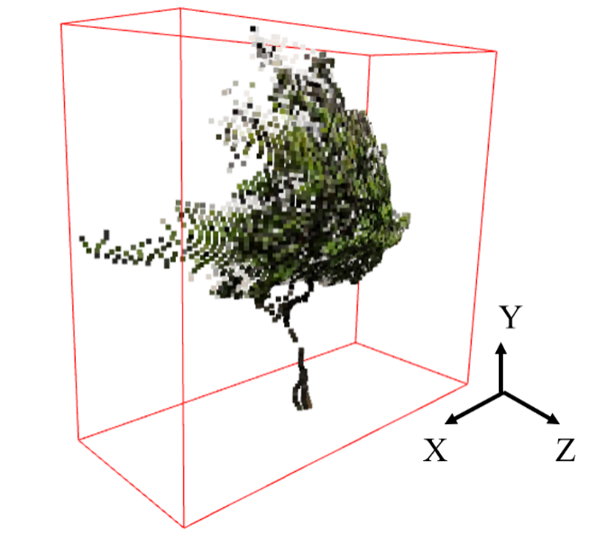{width="3.0069444444444446in"
height="2.701388888888889in"}

图3-37树木点云的轴对齐包围盒

## 3.5树高测量结果验证与分析 {#树高测量结果验证与分析 .Title}

### 3.5.1树高测量误差分析 {#树高测量误差分析 .三级标题}

为了评估本文设计的立木树高测量系统的精确度，在校园内选取了不同高度、不同种类的110株立木，其中有20组数据包含树木最高点被遮挡的情况。选用瑞典Vertex
lV超声波树木测高仪对每棵树进行3次测量，取平均值作为真实值。使用构建的系统对树高进行估测，得到测量值，部分测量的结果如表3-4所示，所有测量数据见附录表1。在拍摄距离为2\~17m的范围内，树高测量系统的最大相对误差为4.87%，最小相对误差为1.92%，平均相对误差为3.20%，满足国家森林资源连续清查的精度要求^\[97\]^。

经分析，本文提出的树高测量方法的误差来源主要有两点：

（1）在深度估计部分，由于仅利用一般手机配备的相机和惯性传感器进行绝对深度估计，无外接激光、红外线等主动测距设备，只能获取0.5米\~20米内的准确深度，平均精度为95%，当待测树木越高时，拍摄距离也会相应增加，从而导致深度估计的误差增大。

（2）使用 Depth-Attention-UNet
对树木图像进行分割时，如果相机存在失焦的情况，导致树木边缘的信息丢失，可能影响分割的精度，因为失焦现象的发生是随机的，并且概率很小，所以这种情况可能会引入随机误差。

表3-4树高测量数据

  -------- ---------- ---------- ------------ ------------ ------------
   样本号   真实值/m   测量值/m   拍摄距离/m   绝对误差/m   相对误差/%

     1        3.7        3.78        2.47         0.08        2.16%

     2        4.8        4.63        3.20         0.17        3.54%

     3        5.6        5.42        3.73         0.18        3.21%

     4        6.5        6.73        4.33         0.23        3.54%

     5        7.4        7.63        4.93         0.23        3.11%

     6        8.7        9.02        5.80         0.32        3.68%

     7        9.3        9.58        6.20         0.28        3.01%

     8        10.8      11.04        7.20         0.24        2.22%

     9        11.3      11.63        7.53         0.33        2.92%

     10        12       12.23        8.00         0.23        1.92%

     11       13.7      14.12        9.13         0.42        3.07%

     12       15.9       15.2       10.60         0.70        4.40%

     13       17.2      16.39       11.47         0.81        4.71%

     14       18.5      19.32       12.33         0.82        4.43%

     15       19.8      20.66       13.20         0.86        4.34%

     16        23       24.12       15.33         1.12        4.87%

     17       23.5      24.45       15.67         0.95        4.04%

     18       24.8      23.69       16.53         1.11        4.48%

     19       25.6      26.75       17.07         1.15        4.49%

     20        26       27.47       17.33         1.47        5.65%
  -------- ---------- ---------- ------------ ------------ ------------

### 3.5.2树高测量稳定性分析 {#树高测量稳定性分析 .三级标题}

为了评估树高测量系统的稳定性，在校园中随机选取一棵树木，并分别使用瑞典Vertex
lV超声波树木测高仪和本文提出的立木树高测量系统进行10次重复性测量。采用标准差（I~SD~）作为评价指标来衡量树高测量的稳定性，该指标可以反映各次测量结果间的离散程度。利用公式(3-34)计算标准差：

  ---------------------------------------------------------------------------------------------------------------------------------------------------------------------- -----------
   $$\mathbf{I}_{\mathbf{SD}} = \sqrt{\frac{\sum_{\mathbf{i}}^{\mathbf{n}}{(\mathbf{x}_{\mathbf{i}} - \overline{\mathbf{x}})}^{\mathbf{2}}}{\mathbf{n} - \mathbf{1}}}$$       (3-34)

  ---------------------------------------------------------------------------------------------------------------------------------------------------------------------- -----------

公式中，
*n*是观测树木的次数，此处*n*等于10；*x~i~*是树高的数值，$\overline{x}$是树高的平均值。树高的测量结果记录在表3-5中。

表3-5树高测量稳定性分析

  ---------- ---------------------------- --------------------
   观测次序   超声波树木测高仪测量树高/m   安卓手机测量树高/m

      1                 5.840                    5.835

      2                 5.800                    5.833

      3                 5.743                    5.831

      4                 5.854                    5.833

      5                 5.820                    5.827

      6                 5.832                    5.833

      7                 5.836                    5.825

      8                 5.823                    5.819

      9                 5.805                    5.831

      10                5.862                    5.822

    平均值              5.855                    5.831

    标准差              0.553                    0.0031
  ---------- ---------------------------- --------------------

[]{#_Toc135490587 .anchor}使用超声波树木测高仪测量树高的标准差是
0.553，而使用立木树高测量系统测量树高的的标准差是0.0031，说明本文研究的树高测量方法稳定性较高。

### 3.5.3树高测量用时分析 {#树高测量用时分析 .三级标题}

为了评估本文提出的树高测量方法完成一次测量所需的时间，随机选取一棵树木，使用立木树高测量系统进行10次重复测量，统计各步骤的运行时间，记录在表3-6中。

表3-6 树高测量用时分析

  ---------- ------------- ----------------- ------------- ----------------- ----------------- ------------- -------------
   测量次序   深度估计/ms   树木图像分割/ms   三维重建/ms   立木点云提取/ms   立木点云去噪/ms   树高提取/ms   整体流程/ms

      1         1483.10         1809.27          6.09            3.00              11.27           0.09         3312.82

      2         1531.66         1981.08          6.42            3.00              10.63           0.10         3532.89

      3         1422.50         1845.22          6.88            3.00              13.28           0.10         3290.98

      4         1455.29         1709.31          6.29            3.00              14.83           0.10         3188.81

      5         1512.97         1581.32          6.38            3.00              11.20           0.10         3114.97

      6         1467.25         1627.70          6.46            3.00              13.01           0.10         3117.52

      7         1426.75         1936.47          6.69            2.99              10.81           0.10         3383.81

      8         1436.96         1897.49          6.24            2.99              10.77           0.10         3354.54

      9         1520.31         1503.55          6.18            2.99              11.14           0.10         3044.27

      10        1466.61         1859.39          6.83            3.00              11.55           0.09         3347.47

    平均值      1472.34         1775.08          6.45            3.00              11.85           0.10         3268.81
  ---------- ------------- ----------------- ------------- ----------------- ----------------- ------------- -------------

可见系统后端完成一次树高测量的平均总用时为3268.81ms，即3.27秒，由于测量所需数据的大小不超过1M，数据传输时间均在1秒内，因此从上传数据到获得测量结果所用时间不超过5秒，说明本文研究的树高测量方法效率较高，可以满足实际应用的要求。

## 3.6本章小结 {#本章小结-1 .Title}

本章首先介绍了DfM算法的处理流程和绝对深度估计结果。其次介绍了MidasNet模型使用的数据集，模型训练过程，以及相对深度估计结果。然后介绍了使用绝对深度图校准相对深度图的尺度，得到最终的绝对深度的处理过程和结果。接着介绍了对Attention-UNet所做的改进，树木数据集的采集、标注与数据增强，Depth-Attention-UNet模型的训练过程，包括超参数、损失函数、梯度下降优化算法和学习率调度策略的设置，以及模型的测试结果。然后比较了Attention-UNet和Depth-Attention-UNet模型在自制树木数据集和VOC2007数据集上的分割效果，证明本文对Attention-UNet的改进有效提升了其在物体密集分布条件下的图像分割的性能。接着介绍了三维点云的生成、分割和去噪，其中，在使用图像分割结果对点云进行分割前，需要先检测树木最高点的遮挡情况，并通过拟合树冠曲线估计最高点。然后介绍了使用轴对齐包围盒提取树木高度的过程。最后对本文提出的树高测量方法进行精度验证以及稳定性和用时分析，并分析了误差来源。

# 立木树高测量APP设计与实现

## 4.1需求分析 {#需求分析 .Title}

立木树高测量是森林资源清查中一个基础而重要的工作。传统的立木树高测量仪器不便携带，操作繁琐且精度难以保证。随着智能手机的普及，利用其内置的摄像头和传感器来进行树高测量已经成为一种新的趋势。本文旨在开发一款基于智能手机安卓APP的立木树高测量系统，为国内林业企业及政府机关（如林业局、环保局）提供一种精准高效且低成本的树高测量工具，更好地满足其对森林资源调查和数据管理的需求。

本立木树高测量系统的目标是提高树高测量的精度和效率，为森林资源清查工作提供智能化、便捷化、数字化的服务。具体而言，本系统的目标包括：

（1）快速、准确、自动地测量树高。

（2）清晰地展示树高测量结果。

（3）提供树木数据的批量测量和管理功能。

立木树高测量系统具备的功能如表4-1所示。

表4-1 系统功能列表

  ------- ------------------------------------------------------ ---------
   标号                            功能                            分类

   R1.1                      拍摄树木的彩色图                     明显的

   R1.2                      估计树木的深度图                     明显的

   R1.3                   获取手机相机的内参数据                  隐藏的

   R2.1                保存某一时刻的彩色图和深度图               明显的

   R2.2               在手机本地构建并维护一个数据库              隐藏的

   R3.1             提供前端APP和后端服务器的通信机制             隐藏的

   R4.1        展示树高测量结果及与测量相关的图像和三维点云       明显的

   R5.1                   一次测量多组树木的树高                  明显的

   R5.2          一次导出多组树高测量结果到Excel表格文件          明显的

   R5.3                    一次删除多组树木数据                   明显的

   R5.4                 一次删除多组树木的测量结果                明显的

   R6.1         分析处理用户上传的彩色图和深度图以计算树高        隐藏的
  ------- ------------------------------------------------------ ---------

为了提供良好的用户体验，本系统应具有如表4-2所示的属性规格。

表4-2 系统属性表

+:------------:+:---------------------------------------------------------------------------------------------------------------------------------------------------------------------------------:+
| 属性         | 细节和边界约束                                                                                                                                                                    |
+--------------+-----------------------------------------------------------------------------------------------------------------------------------------------------------------------------------+
| 响应时间     | 对一组数据进行树高测量时，必须在8秒内显示测量结果                                                                                                                                 |
+--------------+-----------------------------------------------------------------------------------------------------------------------------------------------------------------------------------+
| 界面形式     | （1）拍照时，全屏显示摄像头获取的画面                                                                                                                                             |
|              |                                                                                                                                                                                   |
|              | （2）查看测量结果时，以标签页形式展示一组数据的不同图像                                                                                                                           |
|              |                                                                                                                                                                                   |
|              | （3）批量管理时，以列表形式展示全部数据                                                                                                                                           |
|              |                                                                                                                                                                                   |
|              | （4）界面简洁易操作                                                                                                                                                               |
+--------------+-----------------------------------------------------------------------------------------------------------------------------------------------------------------------------------+
| 容错         | （1）拍照时，若未获取相机权限或存储权限，应立即申请相应权限。若相机帧序列或IMU数据不足以进行深度估计，而用户要求保存数据，应提示用户移动手机，并在完成深度估计后立即提示          |
|              |                                                                                                                                                                                   |
|              | （2）上传数据测量树高时，若出现以下四种情况，应终止测量并提示相应信息：数据库中无对应ID的数据路径；根据路径无法在手机内存找到数据；3秒内无法连接到后端；连接后端后5秒内未获得回复 |
|              |                                                                                                                                                                                   |
|              | （3）批量管理时，若用户未选择任何数据，应进行提示。若用户进行的是删除操作，要进行二次确认                                                                                         |
+--------------+-----------------------------------------------------------------------------------------------------------------------------------------------------------------------------------+
| 操作系统平台 | Android5.0以上和HarmonyOS2.0.0以上                                                                                                                                                |
+--------------+-----------------------------------------------------------------------------------------------------------------------------------------------------------------------------------+

## 4.2系统概要设计 {#系统概要设计 .Title}

本系统主要包含树高测量和数据批量管理两个功能，系统的功能结构图如图4-1所示。本文的立木树高测量系统采用前后端分离开发，前端部分采用Android
Studio，结合ARCore、OpenGL、OkHttp3等框架进行开发，由数据采集模块、数据存储模块、数据传输模块和批量管理模块组成，实现如下功能：

（1）彩色图获取：用户可以通过APP拍摄待测树木的彩色图，调用手机摄像头获取图像数据，并将图片路径写入数据库。

（2）深度图获取：用户可以使用APP估计待测树木的深度图，基于摄像头获取的图像序列和惯性传感器数据进行深度估计，保存深度图到手机本地并在数据库记录路径。

（3）相机内参获取：首次调用相机时，获取相机内参并存储到数据库，以供三维重建使用。

（4）待测数据发送：用户可以将待测数据上传至后端进行树高测量，待测数据包括彩色图、深度图和相机内参。

（5）测量结果接收：接收、处理并存储后端回传的树高、校准深度图、分割结果图和立木三维点云。

（6）测量结果展示：展示前端采集得到的彩色图和绝对深度图以及后端处理得到的树高、校准深度图、分割结果图和立木三维点云。

（7）批量测量：用户可以选择多组待测数据，进行批量树高测量，提高效率。

（8）批量导出：用户可以将多组测量结果批量导出为Excel表格，以方便后续处理和分析。

（9）批量删除：用户可以选择多组测量数据或测量结果，进行批量删除。

后端部分使用Flask框架和Pytorch框架搭建，采用Python语言编写，包含数据传输模块、深度估计模块、图像分割模块、三维重建模块与树高测量模块，实现以下功能：

（1）待测数据接收：接收并保存用户上传的待测数据，以备后续处理。

（2）测量结果发送：将测量结果打包发送至前端，以供用户查看和导出。

（3）数据处理与树高测量：首先调用MidasNet对前端上传的彩色图估计相对深度图，再使用前端上传的深度图进行校准，得到最终的深度图。再调用Depth-Attention-UNet分割出彩色图中的树木区域。接着利用深度图、彩色图和相机内参生成场景三维点云。再对场景三维点云进行分割，根据图像分割结果，对树木最高点遮挡情况进行检测和处理，提取出树木部分点云。然后使用半径滤波对立木三维点云进行去噪，提高测量精度。最后对立木三维点云提取轴对齐包围盒，取盒体在Y轴方向的长度作为树高。

图4-1 系统功能结构图

## 4.3系统详细设计 {#系统详细设计 .Title}

根据系统概要设计，对主要功能函数的处理流程以及数据库的结构进行设计。

其中前端负责树木数据的采集、存储、传输和批量管理，主要功能函数如下：

（1）彩色图获取函数。主要负责将YUV_420_888格式相机帧转化为JEPG格式并存储到手机本地。

图4-2 彩色图获取数据流程图

（2）深度图获取函数。主要负责获取深度图并转为字节数组，再保存到文件。

图4-3 深度图获取数据流程图

> （3）相机内参获取函数。主要负责首次调用相机时获取其内参信息并写入数据库。

图4-4相机内参获取数据流程图

（4）待测数据发送函数。主要负责将彩色图、深度图和相机内参打包上传至后端，并处理各种异常情况，并在获得后端回复后调用测量结果接收函数。

图4-5待测数据发送数据流程图

（5）测量结果接收函数。接收、处理并存储后端传回的树高、校准深度图、分割结果图和立木三维点云。

图4-6测量结果接收数据流程图

（6）批量导出函数。负责将用户选择的多组数据批量导出为Excel表格，方便后续处理和分析。

图4-7批量导出数据流程图

后端主要负责接收前端发送的数据，并调用模型和算法对数据进行分析，计算树高并返回测量结果。主要功能函数如下：

（1）待测数据接收函数。接收并保存用户上传的待测数据，再调用树高测量函数。

图4-8待测数据接收数据流程图

（2）树高测量函数。依次进行深度估计、树木图像分割、三维重建、三维点云分割和树高提取，其中调用最高点检测和处理函数，计算完成后调用测量结果发送函数。

图4-9数据处理与树高测量数据流程图

（3）最高点检测和处理函数。根据Depth-Attention-UNet生成的树木轮廓判断树木最高点是否被遮挡并估计最高点，返回补全的轮廓，其中调用树干和树冠分割函数，当检测到树木最高点被遮挡时调用最高点估计函数。

图4-10最高点检测和处理数据流程图

（4）树干和树冠分割函数。对输入的树木轮廓，找到并返回树干和树冠的分界处的纵坐标。

图4-11树干和树冠分割数据流程图

（5）最高点估计函数。根据树冠的可见部分估计树木最高点，返回补全的轮廓。

图4-12最高点估计数据流程图

（6）测量结果发送函数。将测量结果打包发送至前端。

图4-13测量结果发送数据流程图

本文树高测量系统采用SQLite数据库来保存树木测量相关数据和相机内参数据。因为每个镜头的焦距和光学中心是固定的，所以只需获取一次并存储在intrinsic表中，方便之后直接调用。由于一张图中可能包含多棵树，因此将图像数据与树高数据分别保存在tree_data表和tree_height表中，表格属性如表4-3\~4-5所示。

表4-3 intrinsic表（相机内参表）

  ------------------------ --------------------- --------------------------
          存储字段               数据类型                   备注

             id                   integer         主键；数据编号；自动增长

             fx                    real                水平方向的焦距

             fy                    real                垂直方向的焦距

             cx                    real               光学中心的横坐标

             cy                    real               光学中心的纵坐标
  ------------------------ --------------------- --------------------------

表4-4 tree_data表（树木图像信息表）

  ------------------------ --------------------- ----------------------
          存储字段               数据类型                 备注

             id                   integer            主键；数据编号

           image                  varchar           彩色图的绝对路径

           depth                  varchar         绝对深度图的绝对路径

          reldepth                varchar         校准深度图的绝对路径

            mask                  varchar          树木轮廓的绝对路径

           cloud                  varchar          树木点云的绝对路径
  ------------------------ --------------------- ----------------------

表4-5 tree_height表（树高数据表）

  ------------------------ --------------------- ---------------------------
          存储字段               数据类型                   备注

             id                   integer         主键；数据编号；自动增长

          tree_id                 integer         外键，引用tree_data表的id

         contour_id               integer              树木轮廓的编号

           height                  real                     树高
  ------------------------ --------------------- ---------------------------

## 4.4系统展示 {#系统展示 .Title}

系统的测量流程如下所示：

（1）打开立木树高测量APP，初始界面会以列表形式展示存储在数据库中的样本，如图4-14所示，列表中的每行展示一组样本中的彩色图和粗糙绝对深度图，如果一组样本无树高数据，则显示"未上传计算"，若有且仅有一个树高数据，则直接显示该值，如果出现一组样本中含有多株树木，计算得到了多个树高，则显示"含N个数据"，其中N为树高数据的个数。

（2）点击界面底部的"获取数据"按钮，进入拍照界面，系统调用手机相机拍摄待测立木的彩色图像，并不断获取相机帧估计绝对深度。首次打开次界面时，系统会获取并保存相机内参。当界面显示的是如图4-15(a)所示的彩色图时，点击"显示深度图"按钮，系统会将深度实时渲染到屏幕上，为了确保良好的用户体验，将深度图显示为热力图，不同颜色代表不用深度，如图4-15(b)所示。此时点击"隐藏深度图"按钮，界面就会恢复显示彩色图。在拍摄过程中，需要用户小幅度移动手机，使DfM算法从连续的相机帧序列中获得更多的信息，提高深度估计的精度。用户可以通过观察深度图来确定合适的时机，点击"保存深度图"按钮，系统获取并存储当前的相机帧与其对应的深度图，自动跳转到数据详情界面，如图4-15(c)所示。

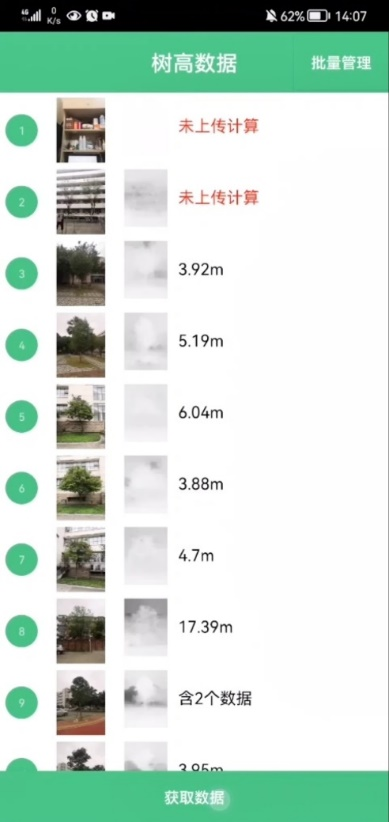{width="1.864990157480315in"
height="3.937007874015748in"}

图4-14 数据列表界面

  --------------------------------------------------------------- --------------------------------------------------------------- ---------------------------------------------------------------
  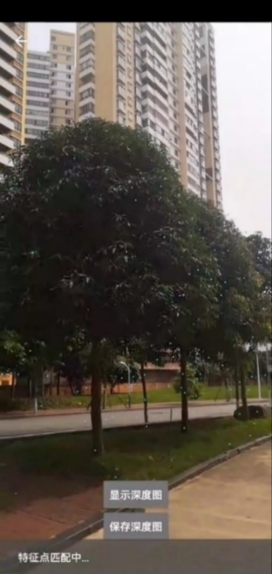{width="1.7534722222222223in"   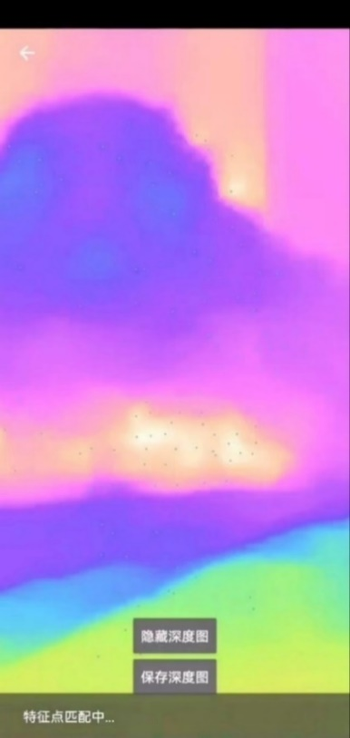{width="1.7534722222222223in"   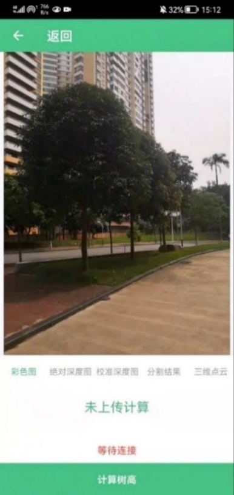{width="1.7534722222222223in"
  height="3.7006944444444443in"}                                  height="3.7006944444444443in"}                                  height="3.7006944444444443in"}

  (a)彩色图                                                       （b）深度图                                                     (c)数据详情界面
  --------------------------------------------------------------- --------------------------------------------------------------- ---------------------------------------------------------------

图4-15拍照界面

（4）点击底部的"计算树高"按钮，发送彩色图、绝对深度图和相机内参到后端进行树高计算并回传结果，等待3\~4秒，系统会自动跳转到"分割结果"标签页，如图4-16(a)所示，图中用不同颜色标记不同的树木区域，并在左上角添加文字，指明不同树木的代号和该树的树高，在图像下方也明确地写出了每棵树木的树高。对于最高点被遮挡的树木，使用白色线段画出其树冠的拟合曲线和树干的拟合直线，曲线和直线段的交点即为估计的最高点。用户可以滑动屏幕查看校准的深度图和三维点云，如图4-16(b)\~(c)所示，并且可以手势控制点云旋转，从不同角度进行观察。

  --------------------------------------------------------------- --------------------------------------------------------------- ---------------------------------------------------------------
  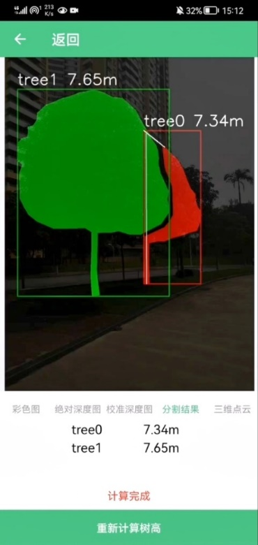{width="2.0520833333333335in"   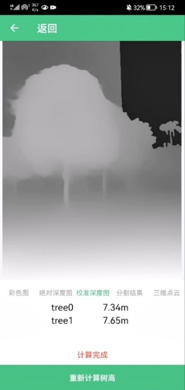{width="2.0520833333333335in"   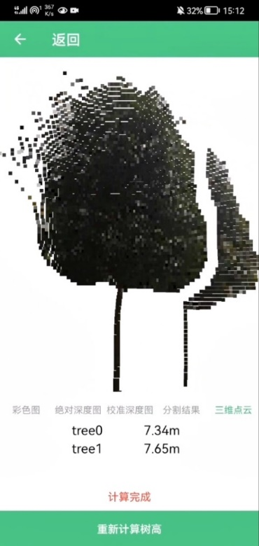{width="2.0520833333333335in"
  height="4.330555555555556in"}                                   height="4.330555555555556in"}                                   height="4.330555555555556in"}

  (a)分割结果                                                     (b)校准深度图                                                   (c)树木三维点云
  --------------------------------------------------------------- --------------------------------------------------------------- ---------------------------------------------------------------

图4-16测量结果展示界面

除了对树木进行实时拍摄和测量外，系统还具备批量处理功能，其流程如下：

（1）在数据列表界面，点击右上角的"批量管理"按钮，每行数据的最右侧出现复选框，列表顶部出现"全选"选框，底部出现四个按钮，对应四种功能，如图4-17所示。选中前六项，点击"上传计算"按钮，界面底部会出现一个进度条显示处理进度，当计算完成后，数据列表页会自动更新数据项的状态，显示树高信息。

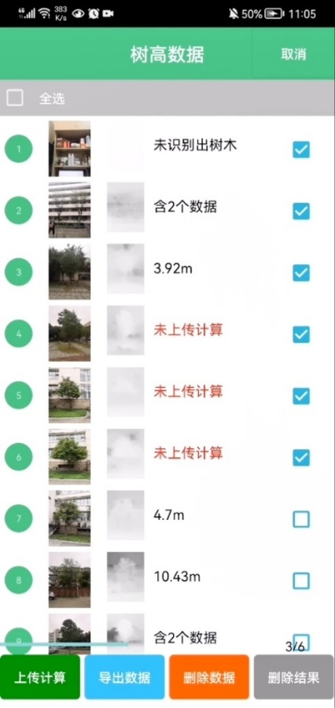{width="1.9395833333333334in"
height="4.094444444444444in"}

图4-17批量上传计算功能

（2）批量测量完成后，可以点击数据项进入详情页查看校准深度图、分割结果和三维点云，如图4-18所示。

  --------------------------------------------------------------- --------------------------------------------------------------- --------------------------------------------------------------- ---------------------------------------------------------------
  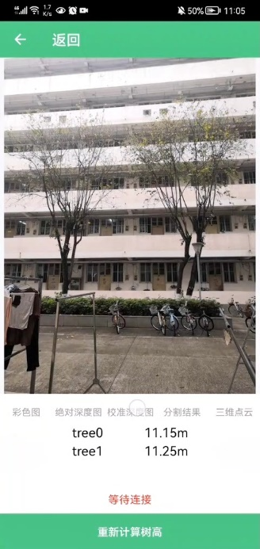{width="1.4916666666666667in"   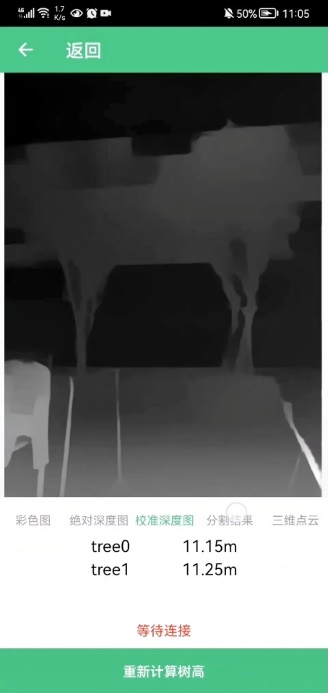{width="1.4916666666666667in"   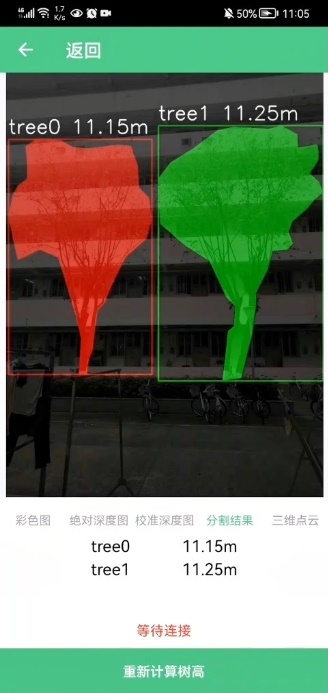{width="1.4916666666666667in"   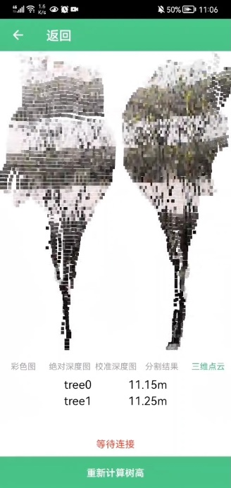{width="1.4916666666666667in"
  height="3.1493055555555554in"}                                  height="3.1493055555555554in"}                                  height="3.1493055555555554in"}                                  height="3.1493055555555554in"}

  --------------------------------------------------------------- --------------------------------------------------------------- --------------------------------------------------------------- ---------------------------------------------------------------

图4-18数据详情

（3）点击"全选"按钮选中全部数据，再点击"导出数据"按钮，即可将所选数据的树高导出到Excel表格文件中，该文件存储在手机根目录下，如图4-19所示。

  --------------------------------------------------------------- --------------------------------------------------------------- ---------------------------------------------------------------
  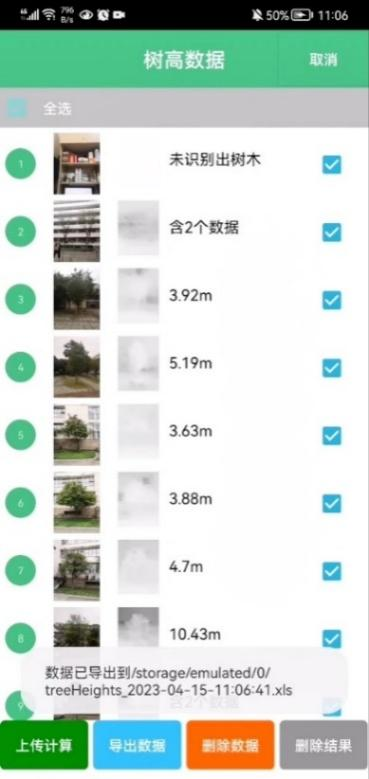{width="1.6784722222222221in"   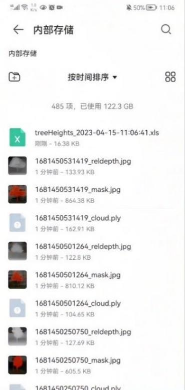{width="1.6784722222222221in"   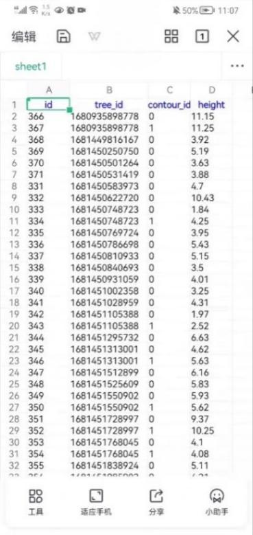{width="1.6784722222222221in"
  height="3.5430555555555556in"}                                  height="3.5430555555555556in"}                                  height="3.5430555555555556in"}

  (a)导出数据提示信息                                             (b)数据文件                                                     (c)树高数据
  --------------------------------------------------------------- --------------------------------------------------------------- ---------------------------------------------------------------

图4-19批量导出数据功能

（4）再次点击"全选"按钮以取消全选，然后选中前两组数据，点击"删除结果"按钮，系统会弹出提示框，防止用户误删数据，如图4-20(a)所示。如果用户点击"确定"，所选数据的计算结果，包括树高、校准深度图、分割结果图和三维点云都会被删除，并更新数据列表，如图4-20(b)所示。点击"删除数据"按钮会进行类似的提示和操作，不同的是删除的是所选的全部数据，包括拍摄数据和测量结果，如图4-21所示。

  --------------------------------------------------------------- ---------------------------------------------------------------
  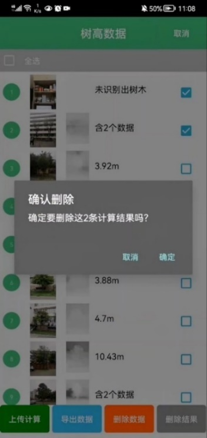{width="1.6034722222222222in"   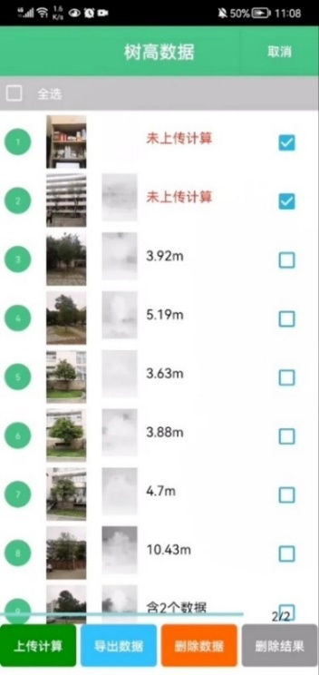{width="1.6034722222222222in"
  height="3.3854166666666665in"}                                  height="3.3854166666666665in"}

  (a)确认删除计算结果提示框                                       (b)删除所选计算结果
  --------------------------------------------------------------- ---------------------------------------------------------------

图4-20批量删除计算结果功能

  --------------------------------------------------------------- ---------------------------------------------------------------
  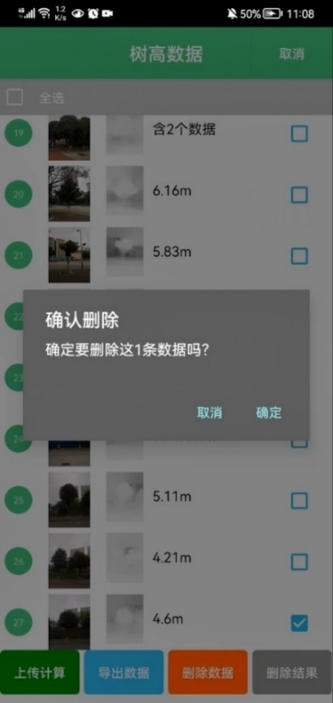{width="1.6784722222222221in"   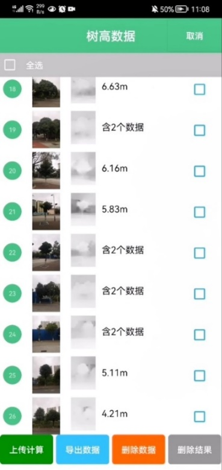{width="1.6784722222222221in"
  height="3.5430555555555556in"}                                  height="3.5430555555555556in"}

  (a)确认删除数据提示框                                           (b)删除所选数据
  --------------------------------------------------------------- ---------------------------------------------------------------

图4-21 批量删除数据功能

## 4.5本章小结 {#本章小结-2 .Title}

本章介绍了基于智能手机安卓APP的立木树高测量系统的开发过程。首先进行了系统的需求分析，明确了系统功能和用户需求。接着进行了系统的概要设计和详细设计，阐述了系统架构和技术方案。最后展示了系统的功能和操作步骤。

# 总结与展望

## 5.1论文工作总结 {#论文工作总结 .Title}

本文针对当前的林木资源调查过程中，特别是树高的测量中，传统人工测量方法自动化程度低，精密仪器辅助测量方法成本高昂、操作复杂、不便于非专业人士操作使用等问题，提出了基于三维重建的树高测量方案，不仅可以实现多株立木树高的测量，也可以解决树木背景复杂、树木最高点被遮挡对测量精度的干扰问题。本文工作的总结如下：

（1）结合DfM
算法和MidasNet模型生成立木深度图。本文首先在手机运动过程中获取少量不同视角的立木图像，通过研究特征点在空间位置上的变化，估计每个像素的深度，获得一个粗略的绝对深度图。然后使用MidasNet模型预测得到边缘更加清晰的相对深度图。最后，使用粗略绝对深度图对精细相对深度图进行校准和调整，从而获得精细的立木绝对深度图，有效提高深度图的准确性。

（2）改进Attention-UNet进行树木图像分割。本研究对Attention
U-Net进行改进，增加深度图作为网络的输入，得到Depth-Attention-UNet模型。在解码阶段进行特征融合，为注意力门提供更丰富的空间信息，进而提高图像分割的精确性和鲁棒性。采集不同环境下不同树木的图像，制作立木数据集，训练Depth-Attention-UNet模型，实现树木图像自动分割。

（3）通过拟合树冠曲线估计被遮挡树木的最高点。首先检测树木最高点是否被遮挡，并通过拟合树冠曲线估计最高点，补全树木轮廓用于点云分割，将获取的深度图与彩色图融合生成三维点云，对点云进行分割获取立木三维点云，并对点云进行半径滤波去除离群点。

（4）基于三维点云测量立木高度。提取点云的轴对齐包围盒，取包围盒在Y世界坐标轴方向作为树高。

（5）利用深度估计、图像分割和三维重建技术，结合Android开发平台，以及Flask和PyTorch框架，设计并实现了一个立木树高测量系统。

实验证明树高测量的平均相对误差为3.20%，满足国家森林资源连续清查的精度要求。

## 5.2展望 {#展望 .Title}

总体来说，本文对使用智能手机进行立木树高测量的研究取得了一定的成果，但在客观或主观因素的影响下，本文的研究仍然存在局限，具体表现在：

（1）在深度估计任务中，只利用普通手机配备的相机和惯性传感器进行绝对深度估计，而没有使用主动测距设备，仅能够获取0.5米\~20米范围内的深度信息，且平均精度为95%。此外，待测树木越高，拍摄时需要的距离也会随之增加，这会进一步导致深度估计的误差增大。

（2）在使用Depth-Attention-UNet对树木图像进行分割时，相机可能会出现失焦的情况，从而导致一些树木边缘的信息丢失。这种情况可能会影响分割的准确性，因为失焦事件是随机发生的，并且概率很小，所以会引入一些随机误差。

（3）Depth-Attention-UNet利用深度信息，可以在多棵树木相互交错的情况下将其准确地分割出来，但是当树木并排密集分布，且树冠颜色及其相近时，模型通常无法进行正确的分割。

基于本文研究的一些不足，希望未来能在以下几个方面深入研究：

（1）针对深度估计受距离限制的问题，可以通过机器学习算法，对相机和惯性传感器采集到的数据进行训练，得到更准确的深度估计模型。在处理较高的树木时，可以考虑使用多视角的图像处理方法，或者通过将多个图像进行拼接的方式来提高深度估计的精度。

（2）针对可能的失焦问题，在训练模型时增加一些失焦数据，以增强模型对于失焦情况的识别和处理能力，提高树木图像分割的精度和稳定性，使其更适用于实际应用场景。

（3）尝试引入基于Transformer的图像分割模型进行树木图像分割，解决树冠密集交错且颜色相近时的分割问题。

1.  

# 参考文献

1.  陈剑.森林、林业与生态文明建设\[J\].现代园艺, 2018(11):153-154.

2.  李金钎.活树木经济价值与林分因子相关模型的研究\[J\].绿色财会,2019(02):15-18.

3.  Groot d M., Schueler S., Sallmannshofer M., et al. Forest
    management, site characteristics and climate change affect multiple
    biotic threats in riparian forests\[J\]. Forest Ecology and
    Management, 2022, 508(1): 120041.

4.  龚书铭. 林业测量学\[M\]. 中国林业出版社, 2005.

5.  Liu T., Sun Y., Wang C., et al. Unmanned aerial vehicle and
    artificial intelligence revolutionizing efficient and precision
    sustainable forest management\[J\]. Journal of Cleaner Production,
    2021, 16(1):97.

6.  黄麟.森林管理的生态效应研究进展\[J\].生态学报, 2021, 41(10): 14.

7.  Carlos Cabo A, Celestino Ordóez a, Carlos A. López-Sánchez.
    Automatic dendrometry: Tree detection, tree height and diameter
    estimation using terrestrial laser scanning\[J\]. International
    Journal of Applied Earth Observation and Geoinformation, 2018, 69:
    164-174.

8.  Newnham, G. J., Armston, J. D., Calders, K., et al. Terrestrial
    Laser Scanning for Plot-Scale Forest Measurement\[J\]. Current
    Forestry Reports, 2015, 1(4): 239-251.

9.  于东海,冯仲科,曹忠,蒋君志伟.全站仪测量立木胸径树高及材积的误差分析\[J\].农业工程学报,2016,32(17):160-167.

10. 隋宏大. 树高测量综合技术比较研究\[D\].北京林业大学,2009.

11. 杨坤，赵艳玲，张建勇，等．利用无人机高分辨率影像进行树木高度提取\[J\]．北京林业大学学报，2017，39(08)：17﹣23.

12. Panagiotidis D, Abdollahnejad A, Surovy P, et al. Determining tree
    height and crown diameter from high-resolution UAV imagery\[J\].
    International Journal of Remote Sensing, 2017, 38(8-10):2392-2410.

13. YIN, DEMENG, WANG, et al. Individual mangrove tree measurement using
    UAV-based Li DAR data: Possibilities and challenges \[J\]. Remote
    Sensing of Environment, 2019, 223: 34 - 49.

14. Mayamanikandan T, Reddy R S, Jha C S. Non-Destructive Tree Volume
    Estimation using Terrestrial Lidar Data in Teak Dominated Central
    Indian Forests\[C\]. 2019 IEEE Recent Advances in Geoscience and
    Remote Sensing : Technologies, Standards and Applications
    (TENGARSS). IEEE, 2020: 100-103.

15. Tian J, Dai T, Li H, et al. A Novel Tree Height Extraction Approach
    for Individual Trees by Combining TLS and UAV Image-Based Point
    Cloud Integration\[J\]. Forests, 2019, 10(7):537.

16. 杨全月，陈志泊，孙国栋．基于点云数据的测树因子自动提取方法\[J\]．农业机械学报，2017，48(08)：179﹣185.

17. Collazos D T, Cano V R, Villota J C P, et al. A photogrammetric
    system for dendrometric feature estimation of individual trees\[C\].
    2018 IEEE 2nd Colombian Conference on Robotics and Automation
    (CCRA). IEEE, 2018: 1-6.

18. 练一宁.
    地面近景摄影获取测树因子方法研究\[D\].北京林业大学,2019.DOI:10.26949/d.cnki.gblyu.2019.000287.

19. 孙英伟.
    基于近景摄影测量的单木结构参数提取研究\[D\].东北林业大学,2020.DOI:10.27009/d.cnki.gdblu.2020.000215.

20. 刘金成，冯仲科，杨立岩，等．实时动态多功能双目立体摄影测树仪设计\[J\]．农业工程学报，2018，34(22):
    61-68.

21. 张真维,赵鹏,韩金城.基于双目视觉的树木高度测量方法研究\[J\].林业工程学报,2021,6(06):156-164.DOI:10.13360/j.issn.2096-1359.202012009.

22. 尹萍,徐爱俊,叶俊华等.基于消费级双目相机的立木因子测量方法\[J\].浙江农林大学学报,2023,40(02):436-445.

23. 高莉平,徐爱俊.应用智能终端的立木高度测量方法\[J\].东北林业大学学报,2018,46(11):28-34.DOI:10.13759/j.cnki.dlxb.2018.11.006.

24. 武新梅. 基于智能手机的多株立木因子测量方法\[D\].浙江农林大学,2019.

25. Coelho J, MM Crisóstomo, Coimbra A P, et al. Non-Destructive Fast
    Estimation of Tree Stem Height and Volume Using Image
    Processing\[J\]. Symmetry, 2021, 13(3): 374.

26. Juyal P, Sharma S. Estimation of Tree Volume Using Mask R-CNN based
    Deep Learning\[C\]. 11th International Conference on Computing,
    Communication and Networking Technologies (ICCCNT). 2020: 1-6.

27. Itakura K, Hosoi F. Simple and effective tool for estimating tree
    trunk diameters and tree species classification\[J\]. Applied
    optics, 2020, 59(2):558-563.

28. 张真维.
    基于计算机视觉的树木数量与高度计算方法研究\[D\].东北林业大学,2022.DOI:10.27009/d.cnki.gdblu.2022.000696.

29. Sutherland I E. Sketch pad a man-machine graphical communication
    system\[C\]. Proceedings of the SHARE design automation
    workshop.1964: 6-329.

30. 张晨博.
    基于平行多线的手持式激光三维扫描技术研究和应用\[D\].南京航空航天大学,2017.

31. Ni Y, Dai J, Zhang Y, et al. Research on Target 3D Reconstruction
    and Measurement Technology based on Binocular Vision and Lidar\[C\].
    2020 15th IEEE Conference on Industrial Electronics and Applications
    (ICIEA). IEEE, 2020: 1780-1784.

32. Li, Dawei, et al. 3D imaging of greenhouse plants with an
    inexpensive binocular stereo vision system\[J\]. Remote Sensing 9.5
    (2017): 508.

33. 韩婧. 基于深度学习的多视图三维重建\[D\].武汉大学,2019.

34. 周三章.
    基于三维点云的农林作物三维重建方法与特征提取研究\[D\].北京林业大学,2020.DOI:10.26949/d.cnki.gblyu.2020.000665.

35. Holzmann, Thomas, et al. Semantically aware urban 3d reconstruction
    with plane-based regularization\[C\]. Proceedings of the European
    Conference on Computer Vision (ECCV). 2018: 468-483.

36. Pontes J K, Kong C, Sridharan S, et al. Image2Mesh: A Learning
    Framework for Single Image 3D Reconstruction\[J\]. 2017: 365-381.

37. Zhu, Ruoning, Zhengqi Guo, and Xiaoli Zhang. Forest 3D
    reconstruction and individual tree parameter extraction combining
    close-range photo enhancement and feature matching\[J\]. Remote
    Sensing 13.9 (2021): 1633.

38. Koenderink J J, Doorn A. Surface shape and curvature scales\[J\].
    Image and Vision Computing, 1993, 10(8):557-564.

39. 李科,毋涛,刘青青.基于深度图与改进Canny算法的人体轮廓提取\[J\].计算机技术与发展,2021,31(05):67-72.

40. 万寒月,陈潇然,王昭.一种低分辨率TOF深度图的优化算法与实现\[J\].信息技术与信息化,2022(05):62-65.

41. Liao Y, Huang L, Yue W, et al. Parse geometry from a line: Monocular
    depth estimation with partial laser observation\[C\]. 2017 IEEE
    International Conference on Robotics and Automation (ICRA). IEEE,
    2017: 5059-5066.

42. 刘杰平,周华盛,余朗衡,丁树浩,梁亚玲.基于视觉词典的深度图生成算法\[J\].光学学报,2018,38(09):276-284.

43. 王琦,朴燕.基于改进遗传算法的深度图像获取技术\[J\].激光与光电子学进展,2018,55(02):176-182.

44. Valentin J, Kowdle A, Barron J T, et al. Depth from motion for
    smartphone AR\[J\]. ACM Transactions on Graphics (ToG), 2018, 37(6):
    1-19.

45. Ha H, Im S, Park J, et al. High-Quality Depth from Uncalibrated
    Small Motion Clip\[C\]. IEEE Conference on Computer Vision and
    Pattern Recognition (CVPR). IEEE, 2016: 5413-5421.

46. Gordon A, Li H, Jonschkowski R, et al. Depth from Videos in the
    Wild: Unsupervised Monocular Depth Learning from Unknown
    Cameras\[J\]. 2019: 8977-8986.

47. Godard C, Aodha O M, Brostow G J. Unsupervised Monocular Depth
    Estimation with Left-Right Consistency\[C\]. Computer Vision &
    Pattern Recognition. IEEE, 2017: 270-279.

48. Saxena A, Min S, Ng A Y. 3-D Reconstruction from Sparse Views using
    Monocular Vision\[C\]. IEEE International Conference on Computer
    Vision. IEEE, 2007: 1-8.

49. Liu B, Gould S, Koller D. Single Image Depth Estimation From
    Predicted Semantic Labels\[C\]. The Twenty-Third IEEE Conference on
    Computer Vision and Pattern Recognition. IEEE, 2010:1253-1260.

50. Wang Y, Wang R, Dai Q. A Parametric Model for Describing the
    Correlation Between Single Color Images and Depth Maps\[J\]. IEEE
    Signal Processing Letters, 2014, 21(7):800-803.

51. 莫一鸣.
    基于非参数多线索融合的单目视频深度图估计研究\[D\].南京邮电大学,2014.

52. Liu M, Salzmann M, He X. Discrete-Continuous Depth Estimation from a
    Single Image\[C\]. IEEE Conference on Computer Vision & Pattern
    Recognition. IEEE Computer Society, 2014:716-723.

53. Zhao, Chaoqiang, et al. Monocular depth estimation based on deep
    learning: An overview\[J\]. Science China Technological
    Sciences 63.9 (2020): 1612-1627.

54. Ranftl R, Lasinger K, Hafner D, et al. Towards Robust Monocular
    Depth Estimation: Mixing Datasets for Zero-shot Cross-dataset
    Transfer\[J\]. IEEE Transactions on Pattern Analysis and Machine
    Intelligence, 2020, PP(99):1-1.

55. 张雪霏.
    面向单目深度估计的无监督深度学习模型研究\[D\].南京信息工程大学,2022.DOI:10.27248/d.cnki.gnjqc.2022.000109.

56. Kuznietsov Y, Stückler, Jrg, Leibe B. Semi-Supervised Deep Learning
    for Monocular Depth Map Prediction\[J\]. IEEE Computer Society,
    2017: 6647-6655.

57. Abdulateef S K, Salman M D. A Comprehensive Review of Image
    Segmentation Techniques\[J\]. Iraqi Journal for Electrical &
    Electronic Engineering, 2021, 17(2):1-3.

58. 葛玉峰,周宏平,郑加强,张慧春.基于相对色彩因子的树木图像分割算法\[J\].南京林业大学学报(自然科学版),2004(04):19-22.

59. 赵茂程,郑加强,林小静,封晓强.基于分形理论的树木图像分割方法\[J\].农业机械学报,2004(02):72-75.

60. Jiang W, Zhou H, Shen Y, et al. Image segmentation with
    pulse-coupled neural network and Canny operators\[J\]. Computers &
    Electrical Engineering, 2015, 46: 528-538.

61. 郭晶晶,李庆武,程海粟,仇春春.基于Lab颜色距离和GMM的树木图像分割算法\[J\].信息技术,2016(02):1-4+9.DOI:10.13274/j.cnki.hdzj.2016.02.001.

62. Long J, Shelhamer E, Darrell T. Fully convolutional networks for
    semantic segmentation\[C\]. IEEE Conference on Computer Vision and
    Pattern Recognition. IEEE Computer Society, 2015:3431-3440.

63. Yang Y, Yin Z, Bi F, et al. M-FCN: Effective Fully Convolutional
    Network-Based Airplane Detection Framework\[J\]. IEEE Geoscience &
    Remote Sensing Letters, 2017, 14(8):1293-1297.

64. He D, Cohen S, Price B, et al. Multi-Scale Multi-Task FCN for
    Semantic Page Segmentation and Table Detection\[C\]. Iapr
    International Conference on Document Analysis & Recognition, 2018:
    254-261.

65. Chen L C, Papandreou G, Kokkinos I, et al. Deep Lab: Semantic Image
    Segmentation with Deep Convolutional Nets, Atrous Convolution, and
    Fully Connected CRFs\[J\]. IEEE Transactions on Pattern Analysis &
    Machine Intelligence, 2018, 40(4):834-848.

66. Chen L C, Zhu Y, Papandreou G, et al. Encoder-Decoder with Atrous
    Separable Convolution for Semantic Image Segmentation\[C\]. 2018
    European Conference on Computer Vision (ECCV), 2018:833-851.

67. Zhao H, Shi J, Qi X, et al. Pyramid Scene Parsing Network\[J\]. 2017
    IEEE Conference on Computer Vision and Pattern Recognition (CVPR),
    2017: 6230-6239.

68. 张达,熊凌.基于改进PSPNet的氩花图像分割算法\[J\].计算机工程与设计,2022,43(10):2843-2849.DOI:10.16208/j.issn1000-7024.2022.10.020.

69. He K, Gkioxari G, Dollar P, et al. Mask R-CNN\[J\]. IEEE
    Transactions on Pattern Analysis & Machine Intelligence,
    2017(99):1-1.

70. Yu F, Tan X, Ren T, et al. Human-Centric Visual Relation
    Segmentation Using Mask R-CNN and VTrans E\[C\]. European Conference
    on Computer Vision, 2018: 582-589.

71. Ronneberger O, Fischer P, Brox T. U-Net: Convolutional Networks for
    Biomedical Image Segmentation\[C\]. International Conference on
    Medical Image Computing & Computer-assisted Intervention, 2015:
    234-241.

72. Zhou Z, Rahman Siddiquee M M, Tajbakhsh N, et al. Unet++: A nested
    u-net architecture for medical image segmentation\[C\]. Deep
    Learning in Medical Image Analysis and Multimodal Learning for
    Clinical Decision Support: 4th International Workshop, DLMIA 2018,
    and 8th International Workshop, ML-CDS 2018, Held in Conjunction
    with MICCAI 2018, Granada, Spain, September 20, 2018, Proceedings 4.
    Springer International Publishing, 2018: 3-11.

73. Alom, Md Zahangir, et al. Recurrent residual U-Net for medical image
    segmentation\[J\]. Journal of Medical Imaging 6.1, 2019:
    014006-014006.

74. Oktay O, Schlemper J, Folgoc L L, et al. Attention u-net: Learning
    where to look for the pancreas\[J\]. IEEE, 2018: 59037-59047..

75. He K, Zhang X, Ren S, et al. Deep Residual Learning for Image
    Recognition\[J\]. IEEE, 2016: 770-778.

76. Paszke A, Gross S, Massa F, et al. PyTorch: An Imperative Style,
    High-Performance Deep Learning Library\[J\]. Advances in neural
    information processing systems, 2019: 32-32.

77. Harris C G, Stephens M J. A combined corner and edge detector\[C\].
    Alvey vision conference. 1988: 10-5244.

78. Bouguet J Y. Pyramidal implementation of the affine lucas kanade
    feature tracker description of the algorithm\[J\]. Intel
    corporation, 2001, 5(1-10): 4.

79. Tomasi C, Kanade T. Detection and tracking of point\[J\]. Int J
    Comput Vis, 1991, 9: 137-154.

80. Pollefeys M, Koch R, Van Gool L. A simple and efficient
    rectification method for general motion\[C\]. Proceedings of the
    Seventh IEEE International Conference on Computer Vision. IEEE,
    1999, 1: 496-501.

81. Ryan Fanello S, Valentin J, Kowdle A, et al. Low compute and fully
    parallel computer vision with hashmatch\[C\]. Proceedings of the
    IEEE International Conference on Computer Vision. 2017: 3874-3883.

82. Bleyer M, Rhemann C, Rother C. PatchMatch Stereo - Stereo Matching
    with Slanted Support Windows\[C\]. British Machine Vision
    Conference. 2011: 1-11.

83. Fanello S R, Valentin J, Rhemann C, et al. Ultrastereo: Efficient
    learning-based matching for active stereo systems\[C\]. 2017 IEEE
    Conference on Computer Vision and Pattern Recognition (CVPR). IEEE,
    2017: 6535-6544.

84. Criminisi A, Shotton J, Konukoglu E. Decision forests: A unified
    framework for classification, regression, density estimation,
    manifold learning and semi-supervised learning\[J\]. Foundations and
    trends® in computer graphics and vision, 2012, 7(2--3): 81-227.

85. Hartley R, Zisserman A. Multiple view geometry in computer
    vision\[M\]. Cambridge University Press. 2000.

86. Mazumdar A, Alaghi A, Barron J T, et al. A hardware-friendly
    bilateral solver for real-time virtual reality video\[M\].
    Proceedings of High Performance Graphics. 2017: 1-10.

87. Li Z, Snavely N. MegaDepth: Learning Single-View Depth Prediction
    from Internet Photos\[J\]. IEEE, 2018: 2041-2050.

88. Ke X, Shen C, Cao Z, et al. Monocular Relative Depth Perception with
    Web Stereo Data Supervision\[C\]. IEEE Conference on Computer Vision
    and Pattern Recognition. IEEE, 2018: 311-320.

89. Wang C, Lucey S, Perazzi F, et al. Web Stereo Video Supervision for
    Depth Prediction from Dynamic Scenes\[J\]. 2019 International
    Conference on 3D Vision, 2019: 348-357.

90. Milletari F, Navab N, Ahmadi S A. V-Net: Fully Convolutional Neural
    Networks for Volumetric Medical Image Segmentation\[J\]. 2016 fourth
    international conference on 3D vision, 2016: 565-571.

91. Nesterov, Yu. Gradient methods for minimizing composite
    functions\[J\]. Mathematical Programming, 2013, 140(1):125-161.

92. Loshchilov I, Hutter F. SGDR: Stochastic Gradient Descent with Warm
    Restarts\[J\]. 2016.

93. 赵芳,冯仲科,高祥,郑君,王智超.树冠遮挡条件下全站仪测量树高及材积方法\[J\].农业工程学报,2014,30(02):182-190.

94. Cheikh M, Lauri K, Kalle E, et al. Using LiDAR-modified topographic
    wetness index, terrain attributes with leaf area index to improve a
    single-tree growth model in south-eastern Finland\[J\]. Forestry,
    2019(3):253-263.

95. 牛思圆,刘鹏举,雷相东,任怡,高影.基于连清样地数据的全国杉木人工林平均木树高-胸径模型\[J\].林业科学研究,2023,36(01):117-123.

96. MS Patrício, Dias C, Nunes L. Mixed-effects generalized
    height-diameter model: A tool for forestry management of young sweet
    chestnut stands\[J\]. Forest Ecology and Management, 2022,
    514:120209-120209.

97. 国家林业局调查规划设计院. GB/T 26424-2010
    森林资源规划设计调查技术规程\[S\]. 北京: 中国标准出版社, 2011.

# 附录

1、外文参考文献原文

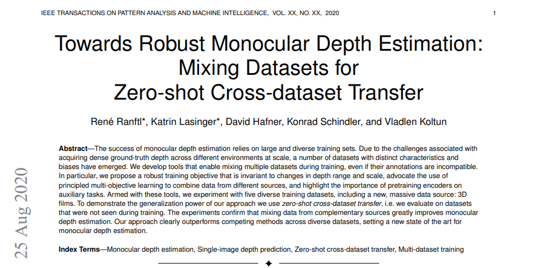{width="6.536111111111111in"
height="3.2645833333333334in"}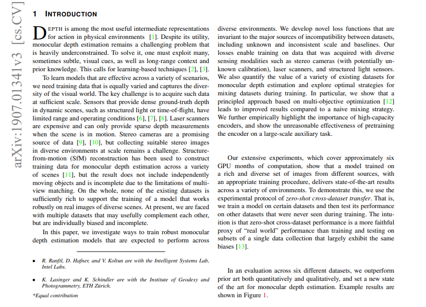{width="6.536111111111111in"
height="4.716666666666667in"}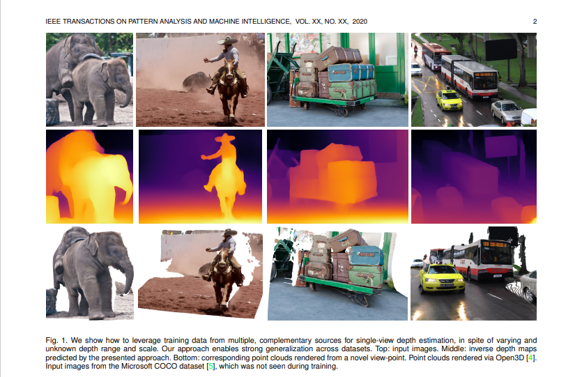{width="6.5137226596675415in"
height="4.2347222222222225in"}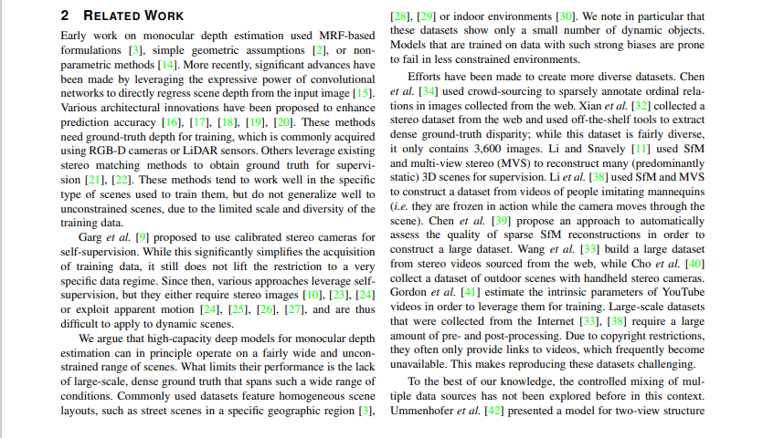{width="6.498797025371829in"
height="3.7576388888888888in"}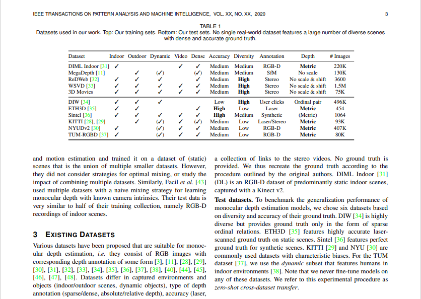{width="6.456965223097113in"
height="4.64375in"}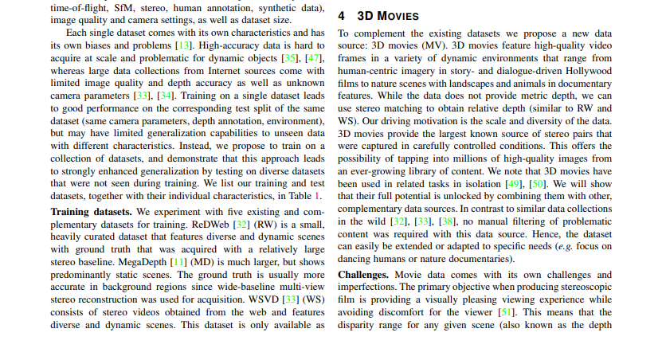{width="6.536111111111111in"
height="3.515972222222222in"}

2、外文参考文献部分译文

鲁棒单目深度估计：混合数据集的零样本跨数据集迁移

Rene Ranftl\*, Katrin Lasinger\*, David Hafner, Konrad Schindler, and
Vladlen Koltun

摘要：单目深度估计的成功依赖于大量多样的训练集。由于在不同环境中大规模获取密集真值深度的相关挑战，出现了许多具有不同特征和偏置的数据集。我们开发的工具可以在训练期间混合多个数据集，即使它们的标注不兼容。特别是，我们提出了一个对深度范围和尺度变化不变的鲁棒训练目标，提倡使用原则性的多目标学习来组合来自不同来源的数据，并强调了用辅助任务对编码器进行预训练的重要性。有了这些工具，我们对五个不同的训练数据集进行了实验，包括一个新的海量数据源：3D电影。为了证明我们方法的泛化能力，我们使用零样本跨数据集迁移，即我们在训练期间未看到的数据集上进行评估。实验证实，混合来自互补源的数据大大提高了单目深度估计。我们的方法在不同的数据集上明显优于竞争对手的方法，为单目深度估计确立了新的技术水平。

关键字：单目深度估计，单图像深度预测，零样本跨数据集迁移，多数据集训练

1 引言

深度是物理环境中动作最有用的中间表示之一\[1\]。尽管单目深度估计很有用，但它仍然是一个严重欠约束的挑战性问题。要解决这个问题，人们必须利用许多(有时是微妙的)视觉线索，以及长程上下文和先验知识。这就需要基于学习的技术\[2\]，\[3\]。

要学习在各种场景下有效的模型，我们需要同样多样化的训练数据，并捕捉视觉世界的多样性。关键的挑战是获得足够规模的数据。在动态场景中提供密集真实深度的传感器，如结构光或飞行时间，具有有限的范围和操作条件\[6\]，\[7\]，\[8\]。激光扫描仪价格昂贵，只能在场景运动时提供稀疏的深度测量。立体相机是一种很有前途的数据来源\[9\]，\[10\]，但在不同环境下大规模采集合适的立体图像仍然是一个挑战。运动恢复结构(structure
-from motion,
SfM)重建已被用于构建跨各种场景\[11\]的单目深度估计的训练数据，但由于多视图匹配的限制，其结果不包括独立运动的目标，且是不完整的。总的来说，现有的数据集都不够丰富，不足以支持训练一个在不同场景的真实图像上鲁棒地工作的模型。目前，我们面临着多个数据集，这些数据集可能有用地相互补充，但都是有偏见的和不完整的。

本文研究了训练鲁棒的单目深度估计模型的方法，这些模型有望在不同的环境中执行。本文开发了新的损失函数，对数据集之间不兼容性的主要来源不变，包括未知和不一致的规模和基线。所提出损失能够对通过不同传感方式获得的数据进行训练，如立体相机(可能具有未知的校准)、激光扫描仪和结构光传感器。量化了各种现有数据集对单目深度估计的价值，并探索了在训练过程中混合数据集的最佳策略。基于多目标优化\[12\]的原则性方法与朴素的混合策略相比，取得了改进的结果。进一步强调了大容量编码器的重要性，并展示了在大规模辅助任务上预训练编码器的不合理有效性。

广泛的实验覆盖了大约六个GPU月的计算，实验表明，在来自不同来源的丰富多样的图像集上训练的模型，通过适当的训练程序，可以在各种环境中提供最先进的结果。为证明这一点，使用零样本跨数据集迁移的实验协议。也就是说，我们在某些数据集上训练一个模型，然后在训练期间从未见过的其他数据集上测试它的性能。直觉是，与在主要表现出相同偏差\[13\]的单个数据集的子集上进行训练和测试相比，零样本跨数据集性能是"真实世界"性能的更可靠的代理。

在对六个不同数据集的评估中，在数量和质量上都超过了现有技术，并为单目深度估计确立了新的技术水平。示例结果如图1所示。

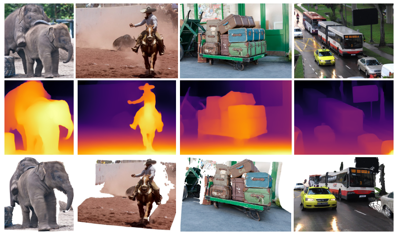{width="5.768055555555556in"
height="3.423611111111111in"}

图1.
我们展示了如何利用来自多个互补源的训练数据进行单视图深度估计，尽管深度范围和尺度不同且未知。我们的方法支持跨数据集的强泛化。顶部：输入图像。中间：通过所提出的方法预测的逆深度图。底部：从新视点渲染的对应点云。通过Open3D渲染的点云\[4\]。输入来自Microsoft
COCO数据集\[5\]的图像，这在训练期间是未见的。

2    相关工作

单目深度估计的早期工作使用基于MRF的公式\[3\]、简单的几何假设\[2\]或非参数方法\[14\]。最近，通过利用卷积网络的表达能力直接从输入图像回归场景深度，取得了重大进展\[15\]。已经提出了各种架构创新来提高预测精度\[16\]，\[17\]，\[18\]，\[19\]，\[20\]。这些方法需要真值深度进行训练，通常使用RGB-D相机或激光雷达传感器获取。其他人利用现有的立体匹配方法来获得监督的真值\[21\]，\[22\]。这些方法往往在用于训练它们的特定类型场景中工作良好，但由于训练数据的规模和多样性有限，不能很好地推广到无约束场景。

Gag等人\[9\]建议使用校准的立体摄像机进行自监督。虽然这大大简化了训练数据的获取，但仍然没有解除对非常具体的数据机制（regime）的限制。从那时起，各种方法利用了自监督，但它们要么需要立体图像\[10\]、\[23\]、\[24\]，要么利用apparent
motion\[24\]、\[25\]、\[26\]、\[27\]，因此难以应用于动态场景。

我们认为，用于单目深度估计的高容量深度模型原则上可以在相当广泛且不受约束的场景范围内运行。限制他们表现的是缺乏跨越如此广泛条件的大规模、密集的真值。常用的数据集以同质场景布局为特征，例如特定地理区域\[3\]、\[28\]、\[29\]的街道场景，或室内环境\[30\]。我们特别注意到，这些数据集仅显示少量动态对象。基于具有如此强偏置的数据进行训练的模型在约束较少的环境中容易失败。

已有一些努力创建更多样化的数据集。Chen等人\[34\]使用众包来稀疏地标注从网络收集的图像中的顺序关系。Xian等人\[32\]从网络上收集了一个立体数据集，并使用现成的工具来提取密集的真值视差；虽然这个数据集相当多样化，但它只包含3600张图像。Li和Snavely\[11\]使用SfM和多视图立体（MVS）重建了许多（主要是静态）3D场景以供监督。Li等人\[38\]使用SfM和MVS从模仿人体模特的人的视频中构建数据集（即，当摄像机在场景中移动时，他们的动作被冻结）。Chen等人\[39\]提出了一种自动评估稀疏SfM重建质量的方法，以构建大型数据集。Wang等人\[33\]从来自网络的立体视频中构建了一个大型数据集，而Cho等人\[40\]使用手持立体摄像机收集了一个室外场景数据集。Gordon等人\[41\]估计YouTube视频的内在参数，以便将其用于训练。从互联网收集的大规模数据集\[33\]，\[38\]需要大量的预处理和后处理。由于版权限制，他们通常只提供视频链接，而这些链接经常无法使用。这使得再现这些数据集具有挑战性。

据我们所知，在此背景下，以前从未探索过多个数据源的受控混合。Ummenhofer等人\[42\]提出了一个双视图结构和运动估计模型，并在多个较小数据集的联合（静态）场景数据集上对其进行了训练。然而，他们没有考虑优化混合的策略，也没有研究组合多个数据集的影响。类似地，Facility等人\[43\]使用具有天真混合策略的多个数据集来学习具有已知相机内参的单目深度。他们的测试数据与他们一半的训练数据非常相似，即室内场景的RGB-D录制。

3 现有数据集

已经提出了适合于单目深度估计的各种数据集，即，它们由具有某种形式的相应深度标注的RGB图像组成\[3\]、\[11\]、\[28\]、\[29\]、\[30\]、\[31\]、\[32\]、\[33\]、\[34\]、\[35\]、\[36\]、\[37\]、\[38\]、\[40\]、\[44\]、\[45\]、\[46\]、\[47\]、\[48\]。数据集在捕获的环境和对象（室内/室外场景、动态对象）、深度注释类型（稀疏/密集、绝对/相对深度）、精度（激光、飞行时间、SfM、立体、人类注释、合成数据）、图像质量和相机设置以及数据集大小方面有所不同。

每个数据集都有自己的特点，也有自己的偏置和问题\[13\]。高精度数据很难大规模获取，并且对于动态对象存在问题\[35\]，\[47\]，而来自互联网来源的大型数据收集具有有限的图像质量和深度精度以及未知的相机参数\[33\]，\[34\]。对单个数据集的训练可以在同一数据集（相同的相机参数、深度注释、环境）的相应测试分割上获得良好的性能，但对具有不同特征的未见数据的泛化能力可能有限。相反，我们建议在一组数据集（a
collection of
datasets）上进行训练，并通过在训练过程中未见的不同数据集上测试，证明这种方法可以显著增强泛化能力。我们在表1中列出了我们的训练和测试数据集及其各自的特征。

表1.我们工作中使用的数据集。顶部：我们的训练集。底部：我们的测试集。没有一个真实世界数据集具有大量、密集和准确真值的不同场景。

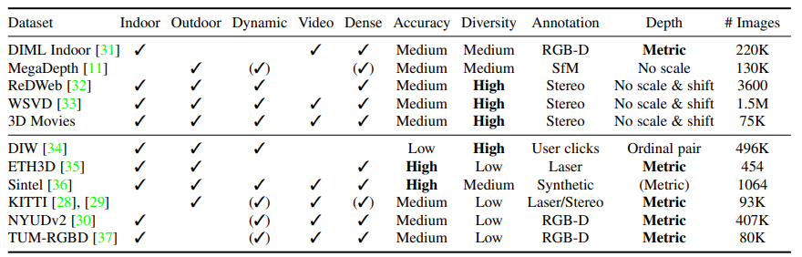{width="5.768055555555556in"
height="1.8479166666666667in"}

训练数据集。    我们用五个现有的和互补的数据集进行实验以进行训练。ReDWeb\[32\]（RW）是一个小的、精心策划的数据集，其特征是使用相对较大的立体基线获得的具有真值的多样化和动态场景。Mega深度\[11\]（MD）更大，但主要显示静态场景。由于宽基线多视图立体重建用于采集，因此背景区域中的真值通常更准确。WSVD\[33\]（WS）由从网络获得的立体视频组成，并具有多样的动态场景。此数据集仅有指向立体视频的一组链接。没有提供真值。因此，我们根据原作者概述的程序重建了真值。DIML
Indoor\[31\]（DL）是一个主要静态室内场景的RGB-D数据集，使用Kinect
v2捕捉。

测试数据集。   
为了衡量单目深度估计模型的泛化性能，我们根据多样性和真值准确性选择了六个数据集。DIW\[34\]是高度多样的，但仅以稀疏序数关系（sparse
ordinal
relations）的形式提供真值。ETH3D\[35\]在静态场景中具有高度精确的激光扫描真值。Sintel\[36\]为合成场景提供了完美的真值。KITTI\[29\]和NYU\[30\]是具有特征偏置（characteristic
biases）的常用数据集。对于TUM数据集\[37\]，我们使用了室内环境中人类的动态子集\[38\]。请注意，我们从不在任何这些数据集上微调模型。我们将此实验过程称为Zero-shot
跨数据集迁移。

3、完整树高测量数据

表1 110棵树高测量数据

  -------- ---------- ---------- ------------ ------------ ------------
   样本号   真实值/m   测量值/m   拍摄距离/m   绝对误差/m   相对误差/%

     1        3.7        3.78        2.47         0.08        2.16%

     2        3.8        3.72        2.53         0.08        2.11%

     3        4.5        4.62        3.00         0.12        2.67%

     4        4.7        4.8         3.13         0.10        2.13%

     5        4.7        4.53        3.13         0.17        3.62%

     6        4.8        4.63        3.20         0.17        3.54%

     7        5.1        5.21        3.40         0.11        2.16%

     8        5.2        5.33        3.47         0.13        2.50%

     9        5.3        5.43        3.53         0.13        2.45%

     10       5.5        5.65        3.67         0.15        2.73%

     11       5.6        5.42        3.73         0.18        3.21%

     12       5.7        5.56        3.80         0.14        2.46%

     13       5.8        5.93        3.87         0.13        2.24%

     14       5.9        5.73        3.93         0.17        2.88%

     15        6         5.78        4.00         0.22        3.67%

     16       6.2        6.34        4.13         0.14        2.26%

     17       6.3        6.46        4.20         0.16        2.54%

     18       6.4        6.21        4.27         0.19        2.97%

     19       6.5        6.73        4.33         0.23        3.54%

     20       6.6        6.74        4.40         0.14        2.12%

     21       6.7        6.5         4.47         0.20        2.99%

     22       6.8        7.02        4.53         0.22        3.24%

     23       6.9        6.73        4.60         0.17        2.46%

     24        7         7.23        4.67         0.23        3.29%

     25       7.1        7.25        4.73         0.15        2.11%

     26       7.2        7.34        4.80         0.14        1.94%

     27       7.3        7.54        4.87         0.24        3.29%

     28       7.4        7.63        4.93         0.23        3.11%

     29       7.5        7.23        5.00         0.27        3.60%

     30       7.6        7.83        5.07         0.23        3.03%

     31       7.7        7.87        5.13         0.17        2.21%

     32       7.8        7.58        5.20         0.22        2.82%

     33       7.9        8.19        5.27         0.29        3.67%

     34        8         8.29        5.33         0.29        3.62%

     35       8.2        8.49        5.47         0.29        3.54%

     36       8.4        8.11        5.60         0.29        3.45%

     37       8.5        8.23        5.67         0.27        3.18%

     38       8.6        8.93        5.73         0.33        3.84%

     39       8.7        9.02        5.80         0.32        3.68%

     40       8.8        9.03        5.87         0.23        2.61%

     41       8.9        9.24        5.93         0.34        3.82%

     42        9         8.68        6.00         0.32        3.56%

     43       9.1        9.35        6.07         0.25        2.75%

     44       9.2        9.48        6.13         0.28        3.04%

     45       9.3        9.58        6.20         0.28        3.01%

     46       9.6        9.28        6.40         0.32        3.33%

     47       10.2      10.45        6.80         0.25        2.45%

     48       10.8      11.04        7.20         0.24        2.22%

     49        11       11.29        7.33         0.29        2.64%

     50       11.1      11.42        7.40         0.32        2.88%

     51       11.3      11.63        7.53         0.33        2.92%

     52       11.4      11.01        7.60         0.39        3.42%

     53       11.7      11.33        7.80         0.37        3.16%
  -------- ---------- ---------- ------------ ------------ ------------

续表1 110棵树高测量数据

  -------- ---------- ---------- ------------ ------------ ------------
   样本号   真实值/m   测量值/m   拍摄距离/m   绝对误差/m   相对误差/%

     54       11.8      12.14        7.87         0.34        2.88%

     55        12       12.23        8.00         0.23        1.92%

     56       12.1      12.48        8.07         0.38        3.14%

     57       12.4      12.94        8.27         0.54        4.35%

     58       12.6      12.09        8.40         0.51        4.05%

     59       12.9      13.38        8.60         0.48        3.72%

     60        13       13.49        8.67         0.49        3.77%

     61       13.7      14.12        9.13         0.42        3.07%

     62       15.9       15.2       10.60         0.70        4.40%

     63       17.2      16.39       11.47         0.81        4.71%

     64       18.5      19.32       12.33         0.82        4.43%

     65       19.8      20.66       13.20         0.86        4.34%

     66       21.1      21.73       14.07         0.63        2.99%

     67       21.3      21.94       14.13         0.74        3.49%

     68       21.3      21.86       14.20         0.56        2.63%

     69       21.4      21.99       14.27         0.59        2.76%

     70       21.6      20.82       14.33         0.68        3.16%

     71       21.6      22.46       14.40         0.86        3.98%

     72       21.7      22.48       14.47         0.78        3.59%

     73       21.8      21.12       14.53         0.68        3.12%

     74       21.9      22.55       14.60         0.65        2.97%

     75        22       22.79       14.67         0.79        3.59%

     76       22.1      22.56       14.73         0.46        2.08%

     77       22.2      22.65       14.80         0.45        2.03%

     78       22.4      22.87       14.87         0.57        2.56%

     79       22.4      22.92       14.93         0.52        2.32%

     80       22.6      22.12       15.07         0.48        2.12%

     81       22.9      22.33       15.27         0.57        2.49%

     82        23       24.12       15.33         1.12        4.87%

     83       23.1      23.93       15.40         0.83        3.59%

     84       23.3      24.12       15.53         0.82        3.52%

     85       23.3      24.28       15.60         0.88        3.76%

     86       23.5      24.45       15.67         0.95        4.04%

     87       23.8      22.82       15.87         0.98        4.12%

     88       23.9      24.42       15.93         0.52        2.18%

     89        24       24.81       16.00         0.81        3.37%

     90       24.2      25.14       16.07         1.04        4.32%

     91       24.2      24.97       16.13         0.77        3.18%

     92       24.3       23.8       16.20         0.50        2.06%

     93       24.4      23.66       16.27         0.74        3.03%

     94       24.4      23.43       16.27         0.97        3.98%

     95       24.5       24.5       23.84        16.33         0.66

     96       24.6      23.94       16.33         0.56        2.29%

     97       24.6      23.78       16.40         0.82        3.33%

     98       24.7      24.13       16.47         0.57        2.31%

     99       24.8      23.69       16.53         1.11        4.48%

    100       24.9      23.85       16.60         1.05        4.22%

    101        25        23.9       16.67         1.10        4.40%

    102       25.1      24.36       16.73         0.74        2.95%

    103       25.2      24.12       16.80         1.08        4.29%

    104       25.3      24.18       16.87         1.12        4.43%

    105       25.4      24.25       16.93         1.15        4.53%

    106       25.4      24.59       17.00         0.91        3.57%

    107       25.6      26.75       17.07         1.15        4.49%
  -------- ---------- ---------- ------------ ------------ ------------

续表1 110棵树高测量数据

+:--------:+:--------:+:--------:+:----------:+:----------:+:----------:+
| 样本号   | 真实值/m | 测量值/m | 拍摄距离/m | 绝对误差/m | 相对误差/% |
+----------+----------+----------+------------+------------+------------+
| 108      | 25.7     | 26.7     | 17.13      | 1.00       | 3.89%      |
+----------+----------+----------+------------+------------+------------+
| 109      | 25.7     | 26.95    | 17.20      | 1.15       | 4.46%      |
+----------+----------+----------+------------+------------+------------+
| 110      | 25.9     | 26.97    | 17.27      | 1.07       | 4.13%      |
+----------+----------+----------+------------+------------+------------+
| 平均值                                      | 0.49       | 3.20%      |
+---------------------------------------------+------------+------------+

# 

# 致谢

在毕业论文即将完成的时刻，我回想起从选题到完成整个毕业设计的漫长道路，经历了整理文献、设计实验、收集数据、发现问题、解决困难等一系列工作，直到最终完成毕业论文的撰写，充满了挑战和困难，但也伴随着许多人的帮助和支持。在这里，我想表达我的感激之情。

首先，我要感谢黄汝维老师和华蓓老师。是她们引领我走进科研的世界，她们的严谨学术精神和认真工作态度深深感染了我。自论文选题开始以来，她们不断耐心地听取我的问题并给出意见和建议，直到论文撰写完成。她们的细致检查和指导使我的论文更加完善。没有两位老师的帮助，我无法完成毕业论文的撰写，谢谢她们！

其次，我要感谢计电学院的老师们，他们的严格教导和高质量的指导，让我不断汲取专业知识并提高自己的实践能力。

此外，我还要感谢智慧林业课题组的同学们，他们帮助我分析和解决实验过程中遇到的问题，协助我完成110棵树木高度数据的采集，使我能够顺利完成论文。

最后，我要感谢我的父母，是你们一直以来对我的鼓励和支持，让我拥有持之以恒不懈奋斗的动力。

谢谢你们！

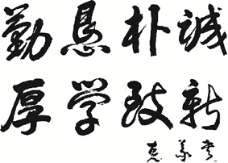{width="2.9472222222222224in"
height="2.1041666666666665in"}
