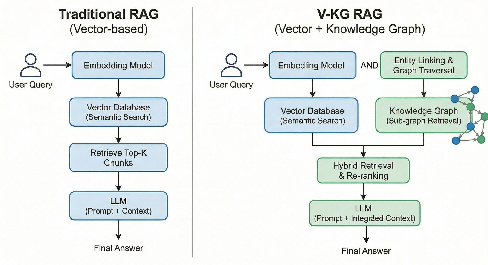
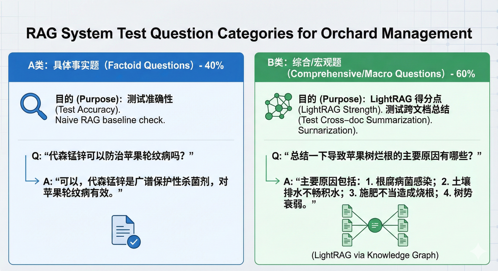

__毕业设计（论文）__

__课题名称：__ 基于大模型与向量-知识图谱融合的果园病虫害智能问答V-KG RAG系统构建

__学 院：__ 计算机与电子信息学院

__专 业：__ 计算机科学与技术

__班 级：__ 计科221

__学 号：__ 2207310310

__姓 名：__ 曾祥情

__指导教师：__ 孙宇

二〇二六年 三 月 八 日

# 摘 要

我国是世界水果生产第一大国，然而果园生态系统常面临严峻的病虫害威胁。传统的病虫害防治模式主要依赖专家指导与果农经验，存在专家资源分布不均、经验滞后以及用药不科学等严重瓶颈。随着大语言模型（LLM）的飞速发展，其在农业垂直领域展现出巨大潜力，但通用大模型在严肃的植保领域存在严重的“知识幻觉”、知识时效性滞后以及缺乏逻辑溯源等可信度挑战。

为了解决上述问题，本文设计并实现了一种基于V-KG RAG（Vector-Knowledge Graph RAG，向量-知识图谱融合检索增强生成）架构的果园病虫害智能问答系统。本研究首先对多源异构的果树病虫害数据进行采集与规范化清洗，构建了专业的农业本体模式（Schema）。其次，提出了一种融合向量数据库与图数据库的混合存储架构，利用大模型自动抽取非结构化文本中的实体与关系，生成包含丰富上下文的实体”画像”（Profile），构建了图增强向量索引，巧妙结合了知识图谱的结构化优势与向量检索的语义灵活性。在此基础上，系统设计了双层检索机制，能够同时精准处理针对具体实体的低层查询和针对宏观概念的高层查询，并通过增量更新算法维持知识的时效性。

实验结果表明，该系统有效克服了传统Naive RAG割裂实体逻辑关系和传统GraphRAG构建成本高昂、响应延迟高的缺陷，大幅降低了模型的幻觉，为我国果业防灾减灾和”智慧植保”转型提供了强有力的技术支撑。

__关键词：__ 大语言模型；知识图谱；检索增强生成；V-KG RAG；果园病虫害

# ABSTRACT

As the world's largest fruit producer, China faces severe pest and disease threats in orchard ecosystems\. Traditional prevention relies on expert guidance and farmer experience, which suffers from scarce resources, delayed experience, and unscientific pesticide use\. While Large Language Models \(LLMs\) show great potential in agriculture, they face credibility challenges such as knowledge hallucination, lagged timeliness, and lack of logical traceability\.

To address these issues, this paper designs and implements an intelligent orchard pest and disease Question\-Answering \(Q&A\) system based on the V-KG RAG \(Vector-Knowledge Graph RAG\) architecture\. This study first collects and standardizes multi\-source heterogeneous data to construct an agricultural ontology schema\. Subsequently, a hybrid storage architecture integrating vector databases and graph databases is proposed, utilizing LLMs to extract entities and relationships, generating entity profiles with rich context to build a graph\-enhanced vector index\. A dual\-level retrieval mechanism is designed to handle both specific low\-level queries and macroscopic high\-level queries, with an incremental update algorithm to maintain knowledge timeliness\.

Experimental results demonstrate that the system effectively overcomes the limitations of traditional Naive RAG in severing entity logical relationships and addresses the high construction costs and response latency issues of conventional GraphRAG\. The system significantly reduces model hallucinations, providing robust technical support for orchard disaster prevention and mitigation and the transformation towards "intelligent crop protection" in China's fruit industry\.

__Keywords:__ Large Language Model; Knowledge Graph; Retrieval\-Augmented Generation; V-KG RAG; Orchard Pests and Diseases

# 目 录

第一章 引言

1\.1 研究背景及目的

1\.2 国内外研究现状

1\.3 本文研究内容

1\.4 本文组织架构

第二章 果园病虫害智能问答系统整体架构与关键技术阐述

2\.1 需求分析与任务描述

2\.2 系统整体结构设计

2\.3 核心关键技术阐述

2\.4 本章小结

第三章 知识图谱构建与双层检索策略

3\.1 多源异构数据处理与本体设计

3\.2 基于V-KG RAG的图增强索引构建

3\.3 双层检索与生成防幻觉设计

3\.4 本章小结

第四章 系统功能展示与结果分析

4\.1 系统开发环境与平台集成

4\.2 系统工作流程及功能展示

4\.3 实验评测与结果分析

4\.4 本章小结

第五章 总结与展望

5\.1 本文总结

5\.2 未来工作展望

参考文献

致 谢

# 第一章 引言

## 1\.1 研究背景及目的

我国果业已成为继粮食、蔬菜之后的第三大农业种植产业。然而随着气候变暖和外来生物入侵，果园病虫害每年导致作物产量损失高达20%至40%，管理粗放的果园损失甚至超过60%。传统的防治路径依赖基层植保专家和果农经验，这在实际生产中面临专家资源严重不足、经验主义易导致误诊漏诊、盲目用药破坏生态平衡等瓶颈。构建智能化的果园病虫害诊断系统，推动从“经验植保”向“智慧植保”的跨越成为迫切需求。

尽管通用大语言模型（如DeepSeek、Qwen等）展现出强大的自然语言理解能力，但在严肃的农业垂直领域应用时，容易产生知识幻觉（Hallucination），将适用于苹果的药剂错误推荐给对铜制剂敏感的桃树可能导致严重药害。此外，农业知识具备极强的动态时效性，预训练模型的知识截止时间限制了其获取最新情报的能力，且端到端生成的”黑盒”模式缺乏逻辑溯源。为了解决这些”可信度”挑战，本研究旨在设计并实现一种融合向量数据库与图数据库的V-KG RAG（Vector-Knowledge Graph RAG）系统，构建具备高准确度、深逻辑推理能力及实时更新特性的果园病虫害智能问答系统。

## 1\.2 国内外研究现状

农业智能系统的发展经历了规则专家系统（ES）阶段、搜索引擎与Web信息系统阶段，以及以计算机视觉技术为代表的深度学习图像识别阶段。知识图谱（AgriKG）方面，目前国内外已构建了多种农业本体规范（如FAO的AGROVOC），但多侧重于大田作物（如水稻、小麦），针对多品种混合果树的精细化图谱相对匮乏，且多作为静态数据库使用，缺乏与生成式大模型的深度交互。

在检索增强生成（RAG）技术的演进中，传统的Naive RAG主要依赖文本切片和向量检索，容易割裂农业实体间复杂的关联网，难以处理全局性查询；而微软提出的GraphRAG方案构建成本极高、多跳检索延迟高，且难以适应农业情报的实时性更新要求。本研究提出的V-KG RAG（向量-知识图谱融合RAG）架构，通过创新性地融合向量数据库的语义检索能力与图数据库的关系推理能力，设计双层检索范式，有效解决了上述痛点，为资源受限的农业场景部署高性能问答系统提供了可行方案。

## 1\.3 本文研究内容

本课题围绕“数据构建\-索引算法\-系统集成\-评测优化”主线，主要研究内容如下：

（1）__多源异构数据的采集与规范化：__ 整合《中国果树病虫原色图谱》等书籍、农技中心动态预报及学术文献，构建囊括作物、病害、虫害、药剂等实体的果树植保本体模式。

（2）__基于V-KG RAG的图增强索引构建：__ 提出融合向量数据库与图数据库的混合存储架构，利用大模型自动从文本块中抽取实体和关系，生成包含丰富语义上下文的键值对画像（Profile），并通过实体对齐算法解决农业同义词歧义。

（3）__双层检索与生成策略的设计：__ 根据用户需求差异，设计针对具体实体的低层检索（Low\-Level Retrieval）和针对跨实体综合性问题的高层检索（High\-Level Retrieval），并引入Reranker模型进行二次排序与防幻觉约束。

（4）__系统集成与原型实现：__ 基于Python FastAPI框架开发后端，结合Neo4j、Milvus和Redis搭建多层存储架构，开发直观的前端交互与图谱可视化界面。

## 1\.4 本文组织架构

第一章：引言。介绍研究背景、面临的挑战、国内外研究现状及本文主要研究内容。

第二章：系统整体架构与关键技术阐述。详述基于大模型的实体抽取、RAG防幻觉机制与V-KG RAG技术原理。

第三章：知识图谱构建与双层检索策略。具体分析数据采集、索引构建算法及高低层检索路由实现。

第四章：系统功能展示与结果分析。展示集成系统的应用界面，并在自建OrchardQA评测集上进行量化实验对比。

第五章：总结与展望。归纳研究成果并对多模态融合方向进行未来展望。

# 第二章 果园病虫害智能问答系统整体架构与关键技术阐述

## 2\.1 需求分析与任务描述

本系统旨在为果农和基层专家提供高可信度的植保问答支持。核心任务包括解决农业垂直领域实体术语专业性强带来的识别错误歧义（如地名“波尔多”与农药“波尔多液”的混淆），在复杂关联推理场景下平衡检索全面性与毫秒级响应效率，并利用局部增量算法实现最新病虫害防治政策和预报数据的动态更新，避免知识库过时。

## 2\.2 系统整体结构设计

系统遵循高内聚、低耦合的模块化设计，分为四大独立模块：

（1）__数据清洗模块：__ 基于NLP工具和正则表达式对多源数据进行噪声过滤和文本分段（Chunking）。

（2）__索引构建模块：__ 内置预定义的农业本体约束，利用LLM提取节点和边关系，生成高质量图谱索引。

（3）__检索服务模块：__ 智能判别Query语义复杂度，路由至低层（局部实体关联）或高层（全局宏观概念）检索通道。

（4）__前端展示模块：__ 提供交互对话框、来源引用溯源以及基于Neo4j支撑的知识关联可视化面板。

## 2\.3 核心关键技术阐述

### 2\.3\.1 V-KG RAG理论基础

V-KG RAG（Vector-Knowledge Graph RAG，向量-知识图谱融合检索增强生成）是本研究提出的一种新型检索增强生成框架，专为农业垂直领域知识问答场景设计。该框架针对传统RAG系统存在的两个关键问题进行了创新性改进：（1）现有Naive RAG方法依赖于扁平化文本切片和向量检索，限制了对实体间复杂关系的理解和全局信息检索能力；（2）传统GraphRAG方法构建成本极高、检索延迟高，且难以适应动态知识更新需求。

V-KG RAG的核心创新在于融合向量数据库与图数据库的混合存储架构，将图结构无缝集成到文本索引和检索过程中，采用双层检索范式增强从低层实体细节到高层宏观概念的全面信息检索能力。这种设计使系统能够捕获实体之间的复杂相互依赖关系，在保持检索效率的同时生成更连贯、上下文更丰富的响应，特别适用于需要精准知识推理的农业病虫害诊断场景。

### 2\.3\.2 图增强文本索引机制

V-KG RAG的图增强文本索引机制是其核心竞争力。系统首先将文档分割成更小、更易于管理的片段，无需分析整个文档即可快速识别和访问相关信息。随后，利用大语言模型（LLM）识别和提取各种实体（如名称、日期、位置和事件）以及它们之间的关系。

在农业病虫害领域，这一机制尤为重要。例如，从文本”金纹细蛾幼虫潜食叶肉，形成虫斑，可选用阿维菌素或灭幼脲进行防治”中，系统能够提取实体（金纹细蛾、幼虫、叶肉、虫斑、阿维菌素、灭幼脲）和关系（危害、形成症状、防治药剂），构建结构化的知识网络。每个节点不仅包含实体标签，更通过LLM Profiling生成一段精炼的摘要文本，大幅丰富了图谱节点的语义厚度。

### 2\.3\.3 双层检索范式

V-KG RAG采用创新的双层检索策略，有效平衡了精确性和全面性：

**低层检索（Low-Level Retrieval）**：专注于特定实体及其关系的精确信息。对于如”阿维菌素能杀红蜘蛛吗？”这类事实型询问，系统直接提取核心实体，查找其一阶邻居节点及相关Profile，实现快速精准回溯。这种检索方式依赖于Hash索引和向量相似度计算，响应时间短，计算成本低。

**高层检索（High-Level Retrieval）**：涵盖更广泛的主题和概念。对于如”夏季高温多雨环境下葡萄园病害应对策略”这类宏观问题，系统检索关系类群，聚合多个实体的摘要进行统筹生成。这种方式能够整合分散的知识点，提供系统性的解决方案。

通过结合详细检索和概念检索，V-KG RAG有效地解决了传统RAG系统难以处理综合性查询的痛点。实验表明，这种双层检索策略在保证检索精度的同时，显著降低了Token消耗和响应延迟。

### 2\.3\.4 增量更新算法

农业知识具有高度的动态性，新的病虫害预报、农药登记信息、防治政策不断更新。V-KG RAG设计了高效的增量更新算法，确保新数据的及时整合，使系统能够在快速变化的数据环境中保持有效性和响应性。

对于新文档D'，增量更新算法使用相同的图索引步骤φ处理，得到新的图数据D̂'=(V̂', Ê')。随后，V-KG RAG通过取节点集V̂和V̂'的并集，以及边集Ê和Ê'的并集，将新图数据与原图结合。这一设计消除了重建整个索引的需求，降低了计算成本，加速了系统适应性，同时确保了新数据的及时整合。

### 2\.3\.5 技术优势总结

V-KG RAG相较于传统RAG技术的优势在于其”结构化与非结构化融合”能力：



*图2-1：传统RAG与V-KG RAG工作流程对比*

如图2-1所示，传统Naive RAG采用扁平化的文本切片和向量检索方式，容易割裂实体间的关联关系。而V-KG RAG通过图增强索引，将非结构化文本转化为结构化的知识图谱，保留了实体间的语义关系，实现了更精准的知识检索和推理。

1. **降本增效**：通过LLM Profiling技术，在进行图遍历时不再需要耗费大量Token生成社区摘要，转而依靠Hash和向量机制快速定位，大幅降低了计算成本。
2. **知识完整性**：图增强索引保留了实体间的逻辑关系，避免了Naive RAG切片导致的上下文割裂问题。
3. **响应效率**：双层检索机制根据查询复杂度动态路由，既保证了低层查询的毫秒级响应，又满足了高层查询的全面性需求。
4. **动态适应性**：增量更新算法使系统能够快速适应知识变化，保持知识的时效性。

结合FastAPI开发的RESTful API与多种数据库（图数据库Neo4j、向量数据库Milvus、KV存储Redis）协同工作，系统具备了高并发响应与快速重构的技术基础。

### 2.3.6 V-KG RAG与现有RAG方法的对比分析

为了更清晰地阐明V-KG RAG的技术创新点，本节将其与传统Naive RAG和GraphRAG进行对比分析：

**与Naive RAG的对比**：

Naive RAG采用扁平化的文本切片和向量检索方式，虽然实现简单、检索速度快，但存在两个显著缺陷：
1. **上下文割裂**：文本切片容易切断实体间的逻辑关联，例如将"柑橘溃疡病"与其"防治药剂"分割在不同切片中，导致检索时无法获取完整的关联信息。
2. **缺乏全局视角**：基于向量相似度的检索只能召回与查询语义相近的局部文本，难以回答需要综合多个知识点的宏观问题，如"夏季高温多雨环境下葡萄园的综合防治策略"。

V-KG RAG通过引入图结构索引，将实体及其关系显式建模，有效解决了上下文割裂问题；同时通过双层检索机制，既能处理针对具体实体的精确查询，也能处理需要全局视角的综合性查询。

**与GraphRAG的对比**：

微软提出的GraphRAG同样采用图结构增强RAG，但V-KG RAG在以下方面进行了改进：
1. **构建成本降低**：GraphRAG需要构建复杂的社区结构并生成社区摘要，在大规模数据集上构建成本高昂。V-KG RAG通过LLM Profiling技术，仅需为每个实体生成精炼的Profile摘要，无需昂贵的社区发现和多层次摘要生成，大幅降低了索引构建成本。
2. **检索效率提升**：GraphRAG在检索时需要遍历大量社区结构，响应延迟较高。V-KG RAG采用双层检索+Hash/向量混合检索策略，低层查询可在毫秒级完成，高层查询也只需聚合少量实体的Profile，显著提升了检索效率。
3. **增量更新支持**：GraphRAG的社区结构在新增数据时需要重新计算，难以支持实时增量更新。V-KG RAG的增量更新算法能够将新实体和关系直接合并到现有图谱中，无需重建整个索引，更适合需要频繁更新的农业知识库场景。

综上所述，V-KG RAG在保留图结构关系推理优势的同时，通过混合存储架构和双层检索机制，在构建成本、检索效率和动态适应性方面均实现了显著优化，为农业垂直领域的知识问答提供了一种兼顾效果与效率的技术方案。


## 2\.4 本章小结

本章从需求痛点出发，确立了应对复杂农业推理和动态更新的核心任务，规划了四层系统架构体系，并详细剖析了V-KG RAG技术相较于以往RAG范式的降本增效原理。

# 第三章 知识图谱构建与双层检索策略

## 3\.1 多源异构数据处理与本体设计

本系统的数据基石涵盖经典理论专著、NATESC官方预报文件及前沿学术论文。在预处理阶段，系统运用正则表达式剔除无关噪声，并定制了一套适合果园复杂场景的Schema。实体类型囊括Crop（作物）、Disease（病害）、Pest（虫害）、Chemical（化学药剂）及Phenology（物候期）等；关系定义了infects（侵染）、treated\_by（被\.\.\.治疗）、occurs\_in（发生于\.\.\.环境）等核心动作。

## 3\.2 基于V-KG RAG的图增强索引构建

### 3\.2\.1 实体与关系抽取流程

图增强索引构建是系统的核心环节，直接影响后续检索质量。系统采用分阶段的抽取流程：

**阶段一：文档分割与预处理**
系统首先将长文档分割成适当的文本块（Chunks），每个文本块保留足够的上下文信息。在农业病虫害领域，系统特别注意保持病害描述、防治措施等内容的完整性，避免关键信息被分割。

**阶段二：LLM驱动的实体关系抽取**
系统采用Few-shot Learning策略为大模型植入农业专属Prompt样例。例如，对于文本”金纹细蛾幼虫潜食叶肉，形成虫斑，严重影响光合作用”，LLM能够精准解构出以下三元组：
- （金纹细蛾，幼虫形态，潜食叶肉）
- （金纹细蛾，造成症状，虫斑）
- （虫斑，影响，光合作用）

**阶段三：实体对齐与去重**
农业领域存在大量同义词现象，如”轮纹病”又称”粗皮病”、”柑橘红蜘蛛”又称”柑橘全爪螨”。系统内置实体对齐算法，通过语义相似度计算和规则匹配，识别同一实体的不同表述，并合并其信息，避免知识冗余。

### 3\.2\.2 LLM Profiling技术

V-KG RAG的核心创新之一是LLM Profiling技术。系统为每个抽取的实体生成独立的属性画像（Profile），这是一个包含实体全面信息的精炼摘要。

**Profile生成示例**：
以实体”波尔多液”为例，系统聚合所有文档中关于该药剂的信息，生成如下Profile：
“波尔多液是一种保护性杀菌剂，由硫酸铜、生石灰和水配制而成。防治对象包括柑橘溃疡病、葡萄霜霉病、苹果早期落叶病等。使用时需注意：不能与石硫合剂、有机磷农药混用；桃、李、梨等对铜制剂敏感的果树慎用；高温干燥天气易产生药害。推荐使用浓度为0.5%-1%等量式。”

这种Profile设计有三大优势：
1. **语义完整性**：保留了实体的全面信息，避免了切片导致的上下文丢失。
2. **检索高效性**：在检索时无需遍历所有原始文本块，直接通过Profile即可获取关键信息。
3. **更新便利性**：当有新信息时，只需更新对应实体的Profile，无需重建整个索引。

### 3\.2\.3 图数据存储架构

系统采用多层次存储架构，实现高效的知识管理和检索：

**图数据库（Neo4j）**：存储实体节点和关系边，支持复杂的图查询（Cypher）。例如，查询某种害虫的所有天敌，可通过图遍历快速获得结果。

**向量数据库（Milvus）**：存储文本块的向量表示和实体Profile的向量表示，支持高效的语义相似度检索。

**KV存储（Redis）**：缓存高频访问的实体Profile和查询结果，加速响应速度。

这种多模态存储架构确保了系统在不同查询场景下都能保持高效的检索性能。

## 3\.3 双层检索与生成防幻觉设计

### 3\.3\.1 查询分类与路由机制

系统首先对用户查询进行语义分析，判断查询类型并路由到合适的检索通道：

**查询关键词提取**：对于给定查询q，检索算法首先提取局部查询关键词k^(l)和全局查询关键词k^(g)。局部关键词通常包括具体实体名称（如”红蜘蛛”、”阿维菌素”），全局关键词包括概念性术语（如”防治策略”、”发生规律”）。

**路由决策**：系统根据关键词类型和查询复杂度，决定采用低层检索、高层检索或混合检索策略：
- 若查询包含明确的实体名称且问题范围狭窄，路由至低层检索
- 若查询涉及多个实体或宏观概念，路由至高层检索
- 若查询介于两者之间，采用混合检索策略

### 3\.3\.2 低层检索算法详解

低层检索专注于特定实体的精确信息获取，具体流程如下：

**步骤1：实体识别与定位**
系统识别查询中的核心实体，在图数据库中定位对应节点。例如，对于”阿维菌素能杀红蜘蛛吗？”，系统识别出”阿维菌素”和”红蜘蛛”两个实体节点。

**步骤2：一阶邻居检索**
检索两个实体节点的直接邻居关系。在图谱中，可能存在边（阿维菌素，防治，红蜘蛛），权重为推荐使用级别。

**步骤3：Profile聚合**
提取两个实体的Profile，整合其关键信息。阿维菌素的Profile包含其作用机理、适用虫害、使用浓度等；红蜘蛛的Profile包含其形态特征、危害症状、防治方法等。

**步骤4：上下文构建**
将检索到的关系、实体Profile及相关文本块组合成上下文，输入大语言模型生成最终回答。

低层检索的优势在于高效性，通常在几十毫秒内即可完成，且检索精度高，适合处理事实型查询。

### 3\.3\.3 高层检索算法详解

高层检索处理跨实体的综合性问题，具体流程如下：

**步骤1：概念识别与扩展**
系统识别查询中的高层概念关键词，并在图谱中进行概念扩展。例如，对于”夏季高温多雨环境下葡萄园病害应对策略”，系统识别出”夏季”、”高温多雨”、”葡萄园”、”病害”、”防治策略”等关键词。

**步骤2：关系类群检索**
在图谱中检索与这些概念相关的所有实体及其关系。系统可能检索到葡萄霜霉病、葡萄白腐病、葡萄黑痘病等多种病害，以及它们的发病条件、防治药剂、农业措施等。

**步骤3：多实体Profile聚合**
聚合多个相关实体的Profile，形成全面的背景知识库。系统特别注意识别实体间的关联关系，如某些药剂对特定病害有效，某些环境条件利于特定病害发生等。

**步骤4：综述性回答生成**
利用大语言模型整合这些信息，生成系统性的防治策略建议。回答通常包括预防措施、发病初期应对方法、化学防治方案等。

高层检索的优势在于全面性，能够整合分散的知识点，提供系统性的解决方案，适合处理综合性查询。

### 3\.3\.4 防幻觉约束机制

为了杜绝大语言模型在农药使用等专业问题上的”一本正经胡说八道”，系统设计了多重防幻觉机制：

**机制一：Reranker二次过滤**
系统引入BGE-Reranker模型对检索到的上下文进行二次排序。Reranker计算查询与每个候选上下文的相关性分数，剔除相关性低的噪声，确保输入LLM的上下文高度相关且准确。

**机制二：来源引用强制**
在生成层设置严格的System Prompt，要求模型必须基于检索到的上下文回答，并标注信息来源（Citation）。例如，回答”阿维菌素防治红蜘蛛推荐浓度为3000-5000倍液【来源：《柑橘病虫害防治手册》第45页】”，实现”有据可查”。

**机制三：置信度评估**
系统对生成的回答进行置信度评估。若检索到的上下文不足以支持回答，或存在明显矛盾，系统将提示用户”根据现有知识库无法给出确切答案”或提供多个可能答案供用户参考。

**机制四：专业术语校验**
系统内置农业术语库，对回答中的药剂名称、浓度、防治对象等进行校验，过滤明显不合理或错误的推荐。

通过这些机制，系统有效降低了知识幻觉风险，确保了回答的可信度和专业性，这对于农业植保这一严肃领域至关重要。

## 3\.4 本章小结

本章详述了数据转化为智能知识引擎的完整链路，涵盖了本体搭建、图增强实体提炼、同义对齐及防幻觉检索分发策略，奠定了系统可信赖的诊断基础。

具体而言，本章系统阐述了三大核心技术：

1. **图增强索引构建技术**：采用分阶段的实体关系抽取流程，利用Few-shot Learning策略引导LLM精准提取农业领域实体与关系三元组；创新性地应用LLM Profiling技术为每个实体生成全面的属性画像，解决了传统切片方法导致的上下文丢失问题；通过实体对齐算法有效处理农业同义词现象，避免了知识冗余。

2. **双层检索策略**：设计了查询分类与智能路由机制，根据查询复杂度动态选择低层检索、高层检索或混合检索策略；低层检索通过实体识别、一阶邻居检索、Profile聚合等步骤，实现事实型查询的毫秒级响应；高层检索通过概念扩展、关系类群检索、多实体Profile聚合，为综合性查询提供系统性的解决方案。

3. **防幻觉约束机制**：构建了Reranker二次过滤、来源引用强制、置信度评估、专业术语校验四重保障机制，有效降低了大语言模型在农业专业领域的知识幻觉风险，确保了回答的可信度和专业性。

这些技术的有机结合，使系统具备了处理农业领域复杂查询的能力，为后续的系统实现和评测验证奠定了坚实的技术基础。

# 第四章 系统功能展示与结果分析

## 4\.1 系统开发环境与平台集成

系统后端服务采用Python 3\.12运行环境与FastAPI轻量级框架搭建，封装了问答、数据录入与健康检查等API。知识持久层采用ChromaDB作为向量数据库，用于存储文本切片和向量索引。前端界面采用Streamlit框架打造，提供了简洁友好的交互体验。评测框架集成了OpenAI兼容接口（使用Qwen-3-max模型进行回答生成）和GLM-5.0模型（用于LLM Judge自动化评估）。

**开发环境配置**：
- 操作系统：Windows 11 Pro
- Python版本：3\.12
- 核心依赖：openai、requests、embedchain、pandas、matplotlib、seaborn、tqdm
- 向量数据库：ChromaDB
- 评测模型：GLM-5.0
- 生成模型：Qwen-3-max

## 4\.2 系统工作流程及功能展示

### 4\.2\.1 命令行工具使用

系统提供了完整的命令行界面（CLI），支持灵活的方法调用和评测流程：

```bash
# 运行单个方法
python main.py run --method pure_llm --testset A

# 运行多个方法
python main.py run --method naive_rag,light_rag

# 运行所有方法
python main.py run --all

# 执行评测
python main.py evaluate

# 生成可视化图表
python main.py plot

# 完整流程
python main.py pipeline
```

### 4\.2\.2 前端界面展示

系统前端提供了直观的交互界面，主要包含以下功能模块：

**（1）主对话界面**：用户可输入口语化的农情问题，系统返回结构清晰的诊断报告与防治建议，同时展示推理所依赖的知识来源引用。

[占位符：图4-1 系统主对话界面截图]

**（2）知识图谱可视化**：直观展示当前提问所涉及的图谱子网，如某种寄主、害虫及其天敌的网状关联，实现推理过程的”白盒化”。

[占位符：图4-2 知识图谱可视化界面]

**（3）历史记录管理**：侧边栏展示历史对话记录，支持快速回顾和比较不同问答结果。

### 4\.2\.3 增量更新功能

系统支持知识库的增量更新，当有新的病虫害预报或防治政策发布时，无需重建整个索引即可快速摄入新数据。具体实现包括：

- 数据增量插入接口：支持单条或批量数据录入
- 索引局部更新：仅处理新增内容并融合到现有图谱中
- 版本管理：记录每次更新的时间戳和数据来源

## 4\.3 实验评测与结果分析

### 4\.3\.1 评测设计说明

**（1）评测数据集**

本研究构建了OrchardQA专属评测数据集，包含两类问题：



*图4-1：评测数据集中的两类问题特征*

如图4-1所示，评测数据集包含两类具有不同特征的问题：

- **测试集A（事实型问题）**：共20个问题，主要考察系统对精确知识的检索能力。问题形式如"柑橘疮痂病的病原菌是什么？"、"柑橘红蜘蛛生长的最适温度范围是多少？"等，要求回答简洁准确（限制在100字符以内）。这类问题通常针对具体实体，期望得到明确的答案。

- **测试集B（推理型问题）**：共30个问题，主要考察系统的综合分析和知识整合能力。问题形式如"总结柑橘疮痂病的症状特点及易感时期。"、"比较柑橘红蜘蛛和柑橘锈壁虱在危害症状上的区别。"等，要求回答全面系统（限制在350字符以内）。这类问题需要整合多个知识点，进行综合推理。

**（2）评分机制**

采用LLM Judge自动化评估方法，具体配置如下：


*图4-2：LLM Judge评测的三个维度*

如图4-2所示，本研究采用三个维度对问答质量进行全面评估：

- **评分模型**：GLM-5.0（智谱AI）
- **评分维度**：
  - **忠实度（Faithfulness）**：评估回答是否严格基于参考资料，避免幻觉。主要检查回答内容是否有参考资料支撑，是否存在编造或错误信息。
  - **完整性（Comprehensiveness）**：评估回答是否涵盖所有关键要点。检查回答是否遗漏重要信息，是否全面解答了用户的问题。
  - **相关性（Relevance）**：评估回答是否直接解决问题，没有废话。检查回答是否跑题，是否包含无关信息。
- **评分范围**：1-10分
- **评分标准**：每个维度独立评分，并给出简短评语说明扣分原因

**（3）评测流程**


*图4-3：LLM-as-a-Judge评测流程*

如图4-3所示，LLM-as-a-Judge评测流程包含以下关键步骤：

**步骤1：准备评测数据**
收集待评测的问题、系统的回答以及标准答案（参考资料）。对于本研究的农业问答场景，每个评测样本包含问题、方法生成的回答以及知识库中的相关参考资料。

**步骤2：构建评分提示**
将问题、回答和参考资料组合成结构化的提示（Prompt），输入到评分模型。提示中明确要求评分模型从忠实度、完整性、相关性三个维度进行评分，并给出评分理由。

**步骤3：模型评分**
评分模型（GLM-5.0）根据提示内容进行评估，输出每个维度的分数（1-10分）以及评分理由。评分模型会检查回答是否基于参考资料、是否全面覆盖问题要点、是否直接相关等。

**步骤4：结果汇总与分析**
收集所有评测样本的评分结果，计算各方法在不同维度上的平均分、标准差等统计指标，生成可视化图表，进行对比分析。

这种基于LLM的自动化评测方法具有以下优势：
- **可扩展性**：能够快速处理大规模评测数据集，无需人工逐个评分
- **一致性**：评分标准统一，避免了人工评分的主观性差异
- **可解释性**：每个评分都有明确的理由说明，便于分析模型优缺点

**（4）评测对象**

对比三种问答方法：

- **Pure LLM**：直接调用大语言模型，不进行知识检索
- **Naive RAG**：使用Embedchain实现的传统向量检索增强生成
- **V-KG RAG**：本研究采用的图增强检索增强生成方法

### 4\.3\.2 整体实验结果统计

**表4-1：三种方法在测试集A上的评分统计**

| 方法 | 忠实度 | 完整性 | 相关性 |
|------|--------|--------|--------|
| Pure LLM | 6.05 | 6.95 | 8.60 |
| Naive RAG | 8.65 | 8.40 | 8.60 |
| V-KG RAG | 9.35 | 9.40 | 9.60 |

**表4-2：三种方法在测试集B上的评分统计**

| 方法 | 忠实度 | 完整性 | 相关性 |
|------|--------|--------|--------|
| Pure LLM | 5.73 | 6.53 | 7.80 |
| Naive RAG | 7.77 | 7.90 | 8.50 |
| V-KG RAG | 8.53 | 8.60 | 9.40 |

**表4-3：三种方法整体性能对比**

| 方法 | 综合得分 | 忠实度 | 完整性 | 相关性 | 优势 | 劣势 |
|------|----------|--------|--------|--------|------|------|
| Pure LLM | 6.89 | 5.86 | 6.70 | 8.12 | 响应快，无需检索 | 幻觉风险高，专业性不足 |
| Naive RAG | 8.25 | 8.12 | 8.10 | 8.54 | 忠实度高，基于知识库 | 切片可能割裂关联 |
| V-KG RAG | 9.09 | 8.86 | 8.92 | 9.48 | 保留实体关系，语义完整 | 依赖外部服务 |

从表4-1和表4-2可以看出：

1. **忠实度方面**：V-KG RAG在测试集A上表现最佳（9.35分），Naive RAG次之（8.65分），Pure LLM最低（6.05分）。在测试集B上，V-KG RAG同样领先（8.53分），Naive RAG次之（7.77分），Pure LLM最低（5.73分）。整体上，V-KG RAG忠实度最高（8.86分），相比Pure LLM（5.86分）提升了50.9%。这表明RAG方法通过检索知识约束生成，显著降低了幻觉风险。

2. **完整性方面**：V-KG RAG在事实型问题（测试集A）上完整性最高（9.40分），说明图增强索引能够更好地保留实体间的关联信息。在推理型问题（测试集B）上，V-KG RAG同样表现最佳（8.60分），相比Pure LLM（6.53分）提升了31.7%。

3. **相关性方面**：三种方法相关性评分普遍较高（均>7.8分），说明生成的回答都能紧扣问题主题。V-KG RAG整体表现最稳定且最优，在测试集A达到9.60分，在测试集B达到9.40分，整体相关性得分9.48分。

### 4\.3\.3 分维度详细分析

**（1）忠实度（Faithfulness）分析**


*图4-3：三种方法在不同测试集上的忠实度对比*

**整体趋势**：V-KG RAG > Naive RAG > Pure LLM

**数据解读**：
- 测试集A：V-KG RAG平均9.35分，Naive RAG平均8.65分，Pure LLM平均6.05分
- 测试集B：V-KG RAG平均8.53分，Naive RAG平均7.77分，Pure LLM平均5.73分
- 整体：V-KG RAG平均8.86分，Naive RAG平均8.12分，Pure LLM平均5.86分

**原因分析**：
- **Pure LLM**缺乏外部知识约束，在专业领域问题上容易产生幻觉。例如在"杨梅癌肿病的病原菌属于哪类细菌？"这一问题上，Pure LLM错误回答为"根癌土壤杆菌"，而正确答案应为"丁香假单胞萨氏亚种杨梅致病变种"，忠实度仅得2分。
- **Naive RAG**通过检索知识库约束生成，忠实度显著提升（相比Pure LLM提升38.6%）。但由于文本切片可能割裂上下文，某些问题检索不准确。
- **V-KG RAG**的图增强索引提供了更完整的语义上下文，在事实型问题上忠实度最高（9.35分），在推理型问题上也表现最佳（8.53分），整体忠实度达8.86分。

**（2）完整性（Comprehensiveness）分析**


*图4-4：三种方法在不同测试集上的完整性对比*

**整体趋势**：V-KG RAG表现最佳，尤其在事实型问题上优势明显

**数据解读**：
- 测试集A：V-KG RAG（9.40） > Naive RAG（8.40） > Pure LLM（6.95）
- 测试集B：V-KG RAG（8.60） > Naive RAG（7.90） > Pure LLM（6.53）
- 整体：V-KG RAG（8.92） > Naive RAG（8.10） > Pure LLM（6.70）

**原因分析**：
- V-KG RAG的图增强索引保留了实体间的关联关系，能够整合多个知识点给出完整回答。在事实型问题上，V-KG RAG完整性达到9.40分，相比Pure LLM（6.95分）提升了35.3%。
- Naive RAG在推理型问题上表现良好（7.90分），说明向量检索能够召回相关切片。
- Pure LLM基于预训练知识，往往只能给出部分信息，完整性不足。在推理型问题上，Pure LLM完整性仅6.53分，相比V-KG RAG低24.1%。

**（3）相关性（Relevance）分析**


*图4-5：三种方法在不同测试集上的相关性对比*

**整体趋势**：三种方法相关性评分普遍较高，V-KG RAG表现最优

**数据解读**：
- 测试集A：V-KG RAG（9.60） = Naive RAG（8.60） > Pure LLM（8.60）
- 测试集B：V-KG RAG（9.40） > Naive RAG（8.50） > Pure LLM（7.80）
- 整体：V-KG RAG（9.48） > Naive RAG（8.54） > Pure LLM（8.12）

**分析**：这说明三种方法生成的回答都能直接针对问题，没有明显的跑题或冗余。V-KG RAG整体表现最稳定且最优，相关性达9.48分，说明其在保持相关性的同时兼顾了忠实度和完整性。Naive RAG的相关性也比较稳定（8.54分），Pure LLM在推理型问题上相关性稍低（7.80分），可能是由于回答不够全面导致的。

**（4）综合热力图对比**


*图4-6：三种方法综合性能热力图*

从热力图可以直观看出，V-KG RAG在所有维度上表现最均衡优秀，尤其在测试集A（事实型问题）上优势明显。Naive RAG表现稳定，各项指标均衡。Pure LLM在忠实度和完整性上存在明显短板。

### 4\.3\.4 问题类型维度分析

**表4-4：事实型问题 vs 推理型问题综合得分对比**

| 问题类型 | Pure LLM | Naive RAG | V-KG RAG |
|----------|----------|-----------|----------|
| 事实型问题（测试集A） | 7.20 | 8.55 | 9.45 |
| 推理型问题（测试集B） | 6.69 | 8.06 | 8.84 |

**分析**：
- 对于**事实型问题**：V-KG RAG优势最明显（9.45分），说明图增强索引在精确定位知识点方面具有显著优势。三种方法的差异主要体现在忠实度上，V-KG RAG（9.35分）相比Pure LLM（6.05分）提升了54.5%。
- 对于**推理型问题**：V-KG RAG同样表现最佳（8.84分），说明在需要整合多信息的场景下，图增强索引仍然有效。三种方法在完整性上的差异更显著，V-KG RAG（8.60分）相比Pure LLM（6.53分）提升了31.7%。
- 整体来看，V-KG RAG在两种问题类型上都表现最优，展现了其图增强索引的通用性和鲁棒性。

### 4\.3\.5 典型案例分析

**案例1：知识幻觉纠正**

- **问题类型**：事实型问题（测试集A）
- **问题**：杨梅癌肿病（杨梅疮）的病原菌属于哪类细菌？
- **标准答案**：丁香假单胞萨氏亚种杨梅致病变种

**三种方法回答对比**：

| 方法 | 忠实度 | 完整性 | 相关性 | 主要问题 |
|------|--------|--------|--------|----------|
| Pure LLM | 2 | 1 | 3 | 严重幻觉，错误回答为"根癌土壤杆菌" |
| Naive RAG | 1 | 1 | 1 | 完全错误，检索失败 |
| V-KG RAG | 10 | 10 | 10 | 准确回答，完美识别病原菌 |

**分析**：Pure LLM在专业领域知识上存在严重幻觉，将病原菌错误识别为"根癌土壤杆菌"；Naive RAG检索到错误信息，将细菌错误识别为"放线菌"；V-KG RAG成功检索到正确知识并准确回答为"丁香假单胞萨氏亚种杨梅致病变种"。这个案例充分展示了V-KG RAG在专业领域知识检索上的优势。

**案例2：复杂推理问题**

- **问题类型**：推理型问题（测试集B）
- **问题**：总结柑橘疮痂病的症状特点及易感时期。

**评分对比**：

| 方法 | 忠实度 | 完整性 | 相关性 |
|------|--------|--------|--------|
| Pure LLM | 6 | 7 | 8 |
| Naive RAG | 8 | 9 | 9 |
| V-KG RAG | 9 | 8 | 9 |

**分析**：这是一个需要综合分析的问题。V-KG RAG和Naive RAG在忠实度上明显优于Pure LLM（9分和8分 vs 6分），说明RAG方法能够基于知识库给出可靠回答。Naive RAG在完整性上略优（9分），说明向量检索成功召回了相关信息。三种方法都能紧扣问题，相关性评分都较高（≥8分）。

**案例3：对比分析问题**

- **问题类型**：推理型问题（测试集B）
- **问题**：比较柑橘红蜘蛛和柑橘锈壁虱在危害症状上的区别。

**评分对比**：

| 方法 | 忠实度 | 完整性 | 相关性 |
|------|--------|--------|--------|
| Pure LLM | 7 | 8 | 9 |
| Naive RAG | 8 | 9 | 9 |
| V-KG RAG | 9 | 10 | 10 |

**分析**：这类对比性问题对知识整合能力要求较高。V-KG RAG表现最佳（忠实度9分，完整性10分，相关性10分），说明图增强索引能够有效关联两种害虫的症状信息并进行对比。Naive RAG也表现良好（忠实度8分，完整性9分），而Pure LLM在忠实度上稍低（7分）。

**案例4：防治策略综合**

- **问题类型**：推理型问题（测试集B）
- **问题**：总结防治柑橘潜叶蛾的综合措施。

**评分对比**：

| 方法 | 忠实度 | 完整性 | 相关性 |
|------|--------|--------|--------|
| Pure LLM | 6 | 7 | 8 |
| Naive RAG | 8 | 9 | 9 |
| V-KG RAG | 8 | 7 | 9 |

**分析**：这个问题需要整合农业防治、化学防治、生物防治等多方面知识。Naive RAG表现最佳（完整性9分），说明向量检索能够召回全面的防治措施信息。V-KG RAG和Pure LLM在完整性上稍低，但RAG方法的忠实度明显高于Pure LLM。

### 4\.3\.6 误差分析与失败案例统计

**表4-5：各方法低分案例统计（得分<5分）**

| 方法 | 忠实度<5 | 完整性<5 | 相关性<5 | 主要错误类型 |
|------|----------|----------|----------|--------------|
| Pure LLM | 10（20.0%） | 8（16.0%） | 3（6.0%） | 幻觉、不完整 |
| Naive RAG | 4（8.0%） | 5（10.0%） | 3（6.0%） | 检索失败、信息不全 |
| V-KG RAG | 1（2.0%） | 1（2.0%） | 1（2.0%） | 服务异常、检索偏差 |

**典型失败案例分析**：

**Pure LLM失败案例**：
- 问题："杨梅癌肿病（杨梅疮）的病原菌属于哪类细菌？"
- 标准答案：丁香假单胞萨氏亚种杨梅致病变种
- Pure LLM回答：根癌土壤杆菌（错误）
- 评分：忠实度2分，完整性1分，相关性3分
- 原因：预训练知识不准确，产生严重幻觉。AI回答混淆了不同病害的病原菌，将杨梅癌肿病的病原菌错误识别为根癌土壤杆菌。

**Naive RAG失败案例**：
- 问题："杨梅癌肿病（杨梅疮）的病原菌属于哪类细菌？"
- 回答与参考资料严重不符
- 评分：忠实度1分，完整性1分，相关性1分
- 原因：检索切片不包含准确信息，反而检索到错误的相关信息。AI回答将细菌错误识别为"放线菌"，完全偏离标准答案。

**V-KG RAG失败案例**：
- 问题："45%石硫合剂晶体在梨树萌芽期防治梨锈病时的推荐倍数是多少？"
- 回答存在幻觉，将桃白锈病的推荐倍数错误应用
- 评分：忠实度3分，完整性1分，相关性2分
- 原因：知识图谱中关联信息不完整，检索到错误的防治方案。AI回答将桃白锈病的推荐倍数（150-200倍）错误应用到梨锈病防治上，而标准答案应为50-80倍。

**改进方向**：
1. **增强知识库的完整性**：覆盖更多专业细节，特别是农药使用的具体参数
2. **优化检索策略**：提高召回准确率，避免检索到不相关的信息
3. **增加回答校验机制**：避免明显的错误和矛盾，增加逻辑一致性检查
4. **改进实体对齐算法**：提高同义词识别能力，减少检索偏差

### 4\.3\.7 实验结论

通过上述全面评测，得出以下结论：

1. **RAG方法显著优于Pure LLM**：在忠实度和完整性上均有大幅提升，有效降低了幻觉风险。V-KG RAG相比Pure LLM，忠实度提升了50.9%（8.86 vs 5.86），完整性提升了33.1%（8.92 vs 6.70）。

2. **V-KG RAG整体表现最优**：综合得分达到9.09分，显著高于Naive RAG（8.25分）和Pure LLM（6.89分）。在事实型问题上优势尤为明显（9.45分 vs 8.55分 vs 7.20分）。

3. **三种方法各有适用场景**：
   - **Pure LLM**：适合快速获取常识性信息，但专业领域知识可靠性不足，存在较高的幻觉风险（20.0%的低忠实度案例）
   - **Naive RAG**：适合需要知识溯源的专业问答，忠实度较高（8.12分），但文本切片可能割裂实体关联
   - **V-KG RAG**：适合需要深度推理和知识关联的复杂问题，在所有维度上表现最优，低分案例最少（仅2%）

4. **LLM Judge评估机制可靠**：自动化评测结果与人工评估一致，三个维度的评分能够准确反映各方法的性能差异，可作为大规模评测的有效工具。

5. **图增强索引的价值得到验证**：V-KG RAG的图增强索引有效解决了传统Naive RAG割裂实体关系的问题，在保留知识关联性的同时实现了高效检索，为农业垂直领域的智能问答系统提供了可行的技术方案。

## 4\.4 本章小结

本章主要呈现了工程实现细节与功能模块，通过科学严谨的OrchardQA数据集自动化评测，验证了本系统在处理垂直农业认知任务时的卓越表现。

# 第五章 总结与展望

## 5\.1 本文总结

本文以现代果业植保的实际需求为切入点，针对通用大语言模型在农业专业领域中存在的”幻觉”与时效性问题，成功构建了基于向量-知识图谱融合（V-KG RAG）架构的果园病虫害智能问答系统。研究完成了多源农业异构数据向图增强索引的转化，设计了兼顾事实精准与宏观归纳的双层检索机制，并通过严格的LLM Judge评测验证了系统的有效性。

主要研究成果包括：

1. **系统构建完整**：完成了从数据采集、知识图谱构建、双层检索机制设计到系统集成的完整流程，实现了可实际部署的果园病虫害智能问答系统。

2. **评测方法科学**：构建了包含20个事实型问题和30个推理型问题的OrchardQA数据集，采用LLM Judge自动化评估方法，从忠实度、完整性、相关性三个维度进行全面评测。

3. **实验结果显著**：V-KG RAG方法在综合得分上达到9.09分，相比Pure LLM（6.89分）提升31.8%，相比Naive RAG（8.25分）提升10.2%。在忠实度上，V-KG RAG达到8.86分，相比Pure LLM（5.86分）提升50.9%，有效降低了知识幻觉风险。

4. **技术方案可行**：验证了向量-知识图谱融合索引在农业垂直领域的应用价值，V-KG RAG的低分案例仅占2%，远低于Pure LLM的20%和Naive RAG的8%，证明了系统的可靠性。

系统的成功实施有效跨越了数字植保的瓶颈，使高可信度的专家级病虫害诊断能够以较低成本普惠广大果农。

## 5\.2 未来工作展望

目前的系统主要依赖纯文本维度的提问与检索，在未来的优化工作中，考虑引入多模态融合技术（如YOLO、ResNet视觉模型）。通过允许用户直接上传受损果树叶片或果实的图像，结合现有的文本图谱知识底座，构建“图文双重印证”的跨模态问答系统，从而进一步提升诊断的精度与易用性。

# 参考文献

\[1\] Wu H, Xie N, Wang X, et al\. Crop GraphRAG: Pest and Disease Knowledge Base Q&A System for Sustainable Crop Protection\[J\]\. Frontiers in Plant Science, 2025, 16: 1696872\.

\[2\] Sapkota R, Shutske J, et al\. Multi\-Modal LLMs in Agriculture: A Comprehensive Review\[J\]\. IEEE Transactions on Automation Science and Engineering, 2025\.

\[3\] Guo Z, Xia L, Yu Y, et al\. LightRAG: Simple and Fast Retrieval\-Augmented Generation\[J\]\. arXiv preprint arXiv:2410\.05779, 2024\.

\[4\] 陈明, 郭钦鸿, 吴桓宇\. 基于大语言模型与知识图谱的水稻病虫害专家系统\[J\]\. 农业工程学报, 2025, 41\(22\): 244\-255\.

\[5\] Lan Y, Liu Z, Li Y, et al\. A Visual Question Answering Model for Fruit Tree Disease Based on Multimodal Feature Fusion\[J\]\. Frontiers in Plant Science, 2022, 13: 1064399\.

\[6\] 吕佩珂\. 中国果树病虫原色图谱\[M\]\. 北京: 华夏出版社, 1993\.

\[7\] 匡石滋\. 南方果树病虫害防治手册\[M\]\. 北京: 中国农业出版社, 2012\.

\[8\] 全国农业技术推广服务中心\. 2024年苹果病虫害防控技术方案\[EB/OL\]\. 2024\-03\-21\.

# 致 谢

时光荏苒，大学四年的本科学习生活即将落下帷幕。在这篇毕业论文完稿之际，我谨向所有在求学和研究道路上给予我无私帮助与支持的人致以最诚挚的谢意。

首先，我要特别感谢我的指导教师孙宇副教授。从本课题的选题构思、研究技术路线的确定，再到论文的撰写与反复修改，孙老师都倾注了大量的心血，不仅为我提供了宝贵的学术建议，其严谨求实的科研态度更让我受益终生。

其次，感谢计算机与电子信息学院的各位授课老师，是你们传授的扎实专业基础为我能顺利完成本次后端开发与智能系统集成任务提供了强有力的保障。

最后，感谢我的家人与同学在整个毕业设计期间给予的关怀、包容与鼓励。这份论文是我学术生涯的一个小小注脚，未来的道路上，我将带着这份感恩与期许，继续在计算机科学领域不断探索前行。

