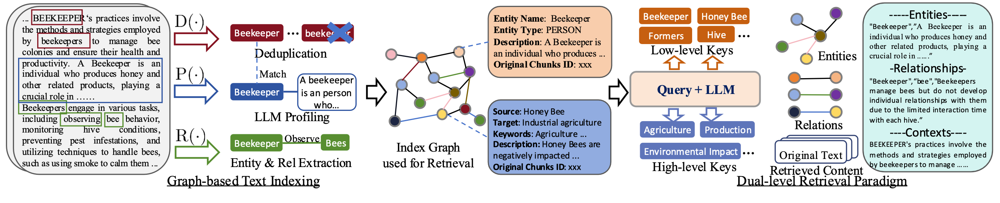
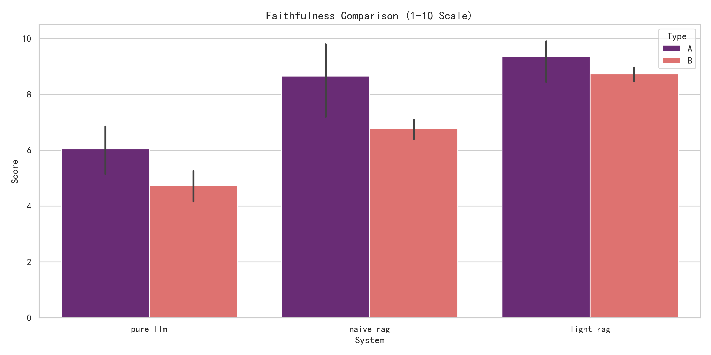
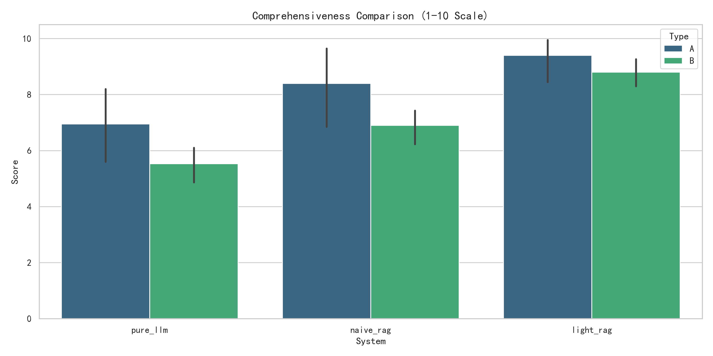
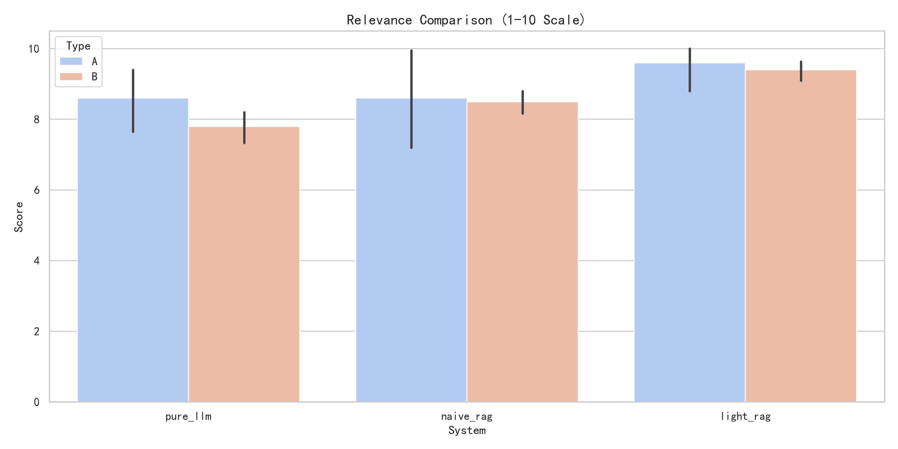
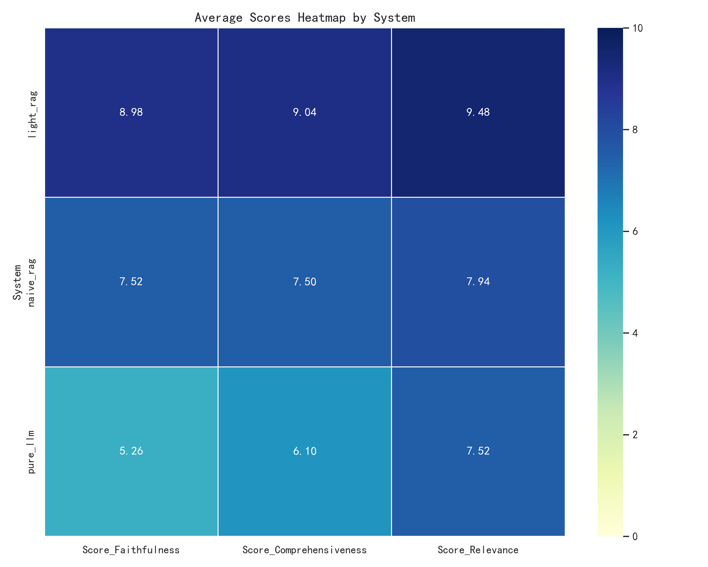

__毕业设计（论文）__

__课题名称：__ 基于大模型与向量-知识图谱融合的果园病虫害智能问答 V-KG RAG 系统构建

__学 院：__ 计算机与电子信息学院

__专 业：__ 计算机科学与技术

__班 级：__ 计科221

__学 号：__ 2207310310

__姓 名：__ 曾祥情

__指导教师：__ 孙宇

二〇二六年 三 月 八 日

# 摘 要

我国是世界水果生产大国，果树病虫害种类多、传播快、时效性强，直接影响果品产量、质量以及果园生态安全。传统病虫害识别与防治工作主要依赖植保专家经验、纸质手册检索和基层口口相传的经验判断，存在知识获取效率低、标准不统一、时效性不足和误诊误治风险较高等问题。随着大语言模型技术的发展，自然语言问答在农业知识服务中展现出较大潜力，但通用模型在果园病虫害等严肃垂直场景下仍容易产生知识幻觉、缺乏来源依据，并且难以有效组织病虫害、寄主、症状、环境条件和药剂措施之间的复杂关系。

针对上述问题，本文围绕果园病虫害知识问答任务，设计并实现了一种基于 V-KG RAG 的智能问答原型系统。该系统将图增强索引、双层检索与大语言模型生成过程结合起来，用于处理病虫害、寄主、症状、环境条件和防治措施之间的关联知识。本文以《经济果林病虫害防治手册》等材料构建知识底座，并结合人工整理的 OrchardQA 评测集形成事实型问题与推理型问题并行的实验环境。在方法上，系统采用实体描述、关系描述、跨片段去重与文本片段协同建模的方式组织知识，并结合局部检索、全局检索、混合检索和邻域扩展完成上下文构建，同时引入引用约束、上下文限制与长度控制等策略，以减少回答中的幻觉现象。

为验证所提方案的有效性，本文选取 Pure LLM、Naive RAG 与 V-KG RAG 三种方法进行对比实验。实验结果表明，V-KG RAG 在忠实度、完整性和相关性三个维度上均取得最高得分。其中，事实型问题综合得分为 9.45，推理型问题综合得分为 8.84，整体综合得分为 9.09，高于 Pure LLM 的 6.89 和 Naive RAG 的 8.25。上述结果表明，在果园病虫害问答场景中，引入图结构知识组织和分层检索机制有助于缓解文本切片带来的上下文割裂问题，并改善回答质量。

本文研究为果园病虫害知识问答系统的构建提供了方法参考。

__关键词：__ 大语言模型；检索增强生成；V-KG RAG；知识图谱；果园病虫害问答

# ABSTRACT

China is one of the world's largest fruit-producing countries, and orchard pests and diseases pose persistent threats to fruit yield, quality, and ecological stability. Traditional pest and disease diagnosis and management mainly rely on expert experience, paper manuals, and empirical judgement, which suffer from low knowledge accessibility, inconsistent standards, poor timeliness, and a high risk of misdiagnosis. With the rapid development of large language models, natural-language-based agricultural question answering has shown strong potential. However, general-purpose models still face serious challenges in domain-specific orchard protection scenarios, including hallucination, weak traceability, and limited capability in modeling complex relations among crops, pests, diseases, symptoms, environments, and control measures.

To address these issues, this paper designs and implements an intelligent orchard pest and disease question-answering prototype based on the V-KG RAG architecture. By integrating graph-enhanced indexing, dual-level retrieval, and large language model generation, the system improves its ability to organize and retrieve entity-level and concept-level agricultural knowledge. The work first builds a domain knowledge basis from orchard protection materials such as _Economic Orchard Pest and Disease Control Manual_, and constructs the OrchardQA evaluation set for both factual and reasoning-oriented questions. Then, a graph-enhanced indexing mechanism is adopted to organize entities, relations, descriptive profiles, cross-chunk deduplication, and text chunks, enabling collaborative retrieval over both structured and unstructured knowledge. Based on this, a retrieval-augmented generation pipeline is designed for orchard protection question answering by combining local-keyword retrieval, global-topic retrieval, mixed retrieval, and neighborhood expansion. In addition, citation constraints, context grounding, and answer-length control are introduced to reduce hallucination risks.

To verify the effectiveness of the proposed method, three methods are compared: Pure LLM, Naive RAG, and V-KG RAG. Experimental results show that V-KG RAG achieves the best overall performance in faithfulness, comprehensiveness, and relevance. Its overall score reaches 9.09, with 9.45 on factual questions and 8.84 on reasoning questions, outperforming Pure LLM (6.89) and Naive RAG (8.25). These results indicate that integrating graph-structured knowledge organization with vector retrieval can effectively mitigate the context fragmentation problem of traditional chunk-based retrieval and improve the reliability and usability of intelligent agricultural question answering.

This study provides a feasible technical route for orchard pest and disease knowledge services and offers practical value for the transformation from experience-driven crop protection to intelligent crop protection.

__Keywords:__ Large Language Model; Retrieval-Augmented Generation; V-KG RAG; Knowledge Graph; Orchard Pest and Disease Question Answering

# 目 录

第一章 绪论

第二章 相关技术与开发环境介绍

第三章 基于 V-KG RAG 的果园病虫害智能问答方法设计

第四章 系统实现与实验分析

第五章 总结与展望

参考文献

致谢

# 第一章 绪论

## 1.1 研究背景及意义

我国果业在农业生产体系中占据重要地位，是继粮食和蔬菜之后的重要种植产业。随着果树种植规模扩大、品种结构日益复杂以及气候变化和外来生物入侵风险增加，果园病虫害问题呈现出高频发生、传播迅速、种类多样和区域差异明显等特征。病虫害不仅会导致减产和品质下降，还会对果园生态平衡、农药使用安全以及果业可持续发展产生长期影响。

在实际生产中，病虫害防治工作高度依赖基层植保经验与人工查阅资料。对于果农而言，面对“某种病害在何种物候期高发”“某类药剂是否适用于特定果树”“不同虫害危害症状如何区分”等问题，传统的信息获取方式往往存在检索慢、表达分散、知识门槛高等问题。尤其在涉及病虫害识别、防治适期与药剂浓度的场景中，一旦判断失误，轻则防治无效，重则可能导致药害或生态破坏。

近年来，大语言模型在开放领域问答、知识组织和自然语言交互方面表现突出，为农业智能服务提供了新的技术可能。用户可以直接以自然语言提出问题，系统则以接近“专家答复”的形式给出答案。然而，果园病虫害问答属于高专业性知识服务任务，知识点不仅包含静态事实，还涉及寄主、病原、症状、环境、物候、防治措施等复杂关系。通用大模型在这类垂直场景中容易出现“知识幻觉”和“来源不明”的问题，难以直接用于可信植保问答。

因此，研究一种结合大语言模型语义理解能力与结构化农业知识组织能力的问答系统，具有明确的理论意义和应用价值。一方面，此类研究有助于推动农业知识服务由传统关键词检索向结构化问答方式转变；另一方面，也可为果农、基层农技人员和教学科研提供门槛较低的知识获取手段。

## 1.2 国内外研究现状

### 1.2.1 农业病虫害智能问答研究现状

农业智能知识服务经历了从规则专家系统到搜索引擎式信息检索，再到深度学习与大模型辅助问答的发展过程。早期农业专家系统通常采用人工构建规则库的方式完成病虫害诊断与处理建议推理，这类方法具有可解释性强的优点，但知识维护成本高、扩展性弱、难以覆盖复杂开放问题。随着 Web 搜索和数字农业资料库的发展，农业知识服务逐步转向基于文档检索和超链接导航的模式，但这类系统通常仍要求用户具备较强的术语检索能力。

近年来，随着自然语言处理和深度学习技术的发展，面向农业场景的智能问答系统开始出现。一些研究聚焦于作物病害识别与问答结合，另一些研究尝试将农业知识图谱与问答系统结合，提升垂直知识服务能力。但从整体上看，现有研究更多集中于大田作物、图像识别或单一类型知识问答，针对果园病虫害这一高专业、强时效、多实体关联场景的问答研究仍相对有限。

### 1.2.2 农业知识图谱研究现状

知识图谱作为组织领域知识的重要技术手段，近年来在农业领域得到较多关注。国内外已有研究围绕作物、病虫害、环境、农资和管理措施等要素构建农业本体和知识图谱，用于智能检索、问答与推荐服务。以 FAO 的 AGROVOC 等农业知识体系为代表的研究，为农业领域术语标准化和知识组织提供了基础支撑。

但在果园病虫害场景中，知识图谱研究仍面临若干难点。其一，果树品种多，病虫害与寄主、物候、气候环境之间耦合关系复杂，图谱构建难度较高。其二，许多现有农业知识图谱更偏向静态知识管理，未与生成式问答能力充分结合。其三，知识图谱若缺乏与原始文本片段的联动机制，容易在问答时出现“图上有关系、文本中无支撑”或“文本能检索到、关系无法组织”的问题。

### 1.2.3 检索增强生成与图增强 RAG 研究现状

检索增强生成技术通过在生成前引入外部知识，有效缓解了大语言模型知识时效性差和幻觉问题。传统 Naive RAG 主要基于文本切片和向量检索，将与问题语义相似的文本片段召回后输入大模型生成答案。这一方式实现简单、部署成本低，在很多通用问答场景中具有较好效果。

然而，Naive RAG 在处理复杂农业知识时存在明显局限。由于知识以切片形式存储，病虫害、症状、寄主和药剂等实体关系可能被拆散在不同片段中，系统虽然可以检索到局部相关文本，但难以形成结构化、连贯且完整的回答。对于“比较两种害虫危害差异”或“总结某环境条件下的综合防治策略”这类问题，单纯依赖向量相似度往往难以得到理想结果。

为解决上述问题，图增强 RAG 逐渐成为研究热点。GraphRAG 通过显式抽取实体与关系，将文本知识组织为图结构，增强系统对多跳关系和全局主题的理解能力。但其社区构建与摘要生成开销较大，在中小规模场景下容易出现构建成本高、响应延迟较大的问题。

在上述研究基础上，轻量化图增强 RAG 进一步提出了“图增强索引 + 双层检索”的思路。该类方法不再重度依赖社区级摘要，而是将实体、关系及其描述组织为可检索的图索引，同时区分面向具体实体的低层检索和面向抽象主题的高层检索，并结合图邻域扩展补充上下文，从而在保证全局关联建模能力的同时降低检索成本。

因此，面向垂直领域的图增强检索增强生成方法逐渐受到关注。这类方法通过图增强索引、双层检索和增量更新机制，使系统能够在保留实体关系结构的同时，兼顾检索效率与更新能力。本文提出的 V-KG RAG 也沿用这一思路，用于果园病虫害问答场景验证。

### 1.2.4 现有研究的不足

综合来看，现有相关研究仍存在以下不足：

1. 面向果园病虫害场景的问答系统研究不够充分，缺少针对该垂直领域的系统性验证。
2. 单纯基于文本切片的检索方法难以保留病虫害知识中的复杂实体关系。
3. 仅依靠通用大模型生成答案，容易出现专业知识错误与来源不清晰的问题。
4. 很多系统缺乏同时面向事实型问题与推理型问题的统一检索机制。
5. 农业知识更新快，现有方案在可维护性和增量更新方面仍有改进空间。

因此，有必要研究一种结合图结构知识组织、向量检索和大语言模型生成能力的果园病虫害智能问答方法，并通过规范实验验证其有效性。

## 1.3 研究目标

本文的总体目标是面向果园病虫害知识服务场景，构建一个具备较高忠实度、较好完整性和较强相关性的智能问答原型系统。具体而言，研究目标包括以下三个方面：

1. 建立适配果园病虫害场景的知识组织与检索增强问答流程，提升系统对专业术语、实体关系和综合性问题的处理能力。
2. 验证图增强索引和双层检索机制在农业垂直知识问答任务中的有效性。
3. 通过构建 OrchardQA 评测集并设置多方法对照实验，分析 V-KG RAG 在忠实度、完整性和相关性方面的优势与局限。

## 1.4 研究内容

围绕上述研究目标，本文主要开展以下工作：

1. 面向果园病虫害问答任务，梳理知识服务需求与任务特征，明确事实型问题和推理型问题的差异化处理需求。
2. 设计适用于果园病虫害知识问答任务的 V-KG RAG 方法框架，重点研究图增强索引、双层检索和答案生成约束机制。
3. 基于现有知识文档与测试集，构建问答实验原型，完成 Pure LLM、Naive RAG 与 V-KG RAG 三类方法的统一实验比较。
4. 对实验结果进行多维度分析，并结合典型案例和失败案例讨论图增强检索方案的实际价值与改进方向。

## 1.5 研究方法与技术路线

本文采用“知识组织—检索增强—生成回答—自动评测”的总体研究路线。首先，对果园病虫害知识文本进行整理，并将其作为问答系统的知识底座。其次，基于图增强索引思想，将原始文本中的实体、关系与描述信息组织为可支持图检索与向量检索协同工作的知识结构。随后，根据问题类型采用局部检索、全局检索或混合检索，生成具有上下文支撑的问答结果。最后，基于 OrchardQA 评测集和 LLM-as-a-Judge 评测流程，对不同方法的问答质量进行量化分析。



*图1-1 系统整体架构图*

从技术实现角度看，本文围绕 V-KG RAG 构建图增强检索增强生成原型，同时保留 Pure LLM 和 Naive RAG 两类对照方法，构成统一评测框架。该技术路线兼顾了论文方法表达与工程实验验证的需要。

## 1.6 论文组织结构

全文共分为五章，具体安排如下：

第一章为绪论，主要介绍研究背景、研究意义、国内外研究现状、研究目标、研究内容以及技术路线。

第二章为相关技术与开发环境介绍，主要阐述大语言模型、检索增强生成和 V-KG RAG 的相关技术基础，并介绍问答原型的开发环境与实验平台。

第三章为基于 V-KG RAG 的果园病虫害智能问答方法设计，重点描述图增强索引、双层检索以及防幻觉约束策略。

第四章为系统实现与实验分析，介绍原型系统实现方式、实验数据集与评测方案，并对整体结果、分维度结果、案例表现与失败原因进行分析。

第五章为总结与展望，对全文工作进行回顾，并讨论当前工作的不足及后续改进方向。

# 第二章 相关技术与开发环境介绍

## 2.1 大语言模型与检索增强生成基础

### 2.1.1 大语言模型在农业问答中的应用特点

大语言模型通过大规模语料预训练获得较强的语义理解与文本生成能力，能够处理开放问答、摘要生成、知识归纳和自然语言交互等任务。在农业问答场景中，其优势主要体现在能够直接理解果农或基层技术人员的自然语言表达，降低专业检索门槛，并以较自然的语言输出诊断与建议。

但农业知识服务不同于一般开放问答。果园病虫害问题往往涉及严格的专业知识边界，例如病原识别、发病条件、适用药剂、物候期判断和安全浓度等。此类问题要求模型不仅能“说得通”，更要“说得准”。因此，仅依靠大模型内部知识并不足以保证问答可靠性，必须通过外部知识检索进行约束。

### 2.1.2 检索增强生成的基本流程

检索增强生成通常包含三个核心阶段：知识组织、上下文检索和约束生成。首先，将外部知识源处理为适合检索的索引形式；其次，根据用户问题检索相关上下文；最后，将上下文与问题一并输入大语言模型，生成最终回答。与直接生成相比，RAG 能在一定程度上降低幻觉，并增强回答的时效性和可追溯性。

在传统 Naive RAG 中，最常用的方法是将长文档切分为多个文本块，再通过向量化后的相似度搜索召回若干片段。这种方式在处理局部事实问题时较为有效，但当问题涉及多实体、多关系或全局主题概括时，文本切片之间的语义断裂会成为系统瓶颈。

从形式化定义看，RAG 可表示为生成模块与检索模块的组合，其中检索模块进一步分为索引器和检索器。若记整个 RAG 系统为 $\mathcal{M}$，生成模块为 $\mathcal{G}$，检索模块为 $\mathcal{R} = (\phi, \psi)$，外部知识库为 $\mathcal{D}$，则其基本形式可表示为：

$$
\mathcal{M} = (\mathcal{G}, \mathcal{R} = (\phi, \psi)), \quad
\mathcal{M}(q; \mathcal{D}) = \mathcal{G}(q, \psi(q; \hat{\mathcal{D}})), \quad
\hat{\mathcal{D}} = \phi(\mathcal{D})
$$

其中，$\phi(\cdot)$ 表示索引函数，用于将原始知识库 $\mathcal{D}$ 转化为可检索的数据结构 $\hat{\mathcal{D}}$；$\psi(\cdot)$ 表示检索函数，用于根据查询 $q$ 从索引结构中召回相关上下文；$\mathcal{G}(\cdot)$ 表示生成函数，用于在问题与检索结果约束下生成答案。该定义说明，RAG 的性能同时受索引、检索与生成三个环节影响。

对垂直领域问答系统而言，RAG 框架通常需要满足三个基本要求：索引阶段应尽量保留知识之间的关联信息，检索阶段应兼顾效率与成本，知识库更新时应支持较快的索引调整。后文关于图增强索引和双层检索的设计，主要基于上述要求展开。

### 2.1.3 向量检索与重排序机制

向量检索的核心思想是利用嵌入模型将文本映射为高维向量，使语义相近的文本在向量空间中更接近。相比关键词匹配，向量检索对表述变化和近义表达具有更好的适应性。在本研究中，Naive RAG 基线方法采用 Embedchain + ChromaDB 的方式建立文本索引，并利用语义相似度召回候选片段。

在初步召回结果基础上，还可引入重排序模型进行二次筛选，使更相关的上下文排在前面。虽然本文未对该部分单独开展实验，但从技术路线看，重排序机制对复杂问题的召回质量仍具有补充作用。

## 2.2 V-KG RAG 技术基础

### 2.2.1 图增强索引思想

V-KG RAG 的核心思想是将图结构引入文本索引与检索流程，通过实体与关系的显式建模增强系统对复杂知识结构的理解能力。与仅存储文本片段的传统方法不同，V-KG RAG 在索引阶段会先对原始文档进行切分，再从每个知识单元中抽取实体与关系，并为相关节点和边生成可供检索的描述信息，从而将原本分散在文档中的语义关系组织为更适合问答的图增强索引。

图增强索引不仅保存“节点-边”结构，还可形成“检索键-描述值”的轻量化组织形式。实体名称、别名和核心术语可作为检索键，症状概括、关系说明和原文摘要可作为描述值，用于衔接图检索与向量检索。对跨片段重复出现的实体和关系，还需进行去重与合并，以减少冗余索引。

参考 LightRAG 的图索引思路，若将知识图表示为 $\hat{\mathcal{D}} = (\mathcal{V}, \mathcal{E})$，其中 $\mathcal{V}$ 表示节点集合，$\mathcal{E}$ 表示边集合，则图增强索引的构建过程可概括为：

$$
\hat{\mathcal{D}} = (\mathcal{V}, \mathcal{E}) = \mathrm{Dedupe} \circ \mathrm{Prof}(\mathcal{V}, \mathcal{E}), \quad
\mathcal{V}, \mathcal{E} = \bigcup_{\mathcal{D}_i \in \mathcal{D}} \mathrm{Recog}(\mathcal{D}_i)
$$

其中，$\mathrm{Recog}(\mathcal{D}_i)$ 表示对文本块 $\mathcal{D}_i$ 进行实体与关系识别；$\mathrm{Prof}(\cdot)$ 表示为节点和边补充描述信息，形成适于检索的键值化表示；$\mathrm{Dedupe}(\cdot)$ 表示对不同文本块中重复出现的实体和关系进行去重与合并。经过上述步骤，原始文档可被组织为兼具结构化关系与文本语义描述的图增强索引。

从处理流程看，该过程可分为三个环节：实体关系抽取函数 $R(\cdot)$ 用于识别节点与边，描述生成函数 $P(\cdot)$ 用于为实体和关系构造检索键值对 $(K, V)$，去重函数 $D(\cdot)$ 用于合并跨片段重复知识。这样可以将文本切分、关系抽取、描述补充和图结构压缩纳入同一索引框架。

在果园病虫害场景中，病虫害名称、寄主树种、发病症状、环境条件和防治措施之间存在较强的关联关系，因此图增强索引适用于该类任务。

### 2.2.2 双层检索机制

V-KG RAG 采用双层检索思想，即同时面向局部实体知识和全局主题知识开展检索。局部检索更适合“某种病害的病原菌是什么”“某种药剂能否防治某虫害”这类实体明确的问题；全局检索则更适合“总结某病害的发生规律”“比较两类害虫危害差异”“给出综合防治策略”这类需要整合多条知识线索的问题。

从查询处理过程看，双层检索通常先对用户问题进行关键词分层：一类指向具体病虫害、寄主、药剂或症状的局部关键词，另一类指向“发生规律”“综合防治”“危害比较”等抽象主题的全局关键词。随后，系统分别利用两类关键词完成实体、关系和主题信息的检索，并在需要时扩展相关节点的一跳邻域，以补充上下文。

若记用户查询为 $q$，则双层检索可以先抽取局部关键词 $k^{(l)}$ 与全局关键词 $k^{(g)}$：

$$
k^{(l)}, k^{(g)} = \mathrm{KeyExt}(q)
$$

在此基础上，系统利用局部关键词匹配候选实体与节点描述，利用全局关键词匹配关系和主题级描述信息。为补充检索结果中的结构信息，还可在局部子图中继续收集一跳邻接节点。若 $N_v$ 和 $N_e$ 分别表示已命中节点与边的邻接节点集合，则邻域扩展结果可写为：

$$
\mathcal{N} = \{ v_i \mid v_i \in \mathcal{V} \land (v_i \in N_v \lor v_i \in N_e) \}
$$

该步骤的作用在于，当用户问题只显式提到某一病虫害实体时，系统仍可补入与其直接关联的症状、环境条件和防治措施，从而减少上下文缺失。

在具体实现中，本文采用局部检索、全局检索和混合检索相结合的机制。其中，混合检索将图检索与向量检索结合，用于处理同时包含实体定位和主题整合需求的问题。本文中的 V-KG RAG 主要基于该机制完成实体关系检索、主题检索与语义召回的协同。

### 2.2.3 增量更新与知识维护能力

农业知识服务系统需要考虑知识更新问题。新的病虫害预报、防治建议和区域性情报会不断产生，如果每次更新都重建全部索引，系统维护成本将明显增加。V-KG RAG 支持增量插入和增量重建思路，可在原有知识结构基础上吸收新增文档并维护图索引一致性。

其基本思路是对新增文档复用既有的切分、抽取、描述构建与去重流程，仅将新增得到的节点、边和描述信息并入原有索引，而不是重建全部结构。对于持续补充型农业知识库，这种方式更便于后续维护。

尽管本文实验主要聚焦问答质量评估，未对更新效率开展独立实验，但从系统扩展角度看，增量更新能力仍是该方案的重要组成部分。

### 2.2.4 与传统 Naive RAG 的差异

与 Naive RAG 相比，V-KG RAG 的主要差异体现在四个方面：

1. 知识组织方式不同。Naive RAG 以文本切片为核心，V-KG RAG 强调实体、关系与文本描述的协同组织。
2. 查询理解方式不同。Naive RAG 主要依赖整体语义相似度，V-KG RAG 更强调局部关键词与全局关键词的分层理解。
3. 检索视角不同。Naive RAG 更适合局部语义相似检索，V-KG RAG 可同时支持实体级与主题级检索，并通过邻域扩展补全关联知识。
4. 回答连贯性不同。Naive RAG 容易在多实体问题中出现上下文割裂，而图增强索引有助于形成更完整的上下文支撑。

## 2.3 开发环境与实验平台

### 2.3.1 原型工程环境

本研究当前使用的问答原型与评测框架基于 Python 构建，采用模块化设计组织不同问答方法、测试集处理与自动评测流程。根据现有项目配置，系统核心运行环境如下：

- 操作系统：Windows 11 Pro
- 编程语言：Python 3.12
- 生成模型接口：Qwen 兼容接口
- 评测模型：GLM-5
- 向量检索基线：Embedchain + ChromaDB
- 图增强检索方案：V-KG RAG

### 2.3.2 项目结构与实验流程

当前工程的核心组成包括：

- 问答方法模块：分别实现 Pure LLM、Naive RAG 与 V-KG RAG 三类方法
- 评测模块：负责 LLM-as-a-Judge 评分与图表生成
- 数据模块：负责知识文档和测试集管理
- 输出模块：负责保存历史输出结果、评测记录和可视化图表

在实验流程上，系统采用统一的“问题输入—方法生成—结果保存—自动评测—图表分析”方式开展对照实验。本文第四章的结果分析即基于这些既有实验产物展开。

### 2.3.3 实验知识底座与评测集

当前原型的知识底座主要来自 `data/documents/经济果林病虫害防治手册.txt`，并配套构建了 OrchardQA 评测集，其中 A 类为事实型问题，B 类为推理型问题。该设计有利于同时观察系统在“精确知识问答”和“多知识点综合推理”两个维度上的表现差异。

## 2.4 本章小结

本章从理论与工程两个层面介绍了本研究所依赖的核心技术。首先，阐述了大语言模型与检索增强生成的基本原理，说明了通用大模型在农业垂直问答中存在的局限。随后，介绍了 V-KG RAG 的图增强索引、双层检索与增量更新思想，明确了其相对于传统 Naive RAG 的优势。最后，对当前问答原型的开发环境、项目结构和实验平台进行了说明，为后续方法设计与实验分析奠定基础。

# 第三章 基于 V-KG RAG 的果园病虫害智能问答方法设计

## 3.1 任务定义与总体框架

本文研究的果园病虫害智能问答任务，目标是使系统能够针对用户提出的自然语言问题，给出内容正确、结构清晰、具有一定依据支撑的回答。从问题特征看，任务主要可分为两类：

1. 事实型问题：关注单一实体属性或单跳关系，例如病原菌名称、越冬虫态、发病温度、药剂浓度等。
2. 推理型问题：关注多实体、多属性和多关系整合，例如症状总结、防治策略归纳、不同病虫害对比、环境条件分析等。

传统纯生成方式在第一类问题上容易出现知识记忆偏差，在第二类问题上则更容易出现遗漏和幻觉。为此，本文提出 V-KG RAG 方案，以图增强索引和双层检索机制为核心，构建面向果园病虫害场景的问答方法框架。

## 3.2 知识组织与图增强索引构建

### 3.2.1 文档预处理与知识单元切分

问答系统首先需要对原始果树植保知识文档进行预处理。由于农业手册类文本通常具有章节层级复杂、术语密集、知识点相对集中的特点，若直接整篇送入模型，会带来较高的计算成本，也不利于后续检索。因此，系统需要先对原始文档进行清洗、分段和知识单元切分。

在这一过程中，切分粒度应尽量兼顾两点：一是保留病虫害描述、防治措施和发病规律等局部上下文；二是避免片段过大导致召回不精确。对于果园病虫害文本而言，较合理的知识单元通常对应病害条目、虫害条目、症状描述段落和防治措施段落等。

### 3.2.2 实体与关系抽取

在完成文本切分后，V-KG RAG 不再停留在“文本块向量化”这一层，而是进一步利用大语言模型从文本中抽取实体与关系。对果园病虫害场景来说，重要实体通常包括：

- 果树或寄主类型
- 病害名称
- 虫害名称
- 症状表现
- 环境条件
- 药剂或防治措施
- 物候期或发生时期

实体之间的关系则可以表现为“危害对象”“发生条件”“主要症状”“适用药剂”“防治时期”等。通过抽取这些实体与关系，原本以自然语言存在的农业知识可以转化为更加结构化的图谱式组织形式，从而为后续图增强检索提供支撑。

### 3.2.3 实体描述与关系描述构建

V-KG RAG 的一个重要思路，是在图结构之外继续保留文本描述能力。也就是说，系统不仅保留实体节点和关系边，还会为节点和关系构建摘要式描述，使其既能参与图结构检索，也能参与向量语义检索。

对于果园病虫害问答任务而言，这种设计非常重要。因为用户问题往往不会严格遵循知识图谱中的标准实体命名，系统需要借助描述文本增强语义匹配能力。实体描述可以聚合某一病虫害的症状、危害部位、防治措施等信息；关系描述则可表达“某药剂适用于某病害”“某环境利于某病虫发生”等事实。

从索引形式看，实体名称、常见别称和病虫害术语可以作为检索键，节点或边的摘要描述、对应原文片段和关系解释可以作为检索值。这样的键值化组织有助于在用户提问使用口语化表达时，仍然通过描述文本与目标实体建立匹配。

### 3.2.4 图增强索引的价值

图增强索引将文本检索与结构化关系组织结合起来，能够有效缓解传统切片式方法中常见的上下文割裂问题。在果园病虫害场景中，若某一问题需要同时涉及“病害—症状—寄主—防治措施”多类信息，单纯依赖切片检索往往很难稳定召回完整上下文，而图增强索引能够更自然地组织这类知识。

此外，图索引中的去重与合并机制也具有实际价值。由于农业手册中同一病虫害可能在不同章节、不同防治段落中多次出现，若缺少实体和关系层面的合并，系统容易重复召回相似内容，既浪费上下文窗口，也会削弱最终答案的条理性。

## 3.3 双层检索与答案生成机制

### 3.3.1 问题理解与检索模式选择

在用户提出问题后，系统首先判断问题更偏向局部实体事实还是全局主题概括。前者主要依赖与目标实体直接相关的知识，后者则更依赖主题聚合和跨实体关系整合。

在 V-KG RAG 中，这一判断可通过问题中的局部关键词与全局关键词进行辅助。局部关键词主要指向病虫害名称、果树品种、症状或药剂名称，全局关键词主要对应总结、比较、规律和策略等任务意图。局部检索强调围绕实体节点及其邻接关系组织上下文，全局检索强调主题级关系聚合，混合检索则进一步结合图检索与向量检索，用于处理同时包含实体定位和主题整合需求的问题。

### 3.3.2 局部检索机制

局部检索适用于实体明确、问题范围清晰的事实型问答，例如“柑橘疮痂病的病原菌是什么”“黑刺粉虱主要以什么虫态越冬”等。这类问题通常存在一个或多个核心实体，系统需要围绕这些实体节点及其相邻关系组织上下文。

与 Naive RAG 直接召回若干文本片段相比，局部检索更侧重定位实体相关知识，并通过实体描述和关系描述补充文本表述差异带来的召回偏差。

在检索过程中，系统可先根据局部关键词匹配候选实体和关系，再将命中的节点、边及其一跳邻居纳入候选上下文。这样可以使回答围绕目标实体展开，同时补入与其直接相关的症状、发生条件和防治措施。

### 3.3.3 全局检索机制

全局检索更适合“总结发病规律”“比较危害差异”“归纳综合防治措施”等问题。这类问题往往不依赖单一实体，而需要系统对多个实体、多个症状或多个策略之间的联系进行整合。

在果园病虫害任务中，全局检索的典型价值体现在：

- 从多个知识点中总结某病害的症状特点和易感时期
- 比较两种害虫在危害症状上的差异
- 归纳一类病虫害的综合防治思路

因此，全局检索机制主要用于提供主题级知识组织能力，是处理推理型问题的重要环节。相较于仅围绕单一节点进行召回，全局检索更适合围绕“主题簇”或“关系簇”组织证据。

### 3.3.4 混合检索与答案生成

在实际问答中，很多问题并不是纯粹的“事实型”或“主题型”，而是同时包含实体定位和知识整合需求。针对这类场景，V-KG RAG 采用混合检索思路，将图增强索引与向量召回结果融合，构建更加完整的上下文输入给大语言模型。

混合检索同时利用图结构对关系链条的组织能力和向量检索对表述变体的适应能力。对于果园病虫害问答中常见的“围绕某病虫害总结规律并给出建议”类问题，该方式比单一检索更适合当前任务。

生成阶段，大语言模型的主要任务不再是凭借内部记忆“直接作答”，而是在外部检索上下文约束下对信息进行组织、压缩和语言化表达。若将检索到的上下文记为 $\psi(q; \hat{\mathcal{D}})$，则答案生成过程可进一步表示为：

$$
a = \mathcal{G}(q, \psi(q; \hat{\mathcal{D}}))
$$

其中，$a$ 表示最终生成答案，$\mathcal{G}(\cdot)$ 表示生成模型。对本文任务而言，$\psi(q; \hat{\mathcal{D}})$ 不仅包含文本片段，还可包含实体描述、关系描述以及由邻域扩展得到的局部结构上下文。生成模型据此完成信息组织与回答生成。

## 3.4 防幻觉与答案约束策略

果园病虫害问答属于高风险知识服务任务，尤其在药剂选择、浓度使用和防治适期等问题上，对答案可靠性的要求极高。因此，除了检索机制本身外，系统还需要通过若干约束策略控制幻觉风险。

### 3.4.1 上下文约束

系统在生成阶段应尽量限制模型围绕检索到的相关上下文作答，避免将常识、泛化记忆或不相关知识混入当前答案。该策略用于降低与知识库不一致的回答出现概率。

### 3.4.2 引用与来源意识

V-KG RAG 在方法设计中强调引文与来源意识，用于增强回答的可追溯性。对于农业问答任务，来源信息不仅关系到答案内容，也关系到依据说明。因此，来源约束是本文降低幻觉风险的重要措施之一。

### 3.4.3 回答长度与内容边界控制

由于 OrchardQA 中事实型问题和推理型问题的答案长度要求不同，因此系统需要对回答长度进行一定限制。对事实型问题而言，过长回答反而可能引入噪声；对推理型问题而言，则需要在保证简洁的同时覆盖关键点。这种长度与内容边界控制也是生成质量管理的一部分。

## 3.5 本章小结

本章围绕果园病虫害问答任务，系统阐述了基于 V-KG RAG 的方法设计思路。首先，从任务类型出发说明了事实型问题与推理型问题的不同处理需求。随后，分析了图增强索引在知识组织中的作用，解释了实体、关系与描述信息协同建模的必要性。在此基础上，介绍了局部检索、全局检索和混合检索在问答生成中的分工，并讨论了上下文约束、引用和长度控制等防幻觉策略。上述内容构成了后续系统实验与结果分析的理论基础。

# 第四章 系统实现与实验分析

## 4.1 原型系统实现

### 4.1.1 原型实现思路

本研究当前形成的是一个面向问答生成与自动评测的实验原型，而非完全面向生产环境的植保服务系统。原型的主要目标是验证不同检索增强方法在果园病虫害问答任务中的表现差异，并分析图增强检索方法的有效性。

在工程实现上，系统围绕三类方法构建统一测试框架：

1. `Pure LLM`：不使用外部检索，直接调用大语言模型生成答案。
2. `Naive RAG`：使用 Embedchain + ChromaDB 的朴素检索增强生成方法。
3. `V-KG RAG`：采用图增强索引与双层检索机制作为论文主方案。

### 4.1.2 工程模块组成

当前工程可概括为以下几个功能模块：

- 数据与测试集模块：负责知识文档与 OrchardQA 测试集读取。
- 问答方法模块：负责三类方法的统一调用，其中论文中的 V-KG RAG 在工程中通过 `V-KG_rag` 方法接入外部 V-KG RAG 服务。
- 评测模块：负责基于 LLM-as-a-Judge 的自动评分。
- 图表模块：负责输出忠实度、完整性、相关性与热力图结果。

从方法调用流程上看，系统以命令行方式统一管理实验过程。`main.py` 用于调度方法运行、结果评测与图表生成；`methods/` 中封装了各问答方法；`evaluation/` 则负责后续自动打分与统计分析。其中，`methods/light_rag.py` 通过 HTTP API 调用图增强 RAG 服务，当前默认查询模式为 `mix`，即在图检索与向量检索融合的方式下完成回答与上下文获取。

### 4.1.3 原型运行方式

原型支持以下典型实验流程：

```bash
# 运行单个方法
python main.py run --method pure_llm --testset A

# 执行评测
python main.py evaluate

# 生成图表
python main.py plot
```

多方法批量执行同样由 `main.py` 统一调度。考虑到论文重点在于方法比较与实验结果分析，本文不再展开项目内部参数细节。

需要说明的是，本文写作阶段未重新触发完整耗时实验流程，第四章分析基于当前工作区中保留的实验产物与统计结果展开。

## 4.2 数据集与评测方案

### 4.2.1 知识文档与任务场景

当前原型使用的核心知识底座为 `经济果林病虫害防治手册.txt`，知识内容覆盖柑橘、桃、梨、葡萄、杨梅、苹果等常见经济果树的病虫害防治知识。知识文本经过整理后用于 Naive RAG 与 V-KG RAG 的索引构建和问答支持。

在任务设置上，系统面向两类场景展开验证：

- 事实型问答：检验系统对明确知识点的精准召回能力
- 推理型问答：检验系统对多知识点整合和归纳能力

### 4.2.2 OrchardQA 评测集

本研究构建了 OrchardQA 专属评测集，包含两类问题：


*图4-1 OrchardQA 评测集中的两类问题特征*

- 测试集 A：事实型问题，共 20 个，答案限制在 100 字以内
- 测试集 B：推理型问题，共 30 个，答案限制在 350 字以内

事实型问题主要关注病原、越冬虫态、适宜温度和药剂浓度等单点知识；推理型问题主要关注症状总结、规律归纳、防治策略整合与差异比较等复合型问答任务。

### 4.2.3 评测维度与评分方式

为了更全面地衡量问答质量，本文采用 LLM-as-a-Judge 自动评测方式，从以下三个维度进行评分：


*图4-2 LLM-as-a-Judge 评测的三个维度*

1. 忠实度（Faithfulness）：回答是否基于知识支撑，是否存在幻觉。
2. 完整性（Comprehensiveness）：回答是否覆盖标准答案中的关键要点。
3. 相关性（Relevance）：回答是否直接回应问题、是否存在明显跑题或冗余。

评分范围为 1 至 10 分。评分模型采用 GLM-5，通过统一提示词对问题、标准答案、上下文和模型回答进行综合判断。

### 4.2.4 评测流程


*图4-3 LLM-as-a-Judge 评测流程*

具体流程包括：

1. 准备测试问题、标准答案与系统回答。
2. 将系统回答与参考信息组织为结构化提示输入评分模型。
3. 由评分模型输出三个维度分数及简要评价。
4. 汇总各方法在不同数据集上的均值，形成后续分析结果。

## 4.3 整体实验结果

### 4.3.1 不同方法在测试集 A 上的结果

表4-1 给出了三种方法在测试集 A 上的平均得分。

| 方法 | 忠实度 | 完整性 | 相关性 |
|------|--------|--------|--------|
| Pure LLM | 6.05 | 6.95 | 8.60 |
| Naive RAG | 8.65 | 8.40 | 8.60 |
| V-KG RAG | 9.35 | 9.40 | 9.60 |

在事实型问题上，V-KG RAG 在三个维度上均取得最高得分，其中忠实度和完整性提升更为明显。

### 4.3.2 不同方法在测试集 B 上的结果

表4-2 给出了三种方法在测试集 B 上的平均得分。

| 方法 | 忠实度 | 完整性 | 相关性 |
|------|--------|--------|--------|
| Pure LLM | 5.73 | 6.53 | 7.80 |
| Naive RAG | 7.77 | 7.90 | 8.50 |
| V-KG RAG | 8.53 | 8.60 | 9.40 |

在推理型问题上，V-KG RAG 同样保持领先。这说明该方法不仅适用于单点事实问答，也适用于需要多知识点整合的场景。

### 4.3.3 各方法整体结果对比

将 A、B 两类问题综合后，可得到三种方法的整体平均表现，如表4-3 所示。

| 方法 | 综合得分 | 忠实度 | 完整性 | 相关性 |
|------|----------|--------|--------|--------|
| Pure LLM | 6.89 | 5.86 | 6.70 | 8.12 |
| Naive RAG | 8.25 | 8.12 | 8.10 | 8.54 |
| V-KG RAG | 9.09 | 8.86 | 8.92 | 9.48 |

从整体结果看，V-KG RAG 相比 Pure LLM 在忠实度方面提升了 50.9%，在完整性方面提升了 33.1%；相比 Naive RAG 也保持优势。这表明图增强索引和双层检索机制对农业垂直场景问答任务具有正向作用。

## 4.4 分维度与分问题类型分析

### 4.4.1 忠实度分析



*图4-4 三种方法在不同测试集上的忠实度对比*

忠实度用于衡量回答是否与知识支撑一致。实验结果显示，Pure LLM 的忠实度最低，说明仅依赖模型内部知识容易在专业场景中产生幻觉；Naive RAG 引入外部知识后忠实度明显提高；V-KG RAG 在事实型和推理型问题上均取得最高分。

### 4.4.2 完整性分析



*图4-5 三种方法在不同测试集上的完整性对比*

完整性反映系统是否覆盖问题所需的关键要点。Pure LLM 在部分常识性问题上能够给出大致正确的回答，但容易遗漏细节；Naive RAG 在完整性上优于 Pure LLM，但在整合多个知识点时仍可能出现缺项；V-KG RAG 的整体完整性得分最高。

### 4.4.3 相关性分析



*图4-6 三种方法在不同测试集上的相关性对比*

三种方法在相关性维度的差距小于忠实度和完整性维度，这说明无论是否引入检索，大语言模型在“理解问题主题”方面都具备一定能力。但如果回答虽然相关却不准确或不完整，仍然难以满足植保问答需求。因此，在专业场景中，不能仅依赖相关性作为系统优劣判断标准。

### 4.4.4 综合热力图分析



*图4-7 三种方法综合性能热力图*

热力图直观展示了三类方法在不同维度和不同任务上的整体表现。V-KG RAG 在多数维度上的表现较为均衡；Pure LLM 在忠实度和完整性上相对较弱；Naive RAG 虽有改善，但整体仍低于图增强检索方案。

### 4.4.5 不同问题类型的综合表现

表4-4 对比了三种方法在事实型问题和推理型问题上的综合得分。

| 问题类型 | Pure LLM | Naive RAG | V-KG RAG |
|----------|----------|-----------|----------------------|
| 事实型问题（A） | 7.20 | 8.55 | 9.45 |
| 推理型问题（B） | 6.69 | 8.06 | 8.84 |

V-KG RAG 在两类问题上均取得最高得分，但在事实型问题上的优势更为明显。这说明该方法在精确定位专业知识点方面表现更稳定；在推理型问题上虽然仍占优，但复杂知识整合仍有改进空间。

## 4.5 典型案例与失败案例分析

### 4.5.1 典型案例分析

#### 案例一：知识幻觉纠正

- 问题：杨梅癌肿病（杨梅疮）的病原菌属于哪类细菌？
- 标准答案：丁香假单胞萨氏亚种杨梅致病变种

在该问题上，Pure LLM 将病原菌误答为“根癌土壤杆菌”，Naive RAG 也因召回偏差给出错误答案，V-KG RAG 返回了标准答案。该案例表明，在命名较复杂的病原识别任务中，检索过程对答案准确性具有直接影响。

#### 案例二：对比分析问题

- 问题：比较柑橘红蜘蛛和柑橘锈壁虱在危害症状上的区别。

这一类问题要求系统同时整合两种虫害的危害特征并进行对照。实验中，V-KG RAG 在忠实度、完整性和相关性上均高于基线方法，说明图增强索引在保留多实体差异信息方面更适合该类问题。

#### 案例三：综合防治策略问题

- 问题：总结防治柑橘潜叶蛾的综合措施。

对于综合性问题，Naive RAG 和 V-KG RAG 均优于 Pure LLM，但在个别样例中，Naive RAG 的完整性得分高于 V-KG RAG。这说明图增强检索并非在所有问题上都占优，其表现仍受知识覆盖和召回质量影响。

### 4.5.2 失败案例统计

表4-5 给出了三种方法在低分案例上的统计结果，其中“低分”定义为某一维度得分低于 5 分。

| 方法 | 忠实度<5 | 完整性<5 | 相关性<5 |
|------|----------|----------|----------|
| Pure LLM | 10（20.0%） | 8（16.0%） | 3（6.0%） |
| Naive RAG | 4（8.0%） | 5（10.0%） | 3（6.0%） |
| V-KG RAG | 1（2.0%） | 1（2.0%） | 1（2.0%） |

统计结果表明，V-KG RAG 的低分案例最少，其整体稳定性优于另外两种方法。

### 4.5.3 V-KG RAG 失败案例分析

在现有实验中，V-KG RAG 的典型低分问题为：

- 问题：45% 石硫合剂晶体在梨树萌芽期防治梨锈病时的推荐倍数是多少？
- 得分：忠实度 3，完整性 1，相关性 2

该问题中，系统将其他病害场景下的药剂倍数错误迁移到了梨锈病问题上，说明即便采用图增强检索方案，当知识库中存在近似药剂条目、场景边界不够清晰或关系上下文不足时，仍可能发生错误匹配。

### 4.5.4 误差原因讨论

结合案例与整体实验结果，当前系统误差主要来源于以下几个方面：

1. 知识覆盖不足：当前知识底座仍以有限文档为主，对部分药剂细节和边界条件覆盖不充分。
2. 相似知识混淆：同类病害或相近药剂在不同果树场景下容易发生错误迁移。
3. 复杂问题整合难度高：对于跨实体、多阶段、多措施的综合性问题，检索和生成之间仍存在信息压缩损失。
4. 评价与生成之间的表达差异：某些回答虽然基本正确，但因术语不够标准或细节不全而被扣分。

## 4.6 本章小结

本章围绕系统实现与实验结果展开分析。首先介绍了问答原型的工程结构与运行方式，随后说明了 OrchardQA 数据集、评分维度和 LLM-as-a-Judge 流程。实验结果表明，V-KG RAG 在果园病虫害问答任务中整体优于 Pure LLM 和 Naive RAG，但在药剂细节、复杂推理和知识边界处理方面仍存在改进空间。

# 第五章 总结与展望

## 5.1 工作总结

本文围绕果园病虫害智能问答任务，针对通用大语言模型在农业垂直场景中存在的知识幻觉、结构化关系利用不足以及来源可追溯性较弱等问题，设计并实现了基于 V-KG RAG 的问答原型系统，并结合现有项目完成了实验验证。

本文的主要工作可概括为以下几个方面：

1. 从果园病虫害知识服务的实际需求出发，分析了农业垂直场景下智能问答面临的主要挑战，明确了事实型问题与推理型问题并存的任务特征。
2. 构建了论文中的 V-KG RAG 方法框架，系统分析了图增强索引、局部检索、全局检索和混合检索在农业知识问答中的作用。
3. 基于现有果园病虫害知识文档和 OrchardQA 评测集，建立了包含 Pure LLM、Naive RAG 和 V-KG RAG 的统一对照实验框架。
4. 通过忠实度、完整性和相关性三个维度对系统进行了定量评估，并结合典型案例和失败案例分析，验证了 V-KG RAG 在农业垂直问答中的优势与不足。

实验结果表明，V-KG RAG 在整体性能上优于 Pure LLM 和 Naive RAG，说明在强调结构化关系和专业准确性的农业病虫害场景中，图增强检索增强生成方法具备可行性。

## 5.2 不足与展望

虽然本文的研究取得了一定结果，但受限于当前知识材料、原型形态和实验范围，仍存在以下不足。

### 5.2.1 知识覆盖与更新能力仍需增强

当前知识底座仍以有限文档为主，对于部分病虫害细节、药剂边界条件、区域性情报和最新防治策略的覆盖还不够充分。后续可进一步扩展知识来源，增强对多文档、多版本、多地区知识的统一组织能力，并在此基础上深入验证增量更新机制的实际效果，例如新增文档插入后的索引维护成本、更新时延和问答质量变化。

### 5.2.2 多模态问答能力尚未纳入当前原型

果园病虫害场景中，许多实际问题并非纯文本问题，而是“图像 + 文本”联合判断问题。例如叶片病斑、果实腐烂、枝干流胶等现象往往需要视觉证据支持。未来可将图像识别模型与 V-KG RAG 结合，构建图文协同的多模态病虫害问答系统，以进一步提高诊断的实用性。

### 5.2.3 可信性控制与评测体系仍可细化

虽然本文已采用 LLM-as-a-Judge 方法对问答质量进行自动评估，但现阶段评价主要集中于回答结果本身，对检索路径、证据来源质量、引用一致性和复杂推理链稳定性的分析还不够细致。后续可进一步设计面向检索质量、路径可解释性和领域安全性的更细粒度评测指标，并补充局部检索、全局检索、混合检索等模式的消融对比，以更准确地解释图增强机制的贡献来源。

总体来看，本文完成了果园病虫害问答任务下图增强检索增强生成方法的方案设计与实验验证。后续工作可围绕知识覆盖扩展、多模态输入和评测细化继续展开。

# 参考文献

[1] Wu H, Xie N, Wang X, et al. Crop GraphRAG: Pest and Disease Knowledge Base Q&A System for Sustainable Crop Protection[J]. Frontiers in Plant Science, 2025, 16: 1696872.

[2] Sapkota R, Shutske J, et al. Multi-Modal LLMs in Agriculture: A Comprehensive Review[J]. IEEE Transactions on Automation Science and Engineering, 2025.

[3] 陈明, 郭钦鸿, 吴桓宇. 基于大语言模型与知识图谱的水稻病虫害专家系统[J]. 农业工程学报, 2025, 41(22): 244-255.

[4] Lan Y, Liu Z, Li Y, et al. A Visual Question Answering Model for Fruit Tree Disease Based on Multimodal Feature Fusion[J]. Frontiers in Plant Science, 2022, 13: 1064399.

[5] 吕佩珂. 中国果树病虫原色图谱[M]. 北京: 华夏出版社, 1993.

[6] 匡石滋. 南方果树病虫害防治手册[M]. 北京: 中国农业出版社, 2012.

[7] 全国农业技术推广服务中心. 2024年苹果病虫害防控技术方案[EB/OL]. 2024-03-21.

[8] Guo Z, Xia L, Yu Y, et al. LightRAG: Simple and Fast Retrieval-Augmented Generation[EB/OL]. arXiv:2410.05779, 2024.

# 致 谢

在本论文的撰写与项目完成过程中，我得到了老师、同学和家人的帮助与支持。首先，衷心感谢指导教师孙宇老师在论文选题、技术路线、实验分析与写作修改过程中给予的耐心指导。老师严谨的治学态度和认真负责的工作方式，使我受益匪浅。

同时，感谢学院各位老师在本科阶段的教学与培养，为我完成本次毕业设计提供了扎实的专业基础。也感谢同学们在项目调试、资料整理和论文讨论中的帮助。

最后，感谢家人在整个学习与毕业设计期间给予的理解、鼓励与支持。谨以此文向所有帮助过我的人表示诚挚谢意。
